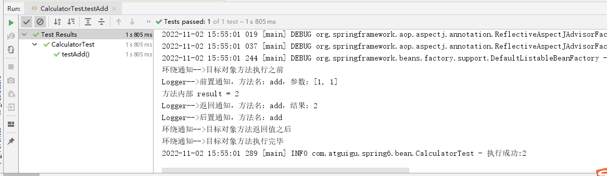

## 1 bean的作用域

**①概念**

在Spring中可以通过配置bean标签的scope属性来指定bean的作用域范围，各取值含义参加下表：

| 取值              | 含义                                    | 创建对象的时机  |
| ----------------- | --------------------------------------- | --------------- |
| singleton（默认） | 在IOC容器中，这个bean的对象始终为单实例 | IOC容器初始化时 |
| prototype         | 这个bean在IOC容器中有多个实例           | 获取bean时      |

如果是在WebApplicationContext环境下还会有另外几个作用域（但不常用）：

| 取值    | 含义                 |
| ------- | -------------------- |
| request | 在一个请求范围内有效 |
| session | 在一个会话范围内有效 |

**②创建类User**

```java
package com.atguigu.spring6.bean;
public class User {

    private Integer id;

    private String username;

    private String password;

    private Integer age;

    public User() {
    }

    public User(Integer id, String username, String password, Integer age) {
        this.id = id;
        this.username = username;
        this.password = password;
        this.age = age;
    }

    public Integer getId() {
        return id;
    }

    public void setId(Integer id) {
        this.id = id;
    }

    public String getUsername() {
        return username;
    }

    public void setUsername(String username) {
        this.username = username;
    }

    public String getPassword() {
        return password;
    }

    public void setPassword(String password) {
        this.password = password;
    }

    public Integer getAge() {
        return age;
    }

    public void setAge(Integer age) {
        this.age = age;
    }

    @Override
    public String toString() {
        return "User{" +
                "id=" + id +
                ", username='" + username + '\'' +
                ", password='" + password + '\'' +
                ", age=" + age +
                '}';
    }
}
```

**③配置bean**

```xml
<!-- scope属性：取值singleton（默认值），bean在IOC容器中只有一个实例，IOC容器初始化时创建对象 -->
<!-- scope属性：取值prototype，bean在IOC容器中可以有多个实例，getBean()时创建对象 -->
<bean class="com.atguigu.spring6.bean.User" scope="prototype"></bean>
```

**④测试**

```java
@Test
public void testBeanScope(){
    ApplicationContext ac = new ClassPathXmlApplicationContext("spring-scope.xml");
    User user1 = ac.getBean(User.class);
    User user2 = ac.getBean(User.class);
    System.out.println(user1==user2);
}
```


## 2 bean生命周期

**①具体的生命周期过程**

- bean对象创建（调用无参构造器）

- 给bean对象设置属性

- 检查是否实现**Aware系列接口，如果实现，执行相关方法

- bean的后置处理器（初始化之前）

- bean对象初始化（需在配置bean时指定初始化方法）

- bean的后置处理器（初始化之后）

- bean对象就绪可以使用

- bean对象销毁（需在配置bean时指定销毁方法）

- IOC容器关闭

**②修改类User**

```java
public class User {

    private Integer id;

    private String username;

    private String password;

    private Integer age;

    public User() {
        System.out.println("生命周期：1、创建对象");
    }

    public User(Integer id, String username, String password, Integer age) {
        this.id = id;
        this.username = username;
        this.password = password;
        this.age = age;
    }

    public Integer getId() {
        return id;
    }

    public void setId(Integer id) {
        System.out.println("生命周期：2、依赖注入");
        this.id = id;
    }

    public String getUsername() {
        return username;
    }

    public void setUsername(String username) {
        this.username = username;
    }

    public String getPassword() {
        return password;
    }

    public void setPassword(String password) {
        this.password = password;
    }

    public Integer getAge() {
        return age;
    }

    public void setAge(Integer age) {
        this.age = age;
    }

    public void initMethod(){
        System.out.println("生命周期：3、初始化");
    }

    public void destroyMethod(){
        System.out.println("生命周期：5、销毁");
    }

    @Override
    public String toString() {
        return "User{" +
                "id=" + id +
                ", username='" + username + '\'' +
                ", password='" + password + '\'' +
                ", age=" + age +
                '}';
    }
}
```

> 注意其中的initMethod()和destroyMethod()，可以通过配置bean指定为初始化和销毁的方法

**③配置bean**

```xml
<!-- 使用init-method属性指定初始化方法 -->
<!-- 使用destroy-method属性指定销毁方法 -->
<bean class="com.atguigu.spring6.bean.User" scope="prototype" init-method="initMethod" destroy-method="destroyMethod">
    <property name="id" value="1001"></property>
    <property name="username" value="admin"></property>
    <property name="password" value="123456"></property>
    <property name="age" value="23"></property>
</bean>
```

**④测试**

```java
@Test
public void testLife(){
    ClassPathXmlApplicationContext ac = new ClassPathXmlApplicationContext("spring-lifecycle.xml");
    User bean = ac.getBean(User.class);
    System.out.println("生命周期：4、通过IOC容器获取bean并使用");
    ac.close();
}
```

**⑤bean的后置处理器**

bean的后置处理器会在生命周期的初始化前后添加额外的操作，需要实现BeanPostProcessor接口，且配置到IOC容器中，需要注意的是，bean后置处理器不是单独针对某一个bean生效，而是针对IOC容器中所有bean都会执行

创建bean的后置处理器：

```java
package com.atguigu.spring6.process;
    
import org.springframework.beans.BeansException;
import org.springframework.beans.factory.config.BeanPostProcessor;

public class MyBeanProcessor implements BeanPostProcessor {
    
    @Override
    public Object postProcessBeforeInitialization(Object bean, String beanName) throws BeansException {
        System.out.println("☆☆☆" + beanName + " = " + bean);
        return bean;
    }
    
    @Override
    public Object postProcessAfterInitialization(Object bean, String beanName) throws BeansException {
        System.out.println("★★★" + beanName + " = " + bean);
        return bean;
    }
}
```

在IOC容器中配置后置处理器：

```xml
<!-- bean的后置处理器要放入IOC容器才能生效 -->
<bean id="myBeanProcessor" class="com.atguigu.spring6.process.MyBeanProcessor"/>
```


## 3 FactoryBean

**①简介**

FactoryBean是Spring提供的一种整合第三方框架的常用机制。和普通的bean不同，配置一个FactoryBean类型的bean，在获取bean的时候得到的并不是class属性中配置的这个类的对象，而是getObject()方法的返回值。通过这种机制，Spring可以帮我们把复杂组件创建的详细过程和繁琐细节都屏蔽起来，只把最简洁的使用界面展示给我们。

将来我们整合Mybatis时，Spring就是通过FactoryBean机制来帮我们创建SqlSessionFactory对象的。

```java
/*
 * Copyright 2002-2020 the original author or authors.
 *
 * Licensed under the Apache License, Version 2.0 (the "License");
 * you may not use this file except in compliance with the License.
 * You may obtain a copy of the License at
 *
 *      https://www.apache.org/licenses/LICENSE-2.0
 *
 * Unless required by applicable law or agreed to in writing, software
 * distributed under the License is distributed on an "AS IS" BASIS,
 * WITHOUT WARRANTIES OR CONDITIONS OF ANY KIND, either express or implied.
 * See the License for the specific language governing permissions and
 * limitations under the License.
 */
package org.springframework.beans.factory;

import org.springframework.lang.Nullable;

/**
 * Interface to be implemented by objects used within a {@link BeanFactory} which
 * are themselves factories for individual objects. If a bean implements this
 * interface, it is used as a factory for an object to expose, not directly as a
 * bean instance that will be exposed itself.
 *
 * <p><b>NB: A bean that implements this interface cannot be used as a normal bean.</b>
 * A FactoryBean is defined in a bean style, but the object exposed for bean
 * references ({@link #getObject()}) is always the object that it creates.
 *
 * <p>FactoryBeans can support singletons and prototypes, and can either create
 * objects lazily on demand or eagerly on startup. The {@link SmartFactoryBean}
 * interface allows for exposing more fine-grained behavioral metadata.
 *
 * <p>This interface is heavily used within the framework itself, for example for
 * the AOP {@link org.springframework.aop.framework.ProxyFactoryBean} or the
 * {@link org.springframework.jndi.JndiObjectFactoryBean}. It can be used for
 * custom components as well; however, this is only common for infrastructure code.
 *
 * <p><b>{@code FactoryBean} is a programmatic contract. Implementations are not
 * supposed to rely on annotation-driven injection or other reflective facilities.</b>
 * {@link #getObjectType()} {@link #getObject()} invocations may arrive early in the
 * bootstrap process, even ahead of any post-processor setup. If you need access to
 * other beans, implement {@link BeanFactoryAware} and obtain them programmatically.
 *
 * <p><b>The container is only responsible for managing the lifecycle of the FactoryBean
 * instance, not the lifecycle of the objects created by the FactoryBean.</b> Therefore,
 * a destroy method on an exposed bean object (such as {@link java.io.Closeable#close()}
 * will <i>not</i> be called automatically. Instead, a FactoryBean should implement
 * {@link DisposableBean} and delegate any such close call to the underlying object.
 *
 * <p>Finally, FactoryBean objects participate in the containing BeanFactory's
 * synchronization of bean creation. There is usually no need for internal
 * synchronization other than for purposes of lazy initialization within the
 * FactoryBean itself (or the like).
 *
 * @author Rod Johnson
 * @author Juergen Hoeller
 * @since 08.03.2003
 * @param <T> the bean type
 * @see org.springframework.beans.factory.BeanFactory
 * @see org.springframework.aop.framework.ProxyFactoryBean
 * @see org.springframework.jndi.JndiObjectFactoryBean
 */
public interface FactoryBean<T> {

    /**
     * The name of an attribute that can be
     * {@link org.springframework.core.AttributeAccessor#setAttribute set} on a
     * {@link org.springframework.beans.factory.config.BeanDefinition} so that
     * factory beans can signal their object type when it can't be deduced from
     * the factory bean class.
     * @since 5.2
     */
    String OBJECT_TYPE_ATTRIBUTE = "factoryBeanObjectType";

    /**
     * Return an instance (possibly shared or independent) of the object
     * managed by this factory.
     * <p>As with a {@link BeanFactory}, this allows support for both the
     * Singleton and Prototype design pattern.
     * <p>If this FactoryBean is not fully initialized yet at the time of
     * the call (for example because it is involved in a circular reference),
     * throw a corresponding {@link FactoryBeanNotInitializedException}.
     * <p>As of Spring 2.0, FactoryBeans are allowed to return {@code null}
     * objects. The factory will consider this as normal value to be used; it
     * will not throw a FactoryBeanNotInitializedException in this case anymore.
     * FactoryBean implementations are encouraged to throw
     * FactoryBeanNotInitializedException themselves now, as appropriate.
     * @return an instance of the bean (can be {@code null})
     * @throws Exception in case of creation errors
     * @see FactoryBeanNotInitializedException
     */
    @Nullable
    T getObject() throws Exception;

    /**
     * Return the type of object that this FactoryBean creates,
     * or {@code null} if not known in advance.
     * <p>This allows one to check for specific types of beans without
     * instantiating objects, for example on autowiring.
     * <p>In the case of implementations that are creating a singleton object,
     * this method should try to avoid singleton creation as far as possible;
     * it should rather estimate the type in advance.
     * For prototypes, returning a meaningful type here is advisable too.
     * <p>This method can be called <i>before</i> this FactoryBean has
     * been fully initialized. It must not rely on state created during
     * initialization; of course, it can still use such state if available.
     * <p><b>NOTE:</b> Autowiring will simply ignore FactoryBeans that return
     * {@code null} here. Therefore it is highly recommended to implement
     * this method properly, using the current state of the FactoryBean.
     * @return the type of object that this FactoryBean creates,
     * or {@code null} if not known at the time of the call
     * @see ListableBeanFactory#getBeansOfType
     */
    @Nullable
    Class<?> getObjectType();

    /**
     * Is the object managed by this factory a singleton? That is,
     * will {@link #getObject()} always return the same object
     * (a reference that can be cached)?
     * <p><b>NOTE:</b> If a FactoryBean indicates to hold a singleton object,
     * the object returned from {@code getObject()} might get cached
     * by the owning BeanFactory. Hence, do not return {@code true}
     * unless the FactoryBean always exposes the same reference.
     * <p>The singleton status of the FactoryBean itself will generally
     * be provided by the owning BeanFactory; usually, it has to be
     * defined as singleton there.
     * <p><b>NOTE:</b> This method returning {@code false} does not
     * necessarily indicate that returned objects are independent instances.
     * An implementation of the extended {@link SmartFactoryBean} interface
     * may explicitly indicate independent instances through its
     * {@link SmartFactoryBean#isPrototype()} method. Plain {@link FactoryBean}
     * implementations which do not implement this extended interface are
     * simply assumed to always return independent instances if the
     * {@code isSingleton()} implementation returns {@code false}.
     * <p>The default implementation returns {@code true}, since a
     * {@code FactoryBean} typically manages a singleton instance.
     * @return whether the exposed object is a singleton
     * @see #getObject()
     * @see SmartFactoryBean#isPrototype()
     */
    default boolean isSingleton() {
        return true;
    }
}
```

**②创建类UserFactoryBean**

```java
package com.atguigu.spring6.bean;
public class UserFactoryBean implements FactoryBean<User> {
    @Override
    public User getObject() throws Exception {
        return new User();
    }

    @Override
    public Class<?> getObjectType() {
        return User.class;
    }
}
```

**③配置bean**

```xml
<bean id="user" class="com.atguigu.spring6.bean.UserFactoryBean"></bean>
```

**④测试**

```java
@Test
public void testUserFactoryBean(){
    //获取IOC容器
    ApplicationContext ac = new ClassPathXmlApplicationContext("spring-factorybean.xml");
    User user = (User) ac.getBean("user");
    System.out.println(user);
}
```


## 4 基于xml自动装配

> 自动装配：
>
> 根据指定的策略，在IOC容器中匹配某一个bean，自动为指定的bean中所依赖的类类型或接口类型属性赋值

**①场景模拟**

创建类UserController

```java
package com.atguigu.spring6.autowire.controller
public class UserController {

    private UserService userService;

    public void setUserService(UserService userService) {
        this.userService = userService;
    }

    public void saveUser(){
        userService.saveUser();
    }

}
```

创建接口UserService

```java
package com.atguigu.spring6.autowire.service
public interface UserService {

    void saveUser();

}
```

创建类UserServiceImpl实现接口UserService

```java
package com.atguigu.spring6.autowire.service.impl
public class UserServiceImpl implements UserService {

    private UserDao userDao;

    public void setUserDao(UserDao userDao) {
        this.userDao = userDao;
    }

    @Override
    public void saveUser() {
        userDao.saveUser();
    }

}
```

创建接口UserDao

```java
package com.atguigu.spring6.autowire.dao
public interface UserDao {

    void saveUser();

}
```

创建类UserDaoImpl实现接口UserDao

```java
package com.atguigu.spring6.autowire.dao.impl
public class UserDaoImpl implements UserDao {

    @Override
    public void saveUser() {
        System.out.println("保存成功");
    }

}
```

**②配置bean**

> 使用bean标签的autowire属性设置自动装配效果
>
> 自动装配方式：byType
>
> byType：根据类型匹配IOC容器中的某个兼容类型的bean，为属性自动赋值
>
> 若在IOC中，没有任何一个兼容类型的bean能够为属性赋值，则该属性不装配，即值为默认值null
>
> 若在IOC中，有多个兼容类型的bean能够为属性赋值，则抛出异常NoUniqueBeanDefinitionException

```xml
<bean id="userController" class="com.atguigu.spring6.autowire.controller.UserController" autowire="byType"></bean>

<bean id="userService" class="com.atguigu.spring6.autowire.service.impl.UserServiceImpl" autowire="byType"></bean>

<bean id="userDao" class="com.atguigu.spring6.autowire.dao.impl.UserDaoImpl"></bean>
```

> 自动装配方式：byName
>
> byName：将自动装配的属性的属性名，作为bean的id在IOC容器中匹配相对应的bean进行赋值

```xml
<bean id="userController" class="com.atguigu.spring6.autowire.controller.UserController" autowire="byName"></bean>

<bean id="userService" class="com.atguigu.spring6.autowire.service.impl.UserServiceImpl" autowire="byName"></bean>
<bean id="userServiceImpl" class="com.atguigu.spring6.autowire.service.impl.UserServiceImpl" autowire="byName"></bean>

<bean id="userDao" class="com.atguigu.spring6.autowire.dao.impl.UserDaoImpl"></bean>
<bean id="userDaoImpl" class="com.atguigu.spring6.autowire.dao.impl.UserDaoImpl"></bean>
```

**③测试**

```java
@Test
public void testAutoWireByXML(){
    ApplicationContext ac = new ClassPathXmlApplicationContext("autowire-xml.xml");
    UserController userController = ac.getBean(UserController.class);
    userController.saveUser();
}
```

## 5、面向切面：AOP

### 5.1、场景模拟

**搭建子模块：spring6-aop**

#### 5.1.1、声明接口

声明计算器接口Calculator，包含加减乘除的抽象方法

```java
public interface Calculator {
    
    int add(int i, int j);
    
    int sub(int i, int j);
    
    int mul(int i, int j);
    
    int div(int i, int j);
    
}
```

#### 5.1.2、创建实现类


```java
public class CalculatorImpl implements Calculator {
    
    @Override
    public int add(int i, int j) {
    
        int result = i + j;
    
        System.out.println("方法内部 result = " + result);
    
        return result;
    }
    
    @Override
    public int sub(int i, int j) {
    
        int result = i - j;
    
        System.out.println("方法内部 result = " + result);
    
        return result;
    }
    
    @Override
    public int mul(int i, int j) {
    
        int result = i * j;
    
        System.out.println("方法内部 result = " + result);
    
        return result;
    }
    
    @Override
    public int div(int i, int j) {
    
        int result = i / j;
    
        System.out.println("方法内部 result = " + result);
    
        return result;
    }
}
```

#### 5.1.3、创建带日志功能的实现类


```java
public class CalculatorLogImpl implements Calculator {
    
    @Override
    public int add(int i, int j) {
    
        System.out.println("[日志] add 方法开始了，参数是：" + i + "," + j);
    
        int result = i + j;
    
        System.out.println("方法内部 result = " + result);
    
        System.out.println("[日志] add 方法结束了，结果是：" + result);
    
        return result;
    }
    
    @Override
    public int sub(int i, int j) {
    
        System.out.println("[日志] sub 方法开始了，参数是：" + i + "," + j);
    
        int result = i - j;
    
        System.out.println("方法内部 result = " + result);
    
        System.out.println("[日志] sub 方法结束了，结果是：" + result);
    
        return result;
    }
    
    @Override
    public int mul(int i, int j) {
    
        System.out.println("[日志] mul 方法开始了，参数是：" + i + "," + j);
    
        int result = i * j;
    
        System.out.println("方法内部 result = " + result);
    
        System.out.println("[日志] mul 方法结束了，结果是：" + result);
    
        return result;
    }
    
    @Override
    public int div(int i, int j) {
    
        System.out.println("[日志] div 方法开始了，参数是：" + i + "," + j);
    
        int result = i / j;
    
        System.out.println("方法内部 result = " + result);
    
        System.out.println("[日志] div 方法结束了，结果是：" + result);
    
        return result;
    }
}
```

#### 5.1.4、提出问题

**①现有代码缺陷**

针对带日志功能的实现类，我们发现有如下缺陷：

- 对核心业务功能有干扰，导致程序员在开发核心业务功能时分散了精力
- 附加功能分散在各个业务功能方法中，不利于统一维护

**②解决思路**

解决这两个问题，核心就是：解耦。我们需要把附加功能从业务功能代码中抽取出来。

**③困难**

解决问题的困难：要抽取的代码在方法内部，靠以前把子类中的重复代码抽取到父类的方式没法解决。所以需要引入新的技术。


### 5.2、代理模式

#### 5.2.1、概念

**①介绍**

二十三种设计模式中的一种，属于结构型模式。它的作用就是通过提供一个代理类，让我们在调用目标方法的时候，不再是直接对目标方法进行调用，而是通过代理类**间接**调用。让不属于目标方法核心逻辑的代码从目标方法中剥离出来——**解耦**。调用目标方法时先调用代理对象的方法，减少对目标方法的调用和打扰，同时让附加功能能够集中在一起也有利于统一维护。


使用代理后：


**②生活中的代理**

- 广告商找大明星拍广告需要经过经纪人
- 合作伙伴找大老板谈合作要约见面时间需要经过秘书
- 房产中介是买卖双方的代理

**③相关术语**

- 代理：将非核心逻辑剥离出来以后，封装这些非核心逻辑的类、对象、方法。
- 目标：被代理“套用”了非核心逻辑代码的类、对象、方法。


#### 5.2.2、静态代理

创建静态代理类：

```java
public class CalculatorStaticProxy implements Calculator {
    
    // 将被代理的目标对象声明为成员变量
    private Calculator target;
    
    public CalculatorStaticProxy(Calculator target) {
        this.target = target;
    }
    
    @Override
    public int add(int i, int j) {
    
        // 附加功能由代理类中的代理方法来实现
        System.out.println("[日志] add 方法开始了，参数是：" + i + "," + j);
    
        // 通过目标对象来实现核心业务逻辑
        int addResult = target.add(i, j);
    
        System.out.println("[日志] add 方法结束了，结果是：" + addResult);
    
        return addResult;
    }
}
```

> 静态代理确实实现了解耦，但是由于代码都写死了，完全不具备任何的灵活性。就拿日志功能来说，将来其他地方也需要附加日志，那还得再声明更多个静态代理类，那就产生了大量重复的代码，日志功能还是分散的，没有统一管理。
>
> 提出进一步的需求：将日志功能集中到一个代理类中，将来有任何日志需求，都通过这一个代理类来实现。这就需要使用动态代理技术了。


#### 5.2.3、动态代理


生产代理对象的工厂类：

```java
public class ProxyFactory {

    private Object target;

    public ProxyFactory(Object target) {
        this.target = target;
    }

    public Object getProxy(){

        /**
         * newProxyInstance()：创建一个代理实例
         * 其中有三个参数：
         * 1、classLoader：加载动态生成的代理类的类加载器
         * 2、interfaces：目标对象实现的所有接口的class对象所组成的数组
         * 3、invocationHandler：设置代理对象实现目标对象方法的过程，即代理类中如何重写接口中的抽象方法
         */
        ClassLoader classLoader = target.getClass().getClassLoader();
        Class<?>[] interfaces = target.getClass().getInterfaces();
        InvocationHandler invocationHandler = new InvocationHandler() {
            @Override
            public Object invoke(Object proxy, Method method, Object[] args) throws Throwable {
                /**
                 * proxy：代理对象
                 * method：代理对象需要实现的方法，即其中需要重写的方法
                 * args：method所对应方法的参数
                 */
                Object result = null;
                try {
                    System.out.println("[动态代理][日志] "+method.getName()+"，参数："+ Arrays.toString(args));
                    result = method.invoke(target, args);
                    System.out.println("[动态代理][日志] "+method.getName()+"，结果："+ result);
                } catch (Exception e) {
                    e.printStackTrace();
                    System.out.println("[动态代理][日志] "+method.getName()+"，异常："+e.getMessage());
                } finally {
                    System.out.println("[动态代理][日志] "+method.getName()+"，方法执行完毕");
                }
                return result;
            }
        };

        return Proxy.newProxyInstance(classLoader, interfaces, invocationHandler);
    }
}
```


#### 5.2.4、测试

```java
@Test
public void testDynamicProxy(){
    ProxyFactory factory = new ProxyFactory(new CalculatorLogImpl());
    Calculator proxy = (Calculator) factory.getProxy();
    proxy.div(1,0);
    //proxy.div(1,1);
}
```


### 5.3、AOP概念及相关术语

#### 5.3.1、概述

AOP（Aspect Oriented Programming）是一种设计思想，是软件设计领域中的面向切面编程，它是面向对象编程的一种补充和完善，它以通过预编译方式和运行期动态代理方式实现，在不修改源代码的情况下，给程序动态统一添加额外功能的一种技术。利用AOP可以对业务逻辑的各个部分进行隔离，从而使得业务逻辑各部分之间的耦合度降低，提高程序的可重用性，同时提高了开发的效率。

#### 5.3.2、相关术语

##### ①横切关注点

分散在每个各个模块中解决同一样的问题，如用户验证、日志管理、事务处理、数据缓存都属于横切关注点。

从每个方法中抽取出来的同一类非核心业务。在同一个项目中，我们可以使用多个横切关注点对相关方法进行多个不同方面的增强。

这个概念不是语法层面的，而是根据附加功能的逻辑上的需要：有十个附加功能，就有十个横切关注点。


##### ②通知（增强）

**增强，通俗说，就是你想要增强的功能，比如 安全，事务，日志等。**

每一个横切关注点上要做的事情都需要写一个方法来实现，这样的方法就叫通知方法。

- 前置通知：在被代理的目标方法**前**执行
- 返回通知：在被代理的目标方法**成功结束**后执行（**寿终正寝**）
- 异常通知：在被代理的目标方法**异常结束**后执行（**死于非命**）
- 后置通知：在被代理的目标方法**最终结束**后执行（**盖棺定论**）
- 环绕通知：使用try...catch...finally结构围绕**整个**被代理的目标方法，包括上面四种通知对应的所有位置


##### ③切面

封装通知方法的类。


##### ④目标

被代理的目标对象。

##### ⑤代理

向目标对象应用通知之后创建的代理对象。

##### ⑥连接点

这也是一个纯逻辑概念，不是语法定义的。

把方法排成一排，每一个横切位置看成x轴方向，把方法从上到下执行的顺序看成y轴，x轴和y轴的交叉点就是连接点。**通俗说，就是spring允许你使用通知的地方**


##### ⑦切入点

定位连接点的方式。

每个类的方法中都包含多个连接点，所以连接点是类中客观存在的事物（从逻辑上来说）。

如果把连接点看作数据库中的记录，那么切入点就是查询记录的 SQL 语句。

**Spring 的 AOP 技术可以通过切入点定位到特定的连接点。通俗说，要实际去增强的方法**

切点通过 org.springframework.aop.Pointcut 接口进行描述，它使用类和方法作为连接点的查询条件。

#### 5.3.3、作用

- 简化代码：把方法中固定位置的重复的代码**抽取**出来，让被抽取的方法更专注于自己的核心功能，提高内聚性。

- 代码增强：把特定的功能封装到切面类中，看哪里有需要，就往上套，被**套用**了切面逻辑的方法就被切面给增强了。

  

### 5.4、基于注解的AOP

#### 5.4.1、技术说明


- 动态代理分为JDK动态代理和cglib动态代理
- 当目标类有接口的情况使用JDK动态代理和cglib动态代理，没有接口时只能使用cglib动态代理
- JDK动态代理动态生成的代理类会在com.sun.proxy包下，类名为$proxy1，和目标类实现相同的接口
- cglib动态代理动态生成的代理类会和目标在在相同的包下，会继承目标类
- 动态代理（InvocationHandler）：JDK原生的实现方式，需要被代理的目标类必须实现接口。因为这个技术要求**代理对象和目标对象实现同样的接口**（兄弟两个拜把子模式）。
- cglib：通过**继承被代理的目标类**（认干爹模式）实现代理，所以不需要目标类实现接口。
- AspectJ：是AOP思想的一种实现。本质上是静态代理，**将代理逻辑“织入”被代理的目标类编译得到的字节码文件**，所以最终效果是动态的。weaver就是织入器。Spring只是借用了AspectJ中的注解。

#### 5.4.2、准备工作

**①添加依赖**

在IOC所需依赖基础上再加入下面依赖即可：

```xml
<dependencies>
    <!--spring context依赖-->
    <!--当你引入Spring Context依赖之后，表示将Spring的基础依赖引入了-->
    <dependency>
        <groupId>org.springframework</groupId>
        <artifactId>spring-context</artifactId>
        <version>6.0.2</version>
    </dependency>

    <!--spring aop依赖-->
    <dependency>
        <groupId>org.springframework</groupId>
        <artifactId>spring-aop</artifactId>
        <version>6.0.2</version>
    </dependency>
    <!--spring aspects依赖-->
    <dependency>
        <groupId>org.springframework</groupId>
        <artifactId>spring-aspects</artifactId>
        <version>6.0.2</version>
    </dependency>

    <!--junit5测试-->
    <dependency>
        <groupId>org.junit.jupiter</groupId>
        <artifactId>junit-jupiter-api</artifactId>
        <version>5.3.1</version>
    </dependency>

    <!--log4j2的依赖-->
    <dependency>
        <groupId>org.apache.logging.log4j</groupId>
        <artifactId>log4j-core</artifactId>
        <version>2.19.0</version>
    </dependency>
    <dependency>
        <groupId>org.apache.logging.log4j</groupId>
        <artifactId>log4j-slf4j2-impl</artifactId>
        <version>2.19.0</version>
    </dependency>
</dependencies>
```

**②准备被代理的目标资源**

接口：

```java
public interface Calculator {
    
    int add(int i, int j);
    
    int sub(int i, int j);
    
    int mul(int i, int j);
    
    int div(int i, int j);
    
}
```

实现类：

```java
@Component
public class CalculatorImpl implements Calculator {
    
    @Override
    public int add(int i, int j) {
    
        int result = i + j;
    
        System.out.println("方法内部 result = " + result);
    
        return result;
    }
    
    @Override
    public int sub(int i, int j) {
    
        int result = i - j;
    
        System.out.println("方法内部 result = " + result);
    
        return result;
    }
    
    @Override
    public int mul(int i, int j) {
    
        int result = i * j;
    
        System.out.println("方法内部 result = " + result);
    
        return result;
    }
    
    @Override
    public int div(int i, int j) {
    
        int result = i / j;
    
        System.out.println("方法内部 result = " + result);
    
        return result;
    }
}
```


#### 5.4.3、创建切面类并配置

```java
// @Aspect表示这个类是一个切面类
@Aspect
// @Component注解保证这个切面类能够放入IOC容器
@Component
public class LogAspect {
    
    @Before("execution(public int com.atguigu.aop.annotation.CalculatorImpl.*(..))")
    public void beforeMethod(JoinPoint joinPoint){
        String methodName = joinPoint.getSignature().getName();
        String args = Arrays.toString(joinPoint.getArgs());
        System.out.println("Logger-->前置通知，方法名："+methodName+"，参数："+args);
    }

    @After("execution(* com.atguigu.aop.annotation.CalculatorImpl.*(..))")
    public void afterMethod(JoinPoint joinPoint){
        String methodName = joinPoint.getSignature().getName();
        System.out.println("Logger-->后置通知，方法名："+methodName);
    }

    @AfterReturning(value = "execution(* com.atguigu.aop.annotation.CalculatorImpl.*(..))", returning = "result")
    public void afterReturningMethod(JoinPoint joinPoint, Object result){
        String methodName = joinPoint.getSignature().getName();
        System.out.println("Logger-->返回通知，方法名："+methodName+"，结果："+result);
    }

    @AfterThrowing(value = "execution(* com.atguigu.aop.annotation.CalculatorImpl.*(..))", throwing = "ex")
    public void afterThrowingMethod(JoinPoint joinPoint, Throwable ex){
        String methodName = joinPoint.getSignature().getName();
        System.out.println("Logger-->异常通知，方法名："+methodName+"，异常："+ex);
    }
    
    @Around("execution(* com.atguigu.aop.annotation.CalculatorImpl.*(..))")
    public Object aroundMethod(ProceedingJoinPoint joinPoint){
        String methodName = joinPoint.getSignature().getName();
        String args = Arrays.toString(joinPoint.getArgs());
        Object result = null;
        try {
            System.out.println("环绕通知-->目标对象方法执行之前");
            //目标对象（连接点）方法的执行
            result = joinPoint.proceed();
            System.out.println("环绕通知-->目标对象方法返回值之后");
        } catch (Throwable throwable) {
            throwable.printStackTrace();
            System.out.println("环绕通知-->目标对象方法出现异常时");
        } finally {
            System.out.println("环绕通知-->目标对象方法执行完毕");
        }
        return result;
    }
    
}
```

在Spring的配置文件中配置：

```xml
<?xml version="1.0" encoding="UTF-8"?>
<beans xmlns="http://www.springframework.org/schema/beans"
       xmlns:xsi="http://www.w3.org/2001/XMLSchema-instance"
       xmlns:context="http://www.springframework.org/schema/context"
       xmlns:aop="http://www.springframework.org/schema/aop"
       xsi:schemaLocation="http://www.springframework.org/schema/beans
       http://www.springframework.org/schema/beans/spring-beans.xsd
       http://www.springframework.org/schema/context
       http://www.springframework.org/schema/context/spring-context.xsd
       http://www.springframework.org/schema/aop
       http://www.springframework.org/schema/aop/spring-aop.xsd">
    <!--
        基于注解的AOP的实现：
        1、将目标对象和切面交给IOC容器管理（注解+扫描）
        2、开启AspectJ的自动代理，为目标对象自动生成代理
        3、将切面类通过注解@Aspect标识
    -->
    <context:component-scan base-package="com.atguigu.aop.annotation"></context:component-scan>

    <aop:aspectj-autoproxy />
</beans>
```

执行测试：

```java
public class CalculatorTest {

    private Logger logger = LoggerFactory.getLogger(CalculatorTest.class);

    @Test
    public void testAdd(){
        ApplicationContext ac = new ClassPathXmlApplicationContext("beans.xml");
        Calculator calculator = ac.getBean( Calculator.class);
        int add = calculator.add(1, 1);
        logger.info("执行成功:"+add);
    }

}
```

执行结果：




#### 5.4.4、各种通知

- 前置通知：使用@Before注解标识，在被代理的目标方法**前**执行
- 返回通知：使用@AfterReturning注解标识，在被代理的目标方法**成功结束**后执行（**寿终正寝**）
- 异常通知：使用@AfterThrowing注解标识，在被代理的目标方法**异常结束**后执行（**死于非命**）
- 后置通知：使用@After注解标识，在被代理的目标方法**最终结束**后执行（**盖棺定论**）
- 环绕通知：使用@Around注解标识，使用try...catch...finally结构围绕**整个**被代理的目标方法，包括上面四种通知对应的所有位置

> 各种通知的执行顺序：
>
> - Spring版本5.3.x以前：
>   - 前置通知
>   - 目标操作
>   - 后置通知
>   - 返回通知或异常通知
> - Spring版本5.3.x以后：
>   - 前置通知
>   - 目标操作
>   - 返回通知或异常通知
>   - 后置通知


#### 5.4.5、切入点表达式语法

**①作用**


**②语法细节**

- 用*号代替“权限修饰符”和“返回值”部分表示“权限修饰符”和“返回值”不限
- 在包名的部分，一个“*”号只能代表包的层次结构中的一层，表示这一层是任意的。
  - 例如：*.Hello匹配com.Hello，不匹配com.atguigu.Hello
- 在包名的部分，使用“*..”表示包名任意、包的层次深度任意
- 在类名的部分，类名部分整体用*号代替，表示类名任意
- 在类名的部分，可以使用*号代替类名的一部分
  - 例如：*Service匹配所有名称以Service结尾的类或接口

- 在方法名部分，可以使用*号表示方法名任意
- 在方法名部分，可以使用*号代替方法名的一部分
  - 例如：*Operation匹配所有方法名以Operation结尾的方法

- 在方法参数列表部分，使用(..)表示参数列表任意
- 在方法参数列表部分，使用(int,..)表示参数列表以一个int类型的参数开头
- 在方法参数列表部分，基本数据类型和对应的包装类型是不一样的
  - 切入点表达式中使用 int 和实际方法中 Integer 是不匹配的
- 在方法返回值部分，如果想要明确指定一个返回值类型，那么必须同时写明权限修饰符
  - 例如：execution(public int *..*Service.*(.., int))	正确
    例如：execution(* int *..*Service.*(.., int))	错误


#### 5.4.6、重用切入点表达式

**①声明**

```java
@Pointcut("execution(* com.atguigu.aop.annotation.*.*(..))")
public void pointCut(){}
```

**②在同一个切面中使用**

```java
@Before("pointCut()")
public void beforeMethod(JoinPoint joinPoint){
    String methodName = joinPoint.getSignature().getName();
    String args = Arrays.toString(joinPoint.getArgs());
    System.out.println("Logger-->前置通知，方法名："+methodName+"，参数："+args);
}
```

**③在不同切面中使用**

```java
@Before("com.atguigu.aop.CommonPointCut.pointCut()")
public void beforeMethod(JoinPoint joinPoint){
    String methodName = joinPoint.getSignature().getName();
    String args = Arrays.toString(joinPoint.getArgs());
    System.out.println("Logger-->前置通知，方法名："+methodName+"，参数："+args);
}
```


#### 5.4.7、获取通知的相关信息

**①获取连接点信息**

获取连接点信息可以在通知方法的参数位置设置JoinPoint类型的形参

```java
@Before("execution(public int com.atguigu.aop.annotation.CalculatorImpl.*(..))")
public void beforeMethod(JoinPoint joinPoint){
    //获取连接点的签名信息
    String methodName = joinPoint.getSignature().getName();
    //获取目标方法到的实参信息
    String args = Arrays.toString(joinPoint.getArgs());
    System.out.println("Logger-->前置通知，方法名："+methodName+"，参数："+args);
}
```

**②获取目标方法的返回值**

@AfterReturning中的属性returning，用来将通知方法的某个形参，接收目标方法的返回值

```java
@AfterReturning(value = "execution(* com.atguigu.aop.annotation.CalculatorImpl.*(..))", returning = "result")
public void afterReturningMethod(JoinPoint joinPoint, Object result){
    String methodName = joinPoint.getSignature().getName();
    System.out.println("Logger-->返回通知，方法名："+methodName+"，结果："+result);
}
```

**③获取目标方法的异常**

@AfterThrowing中的属性throwing，用来将通知方法的某个形参，接收目标方法的异常

```java
@AfterThrowing(value = "execution(* com.atguigu.aop.annotation.CalculatorImpl.*(..))", throwing = "ex")
public void afterThrowingMethod(JoinPoint joinPoint, Throwable ex){
    String methodName = joinPoint.getSignature().getName();
    System.out.println("Logger-->异常通知，方法名："+methodName+"，异常："+ex);
}
```


#### 5.4.8、环绕通知

```java
@Around("execution(* com.atguigu.aop.annotation.CalculatorImpl.*(..))")
public Object aroundMethod(ProceedingJoinPoint joinPoint){
    String methodName = joinPoint.getSignature().getName();
    String args = Arrays.toString(joinPoint.getArgs());
    Object result = null;
    try {
        System.out.println("环绕通知-->目标对象方法执行之前");
        //目标方法的执行，目标方法的返回值一定要返回给外界调用者
        result = joinPoint.proceed();
        System.out.println("环绕通知-->目标对象方法返回值之后");
    } catch (Throwable throwable) {
        throwable.printStackTrace();
        System.out.println("环绕通知-->目标对象方法出现异常时");
    } finally {
        System.out.println("环绕通知-->目标对象方法执行完毕");
    }
    return result;
}
```


#### 5.4.9、切面的优先级

相同目标方法上同时存在多个切面时，切面的优先级控制切面的**内外嵌套**顺序。

- 优先级高的切面：外面
- 优先级低的切面：里面

使用@Order注解可以控制切面的优先级：

- @Order(较小的数)：优先级高
- @Order(较大的数)：优先级低


### 5.5、基于XML的AOP

#### 5.5.1、准备工作

参考基于注解的AOP环境

#### 5.5.2、实现

```xml
<context:component-scan base-package="com.atguigu.aop.xml"></context:component-scan>

<aop:config>
    <!--配置切面类-->
    <aop:aspect ref="loggerAspect">
        <aop:pointcut id="pointCut" 
                   expression="execution(* com.atguigu.aop.xml.CalculatorImpl.*(..))"/>
        <aop:before method="beforeMethod" pointcut-ref="pointCut"></aop:before>
        <aop:after method="afterMethod" pointcut-ref="pointCut"></aop:after>
        <aop:after-returning method="afterReturningMethod" returning="result" pointcut-ref="pointCut"></aop:after-returning>
        <aop:after-throwing method="afterThrowingMethod" throwing="ex" pointcut-ref="pointCut"></aop:after-throwing>
        <aop:around method="aroundMethod" pointcut-ref="pointCut"></aop:around>
    </aop:aspect>
</aop:config>
```

## 7 事务

### 7.1 JdbcTemplate

#### 7.1.1 简介


Spring 框架对 JDBC 进行封装，使用 JdbcTemplate 方便实现对数据库操作

#### 7.1.2、准备工作

**①搭建子模块**

搭建子模块：spring-jdbc-tx

**②加入依赖**

```xml
<dependencies>
    <!--spring jdbc  Spring 持久化层支持jar包-->
    <dependency>
        <groupId>org.springframework</groupId>
        <artifactId>spring-jdbc</artifactId>
        <version>6.0.2</version>
    </dependency>
    <!-- MySQL驱动 -->
    <dependency>
        <groupId>mysql</groupId>
        <artifactId>mysql-connector-java</artifactId>
        <version>8.0.30</version>
    </dependency>
    <!-- 数据源 -->
    <dependency>
        <groupId>com.alibaba</groupId>
        <artifactId>druid</artifactId>
        <version>1.2.15</version>
    </dependency>
</dependencies>
```

**③创建jdbc.properties**

```properties
jdbc.user=root
jdbc.password=root
jdbc.url=jdbc:mysql://localhost:3306/spring?characterEncoding=utf8&useSSL=false
jdbc.driver=com.mysql.cj.jdbc.Driver
```

**④配置Spring的配置文件**

beans.xml

```xml
<?xml version="1.0" encoding="UTF-8"?>
<beans xmlns="http://www.springframework.org/schema/beans"
       xmlns:xsi="http://www.w3.org/2001/XMLSchema-instance"
       xmlns:context="http://www.springframework.org/schema/context"
       xsi:schemaLocation="http://www.springframework.org/schema/beans
       http://www.springframework.org/schema/beans/spring-beans.xsd
       http://www.springframework.org/schema/context
       http://www.springframework.org/schema/context/spring-context.xsd">

    <!-- 导入外部属性文件 -->
    <context:property-placeholder location="classpath:jdbc.properties" />

    <!-- 配置数据源 -->
    <bean id="druidDataSource" class="com.alibaba.druid.pool.DruidDataSource">
        <property name="url" value="${jdbc.url}"/>
        <property name="driverClassName" value="${jdbc.driver}"/>
        <property name="username" value="${jdbc.user}"/>
        <property name="password" value="${jdbc.password}"/>
    </bean>

    <!-- 配置 JdbcTemplate -->
    <bean id="jdbcTemplate" class="org.springframework.jdbc.core.JdbcTemplate">
        <!-- 装配数据源 -->
        <property name="dataSource" ref="druidDataSource"/>
    </bean>

</beans>
```

**⑤准备数据库与测试表**

```java
CREATE DATABASE `spring`;

use `spring`;

CREATE TABLE `t_emp` (
  `id` int(11) NOT NULL AUTO_INCREMENT,
  `name` varchar(20) DEFAULT NULL COMMENT '姓名',
  `age` int(11) DEFAULT NULL COMMENT '年龄',
  `sex` varchar(2) DEFAULT NULL COMMENT '性别',
  PRIMARY KEY (`id`)
) ENGINE=InnoDB DEFAULT CHARSET=utf8mb4;
```


#### 7.1.3、实现CURD

##### ①装配 JdbcTemplate

**创建测试类，整合JUnit，注入JdbcTemplate**

```java
package com.atguigu.spring6;

import org.springframework.beans.factory.annotation.Autowired;
import org.springframework.jdbc.core.JdbcTemplate;
import org.springframework.test.context.junit.jupiter.SpringJUnitConfig;

@SpringJUnitConfig(locations = "classpath:beans.xml")
public class JDBCTemplateTest {

    @Autowired
    private JdbcTemplate jdbcTemplate;
    
}
```

##### ②测试增删改功能

```java
@Test
//测试增删改功能
public void testUpdate(){
    //添加功能
	String sql = "insert into t_emp values(null,?,?,?)";
	int result = jdbcTemplate.update(sql, "张三", 23, "男");
    
    //修改功能
	//String sql = "update t_emp set name=? where id=?";
    //int result = jdbcTemplate.update(sql, "张三atguigu", 1);

    //删除功能
	//String sql = "delete from t_emp where id=?";
	//int result = jdbcTemplate.update(sql, 1);
}
```

##### ③查询数据返回对象

```java
public class Emp {

    private Integer id;
    private String name;
    private Integer age;
    private String sex;

    //生成get和set方法
    //......

    @Override
    public String toString() {
        return "Emp{" +
                "id=" + id +
                ", name='" + name + '\'' +
                ", age=" + age +
                ", sex='" + sex + '\'' +
                '}';
    }
}
```

```java
//查询：返回对象
@Test
public void testSelectObject() {
    //写法一
//        String sql = "select * from t_emp where id=?";
//        Emp empResult = jdbcTemplate.queryForObject(sql,
//                (rs, rowNum) -> {
//                    Emp emp = new Emp();
//                    emp.setId(rs.getInt("id"));
//                    emp.setName(rs.getString("name"));
//                    emp.setAge(rs.getInt("age"));
//                    emp.setSex(rs.getString("sex"));
//                    return emp;
//                }, 1);
//        System.out.println(empResult);

    //写法二
    String sql = "select * from t_emp where id=?";
    Emp emp = jdbcTemplate.queryForObject(sql,
                  new BeanPropertyRowMapper<>(Emp.class),1);
    System.out.println(emp);
}
```

##### ④查询数据返回list集合

```java
@Test
//查询多条数据为一个list集合
public void testSelectList(){
    String sql = "select * from t_emp";
    List<Emp> list = jdbcTemplate.query(sql, new BeanPropertyRowMapper<>(Emp.class));
    System.out.println(list);
}
```

##### ⑤查询返回单个的值

```java
@Test
//查询单行单列的值
public void selectCount(){
    String sql = "select count(id) from t_emp";
    Integer count = jdbcTemplate.queryForObject(sql, Integer.class);
    System.out.println(count);
}
```


### 7.2、声明式事务概念

#### 7.2.1、事务基本概念

##### ①什么是事务

数据库事务( transaction)是访问并可能操作各种数据项的一个数据库操作序列，这些操作要么全部执行,要么全部不执行，是一个不可分割的工作单位。事务由事务开始与事务结束之间执行的全部数据库操作组成。

##### ②事务的特性

**A：原子性(Atomicity)**

一个事务(transaction)中的所有操作，要么全部完成，要么全部不完成，不会结束在中间某个环节。事务在执行过程中发生错误，会被回滚（Rollback）到事务开始前的状态，就像这个事务从来没有执行过一样。

**C：一致性(Consistency)**

事务的一致性指的是在一个事务执行之前和执行之后数据库都必须处于一致性状态。

如果事务成功地完成，那么系统中所有变化将正确地应用，系统处于有效状态。

如果在事务中出现错误，那么系统中的所有变化将自动地回滚，系统返回到原始状态。

**I：隔离性(Isolation)**

指的是在并发环境中，当不同的事务同时操纵相同的数据时，每个事务都有各自的完整数据空间。由并发事务所做的修改必须与任何其他并发事务所做的修改隔离。事务查看数据更新时，数据所处的状态要么是另一事务修改它之前的状态，要么是另一事务修改它之后的状态，事务不会查看到中间状态的数据。

**D：持久性(Durability)**

指的是只要事务成功结束，它对数据库所做的更新就必须保存下来。即使发生系统崩溃，重新启动数据库系统后，数据库还能恢复到事务成功结束时的状态。


#### 7.2.2、编程式事务

事务功能的相关操作全部通过自己编写代码来实现：

```java
Connection conn = ...;
    
try {
    
    // 开启事务：关闭事务的自动提交
    conn.setAutoCommit(false);
    
    // 核心操作
    
    // 提交事务
    conn.commit();
    
}catch(Exception e){
    
    // 回滚事务
    conn.rollBack();
    
}finally{
    
    // 释放数据库连接
    conn.close();
    
}
```

编程式的实现方式存在缺陷：

- 细节没有被屏蔽：具体操作过程中，所有细节都需要程序员自己来完成，比较繁琐。
- 代码复用性不高：如果没有有效抽取出来，每次实现功能都需要自己编写代码，代码就没有得到复用。

#### 7.2.3、声明式事务

既然事务控制的代码有规律可循，代码的结构基本是确定的，所以框架就可以将固定模式的代码抽取出来，进行相关的封装。

封装起来后，我们只需要在配置文件中进行简单的配置即可完成操作。

- 好处1：提高开发效率
- 好处2：消除了冗余的代码
- 好处3：框架会综合考虑相关领域中在实际开发环境下有可能遇到的各种问题，进行了健壮性、性能等各个方面的优化

所以，我们可以总结下面两个概念：

- **编程式**：**自己写代码**实现功能
- **声明式**：通过**配置**让**框架**实现功能


### 7.3、基于注解的声明式事务

#### 7.3.1、准备工作

**①添加配置**

在beans.xml添加配置

```xml
<!--扫描组件-->
<context:component-scan base-package="com.atguigu.spring6"></context:component-scan>
```

**②创建表**

```sql
CREATE TABLE `t_book` (
  `book_id` int(11) NOT NULL AUTO_INCREMENT COMMENT '主键',
  `book_name` varchar(20) DEFAULT NULL COMMENT '图书名称',
  `price` int(11) DEFAULT NULL COMMENT '价格',
  `stock` int(10) unsigned DEFAULT NULL COMMENT '库存（无符号）',
  PRIMARY KEY (`book_id`)
) ENGINE=InnoDB AUTO_INCREMENT=3 DEFAULT CHARSET=utf8;
insert  into `t_book`(`book_id`,`book_name`,`price`,`stock`) values (1,'斗破苍穹',80,100),(2,'斗罗大陆',50,100);
CREATE TABLE `t_user` (
  `user_id` int(11) NOT NULL AUTO_INCREMENT COMMENT '主键',
  `username` varchar(20) DEFAULT NULL COMMENT '用户名',
  `balance` int(10) unsigned DEFAULT NULL COMMENT '余额（无符号）',
  PRIMARY KEY (`user_id`)
) ENGINE=InnoDB AUTO_INCREMENT=2 DEFAULT CHARSET=utf8;
insert  into `t_user`(`user_id`,`username`,`balance`) values (1,'admin',50);
```

**③创建组件**

创建BookController：

```java
package com.atguigu.spring6.controller;

@Controller
public class BookController {

    @Autowired
    private BookService bookService;

    public void buyBook(Integer bookId, Integer userId){
        bookService.buyBook(bookId, userId);
    }
}
```

创建接口BookService：

```java
package com.atguigu.spring6.service;
public interface BookService {
    void buyBook(Integer bookId, Integer userId);
}
```

创建实现类BookServiceImpl：

```java
package com.atguigu.spring6.service.impl;
@Service
public class BookServiceImpl implements BookService {

    @Autowired
    private BookDao bookDao;

    @Override
    public void buyBook(Integer bookId, Integer userId) {
        //查询图书的价格
        Integer price = bookDao.getPriceByBookId(bookId);
        //更新图书的库存
        bookDao.updateStock(bookId);
        //更新用户的余额
        bookDao.updateBalance(userId, price);
    }
}
```

创建接口BookDao：

```java
package com.atguigu.spring6.dao;
public interface BookDao {
    Integer getPriceByBookId(Integer bookId);

    void updateStock(Integer bookId);

    void updateBalance(Integer userId, Integer price);
}
```

创建实现类BookDaoImpl：

```java
package com.atguigu.spring6.dao.impl;
@Repository
public class BookDaoImpl implements BookDao {

    @Autowired
    private JdbcTemplate jdbcTemplate;

    @Override
    public Integer getPriceByBookId(Integer bookId) {
        String sql = "select price from t_book where book_id = ?";
        return jdbcTemplate.queryForObject(sql, Integer.class, bookId);
    }

    @Override
    public void updateStock(Integer bookId) {
        String sql = "update t_book set stock = stock - 1 where book_id = ?";
        jdbcTemplate.update(sql, bookId);
    }

    @Override
    public void updateBalance(Integer userId, Integer price) {
        String sql = "update t_user set balance = balance - ? where user_id = ?";
        jdbcTemplate.update(sql, price, userId);
    }
}
```


#### 7.3.2、测试无事务情况

**①创建测试类**

```java
import org.junit.jupiter.api.Test;
import org.springframework.beans.factory.annotation.Autowired;
import org.springframework.jdbc.core.JdbcTemplate;
import org.springframework.test.context.junit.jupiter.SpringJUnitConfig;

@SpringJUnitConfig(locations = "classpath:beans.xml")
public class TxByAnnotationTest {

    @Autowired
    private BookController bookController;

    @Test
    public void testBuyBook(){
        bookController.buyBook(1, 1);
    }

}
```

**②模拟场景**

用户购买图书，先查询图书的价格，再更新图书的库存和用户的余额

假设用户id为1的用户，购买id为1的图书

用户余额为50，而图书价格为80

购买图书之后，用户的余额为-30，数据库中余额字段设置了无符号，因此无法将-30插入到余额字段

此时执行sql语句会抛出SQLException

**③观察结果**

因为没有添加事务，图书的库存更新了，但是用户的余额没有更新

显然这样的结果是错误的，购买图书是一个完整的功能，更新库存和更新余额要么都成功要么都失败


#### 7.3.3、加入事务

##### ①添加事务配置

在spring配置文件中引入tx命名空间

```xml
<?xml version="1.0" encoding="UTF-8"?>
<beans xmlns="http://www.springframework.org/schema/beans"
       xmlns:xsi="http://www.w3.org/2001/XMLSchema-instance"
       xmlns:context="http://www.springframework.org/schema/context"
       xmlns:tx="http://www.springframework.org/schema/tx"
       xsi:schemaLocation="http://www.springframework.org/schema/beans
       http://www.springframework.org/schema/beans/spring-beans.xsd
       http://www.springframework.org/schema/context
       http://www.springframework.org/schema/context/spring-context.xsd
       http://www.springframework.org/schema/tx
       http://www.springframework.org/schema/tx/spring-tx.xsd">
```

在Spring的配置文件中添加配置：

```xml
<bean id="transactionManager" class="org.springframework.jdbc.datasource.DataSourceTransactionManager">
    <property name="dataSource" ref="druidDataSource"></property>
</bean>

<!--
    开启事务的注解驱动
    通过注解@Transactional所标识的方法或标识的类中所有的方法，都会被事务管理器管理事务
-->
<!-- transaction-manager属性的默认值是transactionManager，如果事务管理器bean的id正好就是这个默认值，则可以省略这个属性 -->
<tx:annotation-driven transaction-manager="transactionManager" />
```

##### ②添加事务注解

因为service层表示业务逻辑层，一个方法表示一个完成的功能，因此处理事务一般在service层处理

**在BookServiceImpl的buybook()添加注解@Transactional**

##### ③观察结果

由于使用了Spring的声明式事务，更新库存和更新余额都没有执行


#### 7.3.4、@Transactional注解标识的位置

@Transactional标识在方法上，则只会影响该方法

@Transactional标识的类上，则会影响类中所有的方法


#### 7.3.5、事务属性：只读

**①介绍**

对一个查询操作来说，如果我们把它设置成只读，就能够明确告诉数据库，这个操作不涉及写操作。这样数据库就能够针对查询操作来进行优化。

**②使用方式**

```java
@Transactional(readOnly = true)
public void buyBook(Integer bookId, Integer userId) {
    //查询图书的价格
    Integer price = bookDao.getPriceByBookId(bookId);
    //更新图书的库存
    bookDao.updateStock(bookId);
    //更新用户的余额
    bookDao.updateBalance(userId, price);
    //System.out.println(1/0);
}
```

**③注意**

对增删改操作设置只读会抛出下面异常：

Caused by: java.sql.SQLException: Connection is read-only. Queries leading to data modification are not allowed


#### 7.3.6、事务属性：超时

**①介绍**

事务在执行过程中，有可能因为遇到某些问题，导致程序卡住，从而长时间占用数据库资源。而长时间占用资源，大概率是因为程序运行出现了问题（可能是Java程序或MySQL数据库或网络连接等等）。此时这个很可能出问题的程序应该被回滚，撤销它已做的操作，事务结束，把资源让出来，让其他正常程序可以执行。

概括来说就是一句话：超时回滚，释放资源。

**②使用方式**

```java
//超时时间单位秒
@Transactional(timeout = 3)
public void buyBook(Integer bookId, Integer userId) {
    try {
        TimeUnit.SECONDS.sleep(5);
    } catch (InterruptedException e) {
        e.printStackTrace();
    }
    //查询图书的价格
    Integer price = bookDao.getPriceByBookId(bookId);
    //更新图书的库存
    bookDao.updateStock(bookId);
    //更新用户的余额
    bookDao.updateBalance(userId, price);
    //System.out.println(1/0);
}
```

**③观察结果**

执行过程中抛出异常：

org.springframework.transaction.**TransactionTimedOutException**: Transaction timed out: deadline was Fri Jun 04 16:25:39 CST 2022


#### 7.3.7、事务属性：回滚策略

**①介绍**

声明式事务默认只针对运行时异常回滚，编译时异常不回滚。

可以通过@Transactional中相关属性设置回滚策略

- rollbackFor属性：需要设置一个Class类型的对象
- rollbackForClassName属性：需要设置一个字符串类型的全类名

- noRollbackFor属性：需要设置一个Class类型的对象
- rollbackFor属性：需要设置一个字符串类型的全类名

**②使用方式**

```java
@Transactional(noRollbackFor = ArithmeticException.class)
//@Transactional(noRollbackForClassName = "java.lang.ArithmeticException")
public void buyBook(Integer bookId, Integer userId) {
    //查询图书的价格
    Integer price = bookDao.getPriceByBookId(bookId);
    //更新图书的库存
    bookDao.updateStock(bookId);
    //更新用户的余额
    bookDao.updateBalance(userId, price);
    System.out.println(1/0);
}
```

**③观察结果**

虽然购买图书功能中出现了数学运算异常（ArithmeticException），但是我们设置的回滚策略是，当出现ArithmeticException不发生回滚，因此购买图书的操作正常执行


#### 7.3.8、事务属性：隔离级别

**①介绍**

数据库系统必须具有隔离并发运行各个事务的能力，使它们不会相互影响，避免各种并发问题。一个事务与其他事务隔离的程度称为隔离级别。SQL标准中规定了多种事务隔离级别，不同隔离级别对应不同的干扰程度，隔离级别越高，数据一致性就越好，但并发性越弱。

隔离级别一共有四种：

- 读未提交：READ UNCOMMITTED

  允许Transaction01读取Transaction02未提交的修改。

- 读已提交：READ COMMITTED、

  要求Transaction01只能读取Transaction02已提交的修改。

- 可重复读：REPEATABLE READ

  确保Transaction01可以多次从一个字段中读取到相同的值，即Transaction01执行期间禁止其它事务对这个字段进行更新。

- 串行化：SERIALIZABLE

  确保Transaction01可以多次从一个表中读取到相同的行，在Transaction01执行期间，禁止其它事务对这个表进行添加、更新、删除操作。可以避免任何并发问题，但性能十分低下。

各个隔离级别解决并发问题的能力见下表：

| 隔离级别         | 脏读 | 不可重复读 | 幻读 |
| ---------------- | ---- | ---------- | ---- |
| READ UNCOMMITTED | 有   | 有         | 有   |
| READ COMMITTED   | 无   | 有         | 有   |
| REPEATABLE READ  | 无   | 无         | 有   |
| SERIALIZABLE     | 无   | 无         | 无   |

各种数据库产品对事务隔离级别的支持程度：

| 隔离级别         | Oracle  | MySQL   |
| ---------------- | ------- | ------- |
| READ UNCOMMITTED | ×       | √       |
| READ COMMITTED   | √(默认) | √       |
| REPEATABLE READ  | ×       | √(默认) |
| SERIALIZABLE     | √       | √       |

**②使用方式**

```java
@Transactional(isolation = Isolation.DEFAULT)//使用数据库默认的隔离级别
@Transactional(isolation = Isolation.READ_UNCOMMITTED)//读未提交
@Transactional(isolation = Isolation.READ_COMMITTED)//读已提交
@Transactional(isolation = Isolation.REPEATABLE_READ)//可重复读
@Transactional(isolation = Isolation.SERIALIZABLE)//串行化
```


#### 7.3.9、事务属性：传播行为

**①介绍**

什么是事务的传播行为？

在service类中有a()方法和b()方法，a()方法上有事务，b()方法上也有事务，当a()方法执行过程中调用了b()方法，事务是如何传递的？合并到一个事务里？还是开启一个新的事务？这就是事务传播行为。

一共有七种传播行为：

- REQUIRED：支持当前事务，如果不存在就新建一个(默认)**【没有就新建，有就加入】**
- SUPPORTS：支持当前事务，如果当前没有事务，就以非事务方式执行**【有就加入，没有就不管了】**
- MANDATORY：必须运行在一个事务中，如果当前没有事务正在发生，将抛出一个异常**【有就加入，没有就抛异常】**
- REQUIRES_NEW：开启一个新的事务，如果一个事务已经存在，则将这个存在的事务挂起**【不管有没有，直接开启一个新事务，开启的新事务和之前的事务不存在嵌套关系，之前事务被挂起】**
- NOT_SUPPORTED：以非事务方式运行，如果有事务存在，挂起当前事务**【不支持事务，存在就挂起】**
- NEVER：以非事务方式运行，如果有事务存在，抛出异常**【不支持事务，存在就抛异常】**
- NESTED：如果当前正有一个事务在进行中，则该方法应当运行在一个嵌套式事务中。被嵌套的事务可以独立于外层事务进行提交或回滚。如果外层事务不存在，行为就像REQUIRED一样。**【有事务的话，就在这个事务里再嵌套一个完全独立的事务，嵌套的事务可以独立的提交和回滚。没有事务就和REQUIRED一样。】**

**②测试**

创建接口CheckoutService：

```java
package com.atguigu.spring6.service;

public interface CheckoutService {
    void checkout(Integer[] bookIds, Integer userId);
}
```

创建实现类CheckoutServiceImpl：

```java
package com.atguigu.spring6.service.impl;

@Service
public class CheckoutServiceImpl implements CheckoutService {

    @Autowired
    private BookService bookService;

    @Override
    @Transactional
    //一次购买多本图书
    public void checkout(Integer[] bookIds, Integer userId) {
        for (Integer bookId : bookIds) {
            bookService.buyBook(bookId, userId);
        }
    }
}
```

在BookController中添加方法：

```java
@Autowired
private CheckoutService checkoutService;

public void checkout(Integer[] bookIds, Integer userId){
    checkoutService.checkout(bookIds, userId);
}
```

在数据库中将用户的余额修改为100元

**③观察结果**

可以通过@Transactional中的propagation属性设置事务传播行为

修改BookServiceImpl中buyBook()上，注解@Transactional的propagation属性

@Transactional(propagation = Propagation.REQUIRED)，默认情况，表示如果当前线程上有已经开启的事务可用，那么就在这个事务中运行。经过观察，购买图书的方法buyBook()在checkout()中被调用，checkout()上有事务注解，因此在此事务中执行。所购买的两本图书的价格为80和50，而用户的余额为100，因此在购买第二本图书时余额不足失败，导致整个checkout()回滚，即只要有一本书买不了，就都买不了

@Transactional(propagation = Propagation.REQUIRES_NEW)，表示不管当前线程上是否有已经开启的事务，都要开启新事务。同样的场景，每次购买图书都是在buyBook()的事务中执行，因此第一本图书购买成功，事务结束，第二本图书购买失败，只在第二次的buyBook()中回滚，购买第一本图书不受影响，即能买几本就买几本。


#### 7.3.10、全注解配置事务

**①添加配置类**

```java
package com.atguigu.spring6.config;

import com.alibaba.druid.pool.DruidDataSource;
import org.springframework.context.annotation.Bean;
import org.springframework.context.annotation.ComponentScan;
import org.springframework.context.annotation.Configuration;
import org.springframework.jdbc.core.JdbcTemplate;
import org.springframework.jdbc.datasource.DataSourceTransactionManager;
import org.springframework.transaction.annotation.EnableTransactionManagement;
import javax.sql.DataSource;

@Configuration
@ComponentScan("com.atguigu.spring6")
@EnableTransactionManagement
public class SpringConfig {

    @Bean
    public DataSource getDataSource(){
        DruidDataSource dataSource = new DruidDataSource();
        dataSource.setDriverClassName("com.mysql.cj.jdbc.Driver");
        dataSource.setUrl("jdbc:mysql://localhost:3306/spring?characterEncoding=utf8&useSSL=false");
        dataSource.setUsername("root");
        dataSource.setPassword("root");
        return dataSource;
    }

    @Bean(name = "jdbcTemplate")
    public JdbcTemplate getJdbcTemplate(DataSource dataSource){
        JdbcTemplate jdbcTemplate = new JdbcTemplate();
        jdbcTemplate.setDataSource(dataSource);
        return jdbcTemplate;
    }

    @Bean
    public DataSourceTransactionManager getDataSourceTransactionManager(DataSource dataSource){
        DataSourceTransactionManager dataSourceTransactionManager = new DataSourceTransactionManager();
        dataSourceTransactionManager.setDataSource(dataSource);
        return dataSourceTransactionManager;
    }
}
```

**②测试**

```java
import com.atguigu.spring6.config.SpringConfig;
import com.atguigu.spring6.controller.BookController;
import org.junit.jupiter.api.Test;
import org.springframework.beans.factory.annotation.Autowired;
import org.springframework.context.ApplicationContext;
import org.springframework.context.annotation.AnnotationConfigApplicationContext;
import org.springframework.test.context.junit.jupiter.SpringJUnitConfig;

public class TxByAllAnnotationTest {

    @Test
    public void testTxAllAnnotation(){
        ApplicationContext applicationContext = new AnnotationConfigApplicationContext(SpringConfig.class);
        BookController accountService = applicationContext.getBean("bookController", BookController.class);
        accountService.buyBook(1, 1);
    }
}
```


### 7.4、基于XML的声明式事务

#### 7.3.1、场景模拟

参考基于注解的声明式事务

#### 7.3.2、修改Spring配置文件

将Spring配置文件中去掉tx:annotation-driven 标签，并添加配置：

```xml
<aop:config>
    <!-- 配置事务通知和切入点表达式 -->
    <aop:advisor advice-ref="txAdvice" pointcut="execution(* com.atguigu.spring.tx.xml.service.impl.*.*(..))"></aop:advisor>
</aop:config>
<!-- tx:advice标签：配置事务通知 -->
<!-- id属性：给事务通知标签设置唯一标识，便于引用 -->
<!-- transaction-manager属性：关联事务管理器 -->
<tx:advice id="txAdvice" transaction-manager="transactionManager">
    <tx:attributes>
        <!-- tx:method标签：配置具体的事务方法 -->
        <!-- name属性：指定方法名，可以使用星号代表多个字符 -->
        <tx:method name="get*" read-only="true"/>
        <tx:method name="query*" read-only="true"/>
        <tx:method name="find*" read-only="true"/>
    
        <!-- read-only属性：设置只读属性 -->
        <!-- rollback-for属性：设置回滚的异常 -->
        <!-- no-rollback-for属性：设置不回滚的异常 -->
        <!-- isolation属性：设置事务的隔离级别 -->
        <!-- timeout属性：设置事务的超时属性 -->
        <!-- propagation属性：设置事务的传播行为 -->
        <tx:method name="save*" read-only="false" rollback-for="java.lang.Exception" propagation="REQUIRES_NEW"/>
        <tx:method name="update*" read-only="false" rollback-for="java.lang.Exception" propagation="REQUIRES_NEW"/>
        <tx:method name="delete*" read-only="false" rollback-for="java.lang.Exception" propagation="REQUIRES_NEW"/>
    </tx:attributes>
</tx:advice>
```

> 注意：基于xml实现的声明式事务，必须引入aspectJ的依赖
>
> ```xml
> <dependency>
>   <groupId>org.springframework</groupId>
>   <artifactId>spring-aspects</artifactId>
>   <version>6.0.2</version>
> </dependency>
> ```

