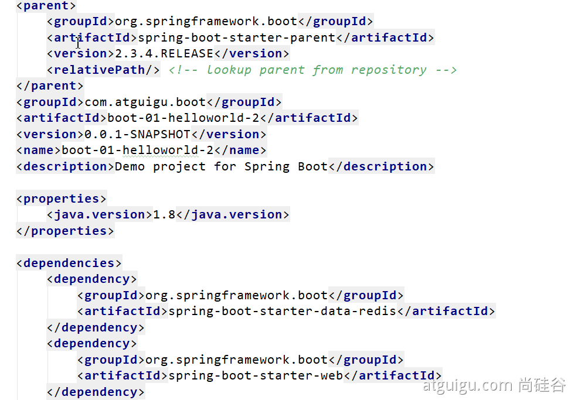
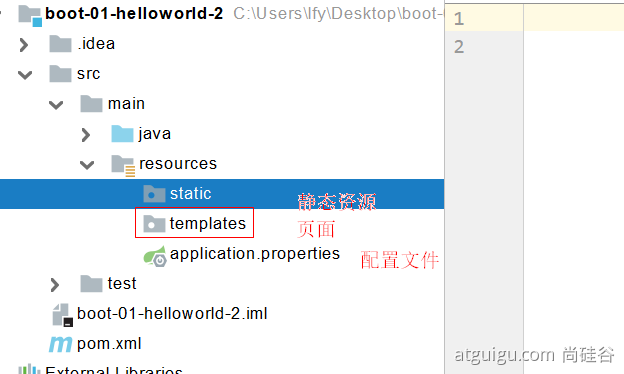
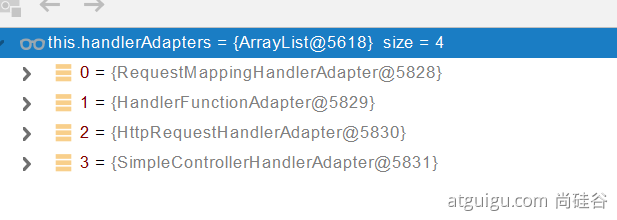
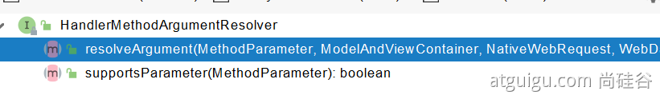
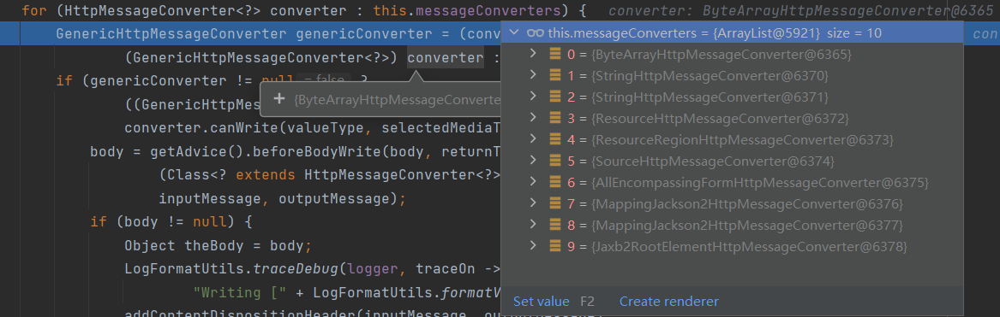
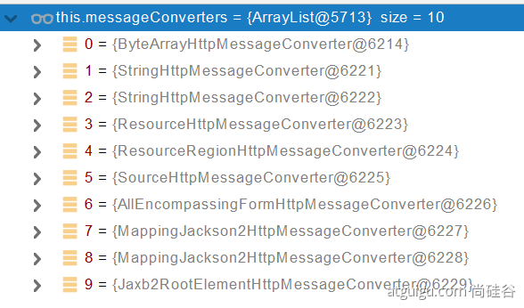
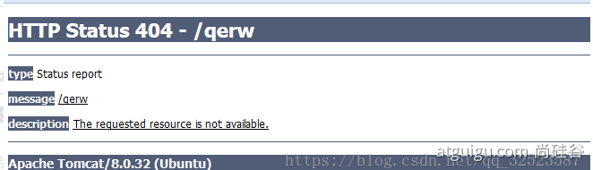

[教程地址](https://www.bilibili.com/video/BV19K4y1L7MT)

# 1 Spring与SpringBoot

## 1.1 Spring能做什么

### 1.1.1 Spring的能力


### 1.1.2 Spring的生态 

https://spring.io/projects/spring-boot

覆盖了：
* web开发
* 数据访问

* 安全控制

* 分布式

* 消息服务

* 移动开发

* 批处理

​	......

 ### 1.1.3 Spring5重大升级

#### 响应式编程

 

#### 内部源码设计

基于Java8的一些新特性，如：接口默认实现。重新设计源码架构。

## 1.2 为什么用SpringBoot

> Spring Boot makes it easy to create stand-alone, production-grade Spring based Applications that you can "just run".

> 能快速创建出生产级别的Spring应用

### 1.2.1 SpringBoot优点

* Create stand-alone Spring applications
  * 创建独立Spring应用


* Embed Tomcat, Jetty or Undertow directly (no need to deploy WAR files)
  * 内嵌web服务器


* Provide opinionated 'starter' dependencies to simplify your build configuration
  * 自动starter依赖，简化构建配置


* Automatically configure Spring and 3rd party libraries whenever possible
  * 自动配置Spring以及第三方功能


* Provide production-ready features such as metrics, health checks, and externalized configuration
  * 提供生产级别的监控、健康检查及外部化配置


* Absolutely no code generation and no requirement for XML configuration
  * 无代码生成、无需编写XML


> SpringBoot是整合Spring技术栈的一站式框架
> SpringBoot是简化Spring技术栈的快速开发脚手架

### 1.2.2 SpringBoot缺点

* 人称版本帝，迭代快，需要时刻关注变化
* 封装太深，内部原理复杂，不容易精通

## 1.3 时代背景

### 1.3.1 微服务

[James Lewis and Martin Fowler (2014)](https://martinfowler.com/articles/microservices.html)  提出微服务完整概念。https://martinfowler.com/microservices/

> In short, the microservice architectural style is an approach to developing a single application as a suite of small services, each running in its own process and communicating with lightweight mechanisms, often an HTTP resource API. These services are built around business capabilities and independently deployable by fully automated deployment machinery. There is a bare minimum of centralized management of these services, which may be written in different programming languages and use different data storage technologies.-- [James Lewis and Martin Fowler (2014)](https://martinfowler.com/articles/microservices.html)

* 微服务是一种架构风格
* 一个应用拆分为一组小型服务
* 每个服务运行在自己的进程内，也就是可独立部署和升级
* 服务之间使用轻量级HTTP交互
* 服务围绕业务功能拆分
* 可以由全自动部署机制独立部署
* 去中心化，服务自治。服务可以使用不同的语言、不同的存储技术

### 1.3.2 分布式


#### 分布式的困难

* 远程调用
* 服务发现
* 负载均衡
* 服务容错
* 配置管理
* 服务监控
* 链路追踪
* 日志管理
* 任务调度
* ......

#### 分布式的解决

SpringBoot + SpringCloud


### 1.3.3 云原生

原生应用如何上云。 Cloud Native

#### 上云的困难

* 服务自愈
* 弹性伸缩
* 服务隔离
* 自动化部署
* 灰度发布
* 流量治理
* ......

#### 上云的解决


## 1.4 如何学习SpringBoot

### 1.4.1 官网文档架构


查看版本新特性；
https://github.com/spring-projects/spring-boot/wiki#release-notes


# 2 SpringBoot2入门

## 2.1 系统要求

* [Java 8](https://www.java.com/) & 兼容java14
* Maven 3.3+
* idea 2019.1.2+

### 2.1.1 maven设置

```xml
<mirrors>
      <mirror>
        <id>nexus-aliyun</id>
        <mirrorOf>central</mirrorOf>
        <name>Nexus aliyun</name>
        <url>http://maven.aliyun.com/nexus/content/groups/public</url>
      </mirror>
  </mirrors>
 
  <profiles>
         <profile>
              <id>jdk-1.8</id>
              <activation>
                <activeByDefault>true</activeByDefault>
                <jdk>1.8</jdk>
              </activation>
              <properties>
                <maven.compiler.source>1.8</maven.compiler.source>
                <maven.compiler.target>1.8</maven.compiler.target>
                <maven.compiler.compilerVersion>1.8</maven.compiler.compilerVersion>
              </properties>
         </profile>
  </profiles>
```

## 2.2 HelloWorld

需求：浏览发送/hello请求，响应 Hello，Spring Boot 2 

### 2.2.1 创建maven工程

### 2.2.2 引入依赖

```xml
	<parent>
        <groupId>org.springframework.boot</groupId>
        <artifactId>spring-boot-starter-parent</artifactId>
        <version>2.3.4.RELEASE</version>
    </parent>


    <dependencies>
        <dependency>
            <groupId>org.springframework.boot</groupId>
            <artifactId>spring-boot-starter-web</artifactId>
        </dependency>

    </dependencies>
```

### 2.2.3 创建主程序

```java
/**
 * 主程序类
 * @SpringBootApplication：这是一个SpringBoot应用
 */
@SpringBootApplication
public class MainApplication {

    public static void main(String[] args) {
        SpringApplication.run(MainApplication.class,args);
    }
}
```

### 2.2.4 编写业务

```java
@RestController
public class HelloController {
    @RequestMapping("/hello")
    public String handle01(){
        return "Hello, Spring Boot 2!";
    }
}
```

### 2.2.5 测试

直接运行main方法

### 2.2.6 简化配置

application.properties

```properties
server.port=8888
```

### 2.2.7 简化部署

```xml
 	<build>
        <plugins>
            <plugin>
                <groupId>org.springframework.boot</groupId>
                <artifactId>spring-boot-maven-plugin</artifactId>
                //只有加上version 在idea里才不会报红
                <version>${parent.version}</version>
            </plugin>
        </plugins>
    </build>
```

把项目打成jar包，直接在目标服务器执行即可。

```
java -jar .\springbootdemo-0.0.1-SNAPSHOT.jar
```


**tips**
取消掉cmd的快速编辑模式

# 3 了解自动配置原理

## 3.1 SpringBoot特点

### 3.1.1 依赖管理

**父项目做依赖管理**

```xml
依赖管理    
<parent>
        <groupId>org.springframework.boot</groupId>
        <artifactId>spring-boot-starter-parent</artifactId>
        <version>2.3.4.RELEASE</version>
</parent>

他的父项目
 <parent>
    <groupId>org.springframework.boot</groupId>
    <artifactId>spring-boot-dependencies</artifactId>
    <version>2.3.4.RELEASE</version>
  </parent>

几乎声明了所有开发中常用的依赖的版本号,自动版本仲裁机制
```

spring-boot-dependencies 通过dependencyManagement 和 pluginManagement 几乎声明了所有**常见依赖的版本**和**常见插件的版本和配置**

**开发导入starter场景启动器**

```xml
1、见到很多 spring-boot-starter-* ： *就某种场景
2、只要引入starter，这个场景的所有常规需要的依赖我们都自动引入(maven的依赖传递)
3、SpringBoot所有支持的场景
https://docs.spring.io/spring-boot/docs/current/reference/html/using-spring-boot.html#using-boot-starter
4、见到的  *-spring-boot-starter： 第三方为我们提供的简化开发的场景启动器。
5、所有场景启动器最底层的依赖
<dependency>
  <groupId>org.springframework.boot</groupId>
  <artifactId>spring-boot-starter</artifactId>
  <version>2.3.4.RELEASE</version>
  <scope>compile</scope>
</dependency>
```

**无需关注版本号，自动版本仲裁**

>1、引入依赖默认都可以不写版本

> 2、引入非版本仲裁的jar，要写版本号

**可以修改默认版本号**

```xml
1、查看spring-boot-dependencies里面规定当前依赖的版本用的key。
2、在当前项目里面重写配置
<properties>
  <mysql.version>5.1.43</mysql.version>
</properties>
```

### 3.1.2 自动配置

**自动配置好了Tomcat**

引入Tomcat依赖 

   ```xml
   <dependency>
         <groupId>org.springframework.boot</groupId>
         <artifactId>spring-boot-starter-tomcat</artifactId>
         <version>2.3.4.RELEASE</version>
         <scope>compile</scope>
   </dependency>
   ```

配置Tomcat


**自动配好SpringMVC**

引入SpringMVC全套组件

自动配好SpringMVC常用组件（功能）


**自动配好Web常见功能，如：字符编码问题**

SpringBoot帮我们配置好了所有web开发的常见场景


**默认的包结构**

主程序所在包及其下面的所有子包里面的组件都会被默认扫描进来
无需以前的包扫描配置

想要改变扫描路径，@SpringBootApplication(scanBasePackages=**"com.atguigu"**)

或者@ComponentScan 指定扫描路径

```java
@SpringBootApplication
等同于
@SpringBootConfiguration
@EnableAutoConfiguration
@ComponentScan("com.atguigu.boot")
```
**

**各种配置拥有默认值**
默认配置最终都是映射到某个类上，如：MultipartProperties
配置文件的值最终会绑定每个类上，这个类会在容器中创建对象

**按需加载所有自动配置项**
非常多的starter
引入了哪些场景这个场景的自动配置才会开启
SpringBoot所有的自动配置功能都在 spring-boot-autoconfigure 包里面

......


## 3.2 容器功能

### 3.2.1 组件添加

#### 1 @Configuration

```java
#############################Configuration使用示例######################################################
/**
 * 1、配置类里面使用@Bean标注在方法上给容器注册组件，默认也是单实例的
 * 2、配置类本身也是组件
 * 3、proxyBeanMethods：代理bean的方法
 *      Full(proxyBeanMethods = true)、【保证每个@Bean方法被调用多少次返回的组件都是单实例的】
 *      Lite(proxyBeanMethods = false)【每个@Bean方法被调用多少次返回的组件都是新创建的】
 *      组件依赖必须使用Full模式默认。其他默认使用Lite模式
 */
@Configuration(proxyBeanMethods = false) //告诉SpringBoot这是一个配置类 == 配置文件
public class MyConfig {

    /**
     * Full:外部无论对配置类中的这个组件注册方法调用多少次获取的都是之前注册容器中的单实例对象
     * @return
     */
    @Bean //给容器中添加组件。以方法名作为组件的id。返回类型就是组件类型。返回的值，就是组件在容器中的实例
    public User user01(){
        User zhangsan = new User("zhangsan", 18);
        //user组件依赖了Pet组件
        zhangsan.setPet(tomcatPet());
        return zhangsan;
    }

    @Bean("tom")
    public Pet tomcatPet(){
        return new Pet("tomcat");
    }
}


################################@Configuration测试代码如下########################################
@SpringBootConfiguration
@EnableAutoConfiguration
@ComponentScan("com.atguigu.boot")
public class MainApplication {
    public static void main(String[] args) {
        //1、返回我们IOC容器
        ConfigurableApplicationContext run = SpringApplication.run(MainApplication.class, args);
        //2、查看容器里面的组件
        String[] names = run.getBeanDefinitionNames();
        for (String name : names) {
            System.out.println(name);
        }

        //3、从容器中获取组件
        Pet tom01 = run.getBean("tom", Pet.class);

        Pet tom02 = run.getBean("tom", Pet.class);

        System.out.println("组件："+(tom01 == tom02));


        //4、com.atguigu.boot.config.MyConfig$$EnhancerBySpringCGLIB$$51f1e1ca@1654a892
        MyConfig bean = run.getBean(MyConfig.class);
        System.out.println(bean);

        //如果@Configuration(proxyBeanMethods = true)代理对象调用方法。SpringBoot总会检查这个组件是否在容器中有。
        //保持组件单实例
        User user = bean.user01();
        User user1 = bean.user01();
        System.out.println(user == user1);


        User user01 = run.getBean("user01", User.class);
        Pet tom = run.getBean("tom", Pet.class);

        System.out.println("用户的宠物："+(user01.getPet() == tom));

    }
}
```

#### 2 @Bean、@Component、@Controller、@Service、@Repository

1. @Bean：用于在Java配置类中定义Spring Bean，通过@Bean注解的方法返回一个对象，Spring会将该对象注册为一个Bean。
2. @Component：通用的注解，用于标注一个类为Spring组件，不同于@Controller、@Service、@Repository等注解，它不具有特定的业务含义。
3. @Controller：用于标注一个类为Spring MVC控制器，处理HTTP请求。
4. @Service：用于标注一个类为业务逻辑层（Service层）的组件。
5. @Repository：用于标注一个类为数据访问层（DAO层）的组件。

这些注解都可以用于定义Spring Bean，但是它们之间的主要区别在于业务含义和使用场景：

1. @Bean注解通常用于Java配置类中，用于手动定义Bean，可以自由地定义Bean的名称和作用域，适用于一些无法使用其他注解创建的组件。
2. @Component、@Controller、@Service、@Repository注解通常用于自动扫描组件的方式来创建Bean，Spring会自动扫描标注了这些注解的类，并将其注册为Bean。它们主要的区别在于业务含义，如@Controller用于标注控制器，@Service用于标注业务逻辑层组件，@Repository用于标注数据访问层组件。

总之，在使用注解创建Spring Bean时，应该根据具体的业务场景和需求来选择合适的注解。

#### 3 @ComponentScan、@Import

1. @ComponentScan：用于指定需要扫描的包或类，并自动注册其中标注了@Component、@Controller、@Service、@Repository等注解的组件为Spring Bean。通过设置@ComponentScan注解的basePackages属性，可以指定需要扫描的包路径；也可以使用value属性作为其别名，它们的效果相同。

2. @Import：用于将一个或多个Java配置类或普通Java类的Bean定义导入到当前的配置类中。@Import注解可以导入其他的Java配置类，从而实现将多个Java配置类组合起来，构建出一个完整的Spring应用上下文。

   除此之外，@Import还可以导入普通Java类，使其成为Spring应用上下文中的Bean。

```java
 *@Import({User.class, DBHelper.class})
 *给容器中自动创建出这两个类型的组件、默认组件的名字就是全类名
 */
@Import({User.class, DBHelper.class})
@Configuration(proxyBeanMethods = false) //告诉SpringBoot这是一个配置类 == 配置文件
public class MyConfig {
}
```

3.importSelector

importSelector是一个接口，它允许我们通过编程方式向Spring容器注册Bean。当我们在@Configuration类上使用@Import注解并传递了一个实现了ImportSelector接口的类时，Spring会调用该类的selectImports方法，该方法返回一个数组，这些数组中的类将被注册为Spring Bean。

ImportSelector接口有一个方法selectImports，该方法返回一个字符串数组，这些字符串表示需要注册为Spring Bean的类。例如，下面是一个实现ImportSelector接口的例子：

```java
public class MyImportSelector implements ImportSelector {

    @Override
    public String[] selectImports(AnnotationMetadata metadata) {
        // 返回需要注册为Spring Bean的类的全限定名
        return new String[] { "com.example.MyBean1", "com.example.MyBean2" };
    }

}
```

在上面的例子中，MyImportSelector类实现了ImportSelector接口，并重写了selectImports方法。该方法返回一个字符串数组，该数组中包含了需要注册为Spring Bean的类的全限定名。使用ImportSelector接口可以动态地向Spring容器中注册Bean，这些Bean可以是普通的Java类、组件、甚至是其他的@Configuration类。例如，我们可以在一个@Configuration类中使用@Import注解并传递一个实现ImportSelector接口的类，从而动态地注册多个Bean。

总之，ImportSelector接口允许我们通过编程方式向Spring容器注册Bean，它可以让我们更加灵活地控制Spring容器中的Bean，使得我们可以更加方便地对Spring应用程序进行扩展和定制。

4.ImportBeanDefinitionRegistrar

ImportBeanDefinitionRegistrar是一个接口，它允许我们通过编程方式向Spring容器注册Bean定义。当我们在@Configuration类上使用@Import注解并传递了一个实现了ImportBeanDefinitionRegistrar接口的类时，Spring会调用该类的registerBeanDefinitions方法，该方法可以向Spring容器注册Bean定义。

ImportBeanDefinitionRegistrar接口有一个方法registerBeanDefinitions，该方法允许我们向Spring容器注册Bean定义。在这个方法中，我们可以使用BeanDefinitionRegistry接口将Bean定义注册到Spring容器中。例如，下面是一个实现ImportBeanDefinitionRegistrar接口的例子：

```java
public class MyImportBeanDefinitionRegistrar implements ImportBeanDefinitionRegistrar {

    @Override
    public void registerBeanDefinitions(AnnotationMetadata metadata, BeanDefinitionRegistry registry) {
        // 创建一个Bean定义
        BeanDefinition beanDefinition = BeanDefinitionBuilder
                .genericBeanDefinition(MyBean.class)
                .getBeanDefinition();

        // 向Spring容器中注册Bean定义
        registry.registerBeanDefinition("myBean", beanDefinition);
    }

}
```

在上面的例子中，MyImportBeanDefinitionRegistrar类实现了ImportBeanDefinitionRegistrar接口，并重写了registerBeanDefinitions方法。在这个方法中，我们创建了一个Bean定义，并使用BeanDefinitionRegistry接口将其注册到Spring容器中。

使用ImportBeanDefinitionRegistrar接口可以动态地向Spring容器中注册Bean，这些Bean可以是普通的Java类、组件、甚至是其他的@Configuration类。例如，我们可以在一个@Configuration类中使用@Import注解并传递一个实现ImportBeanDefinitionRegistrar接口的类，从而动态地注册多个Bean定义。

总之，ImportBeanDefinitionRegistrar接口允许我们通过编程方式向Spring容器注册Bean定义，它可以让我们更加灵活地控制Spring容器中的Bean定义，使得我们可以更加方便地对Spring应用程序进行扩展和定制。


5 DeterminableImports

DeterminableImports是一个接口，它允许在Spring应用程序上下文的bean定义注册期间动态地确定要导入的类。当我们在@Configuration类上使用@Import注解并传递一个实现了DeterminableImports接口的类时，Spring会调用该类的determineImports方法，该方法返回一个数组，这些数组中的类将被注册为Spring Bean。

DeterminableImports接口有一个方法determineImports，该方法返回一个Class<?>数组，这些数组中的类将被注册为Spring Bean。例如，下面是一个实现DeterminableImports接口的例子：

```java
public class MyDeterminableImports implements DeterminableImports {

    @Override
    public Set<Class<?>> determineImports(AnnotationMetadata metadata) {
        Set<Class<?>> classes = new HashSet<>();
        classes.add(MyBean1.class);
        classes.add(MyBean2.class);
        return classes;
    }

}
```

在上面的例子中，MyDeterminableImports类实现了DeterminableImports接口，并重写了determineImports方法。该方法返回一个Class<?>数组，其中包含了需要注册为Spring Bean的类。

使用DeterminableImports接口可以动态地向Spring容器中注册Bean，这些Bean可以是普通的Java类、组件、甚至是其他的@Configuration类。例如，我们可以在一个@Configuration类中使用@Import注解并传递一个实现DeterminableImports接口的类，从而动态地注册多个Bean。

总之，DeterminableImports接口允许我们动态地确定要导入的类，从而更加灵活地控制Spring容器中的Bean，使得我们可以更加方便地对Spring应用程序进行扩展和定制。

#### 4 @Conditional

条件装配：满足Conditional指定的条件，则进行组件注入


```java
@Configuration(proxyBeanMethods = false)
@ConditionalOnMissingBean(name = "tom")
public class MyConfig {

    @Bean
    public User user01(){
        User zhangsan = new User("zhangsan", 18);
        //user组件依赖了Pet组件
        zhangsan.setPet(tomcatPet());
        return zhangsan;
    }

    @Bean("tom22")
    public Pet tomcatPet(){
        return new Pet("tomcat");
    }
}

public static void main(String[] args) {
        //1、返回我们IOC容器
        ConfigurableApplicationContext run = SpringApplication.run(MainApplication.class, args);

        //2、查看容器里面的组件
        String[] names = run.getBeanDefinitionNames();
        for (String name : names) {
            System.out.println(name);
        }

        boolean tom = run.containsBean("tom");
        System.out.println("容器中Tom组件："+tom);

        boolean user01 = run.containsBean("user01");
        System.out.println("容器中user01组件："+user01);

        boolean tom22 = run.containsBean("tom22");
        System.out.println("容器中tom22组件："+tom22);
    }
}
```

### 3.2.2 原生配置文件引入

#### @ImportResource

```xml
======================beans.xml=========================
<?xml version="1.0" encoding="UTF-8"?>
<beans xmlns="http://www.springframework.org/schema/beans"
       xmlns:xsi="http://www.w3.org/2001/XMLSchema-instance"
       xmlns:context="http://www.springframework.org/schema/context"
       xsi:schemaLocation="http://www.springframework.org/schema/beans http://www.springframework.org/schema/beans/spring-beans.xsd http://www.springframework.org/schema/context https://www.springframework.org/schema/context/spring-context.xsd">

    <bean id="haha" class="com.atguigu.boot.bean.User">
        <property name="name" value="zhangsan"></property>
        <property name="age" value="18"></property>
    </bean>

    <bean id="hehe" class="com.atguigu.boot.bean.Pet">
        <property name="name" value="tomcat"></property>
    </bean>
</beans>
```

```java
@ImportResource("classpath:beans.xml")
public class MyConfig {}

======================测试=================
        boolean haha = run.containsBean("haha");
        boolean hehe = run.containsBean("hehe");
        System.out.println("haha："+haha);//true
        System.out.println("hehe："+hehe);//true
```

### 3.2.3 配置绑定

如何使用Java读取到properties文件中的内容，并且把它封装到JavaBean中，以供随时使用；

```java
public class getProperties {
     public static void main(String[] args) throws FileNotFoundException, IOException {
         Properties pps = new Properties();
         pps.load(new FileInputStream("a.properties"));
         Enumeration enum1 = pps.propertyNames();//得到配置文件的名字
         while(enum1.hasMoreElements()) {
             String strKey = (String) enum1.nextElement();
             String strValue = pps.getProperty(strKey);
             System.out.println(strKey + "=" + strValue);
             //封装到JavaBean。
         }
     }
 }
```


**1 @Component + @ConfigurationProperties**

```java
/**
 * 只有在容器中的组件，才会拥有SpringBoot提供的强大功能
 */
@Component
@ConfigurationProperties(prefix = "mycar")
public class Car {

    private String brand;
    private Integer price;

    public String getBrand() {
        return brand;
    }

    public void setBrand(String brand) {
        this.brand = brand;
    }

    public Integer getPrice() {
        return price;
    }

    public void setPrice(Integer price) {
        this.price = price;
    }

    @Override
    public String toString() {
        return "Car{" +
                "brand='" + brand + '\'' +
                ", price=" + price +
                '}';
    }
}
```

**2 @EnableConfigurationProperties + @ConfigurationProperties**

```java
@ConfigurationProperties(prefix = "mycar")
public class Car {

    private String brand;
    private Integer price;

    public String getBrand() {
        return brand;
    }

    public void setBrand(String brand) {
        this.brand = brand;
    }

    public Integer getPrice() {
        return price;
    }

    public void setPrice(Integer price) {
        this.price = price;
    }

    @Override
    public String toString() {
        return "Car{" +
                "brand='" + brand + '\'' +
                ", price=" + price +
                '}';
    }
}
```

```java
@EnableConfigurationProperties(Car.class)
//1、开启Car配置绑定功能
//2、把这个Car这个组件自动注册到容器中
public class MyConfig {
}
```

**3 测试**

```pro
mycar.brand = ED
mycar.price = 10000
```

```java
ConfigurableApplicationContext run = SpringApplication.run(SpringbootdemoApplication.class, args);
Car car = run.getBean("car", Car.class);
System.out.println(car);
```


## 3.3 自动配置原理入门

### 3.3.1、引导加载自动配置类

```java
package com.example.springbootdemo;

import org.springframework.boot.SpringApplication;
import org.springframework.boot.autoconfigure.SpringBootApplication;

@SpringBootApplication
public class SpringbootdemoApplication {

    public static void main(String[] args) {
        SpringApplication.run(SpringbootdemoApplication.class, args);
    }
}
```

**@SpringBootApplication**是Spring Boot应用程序的核心注解之一，它是一个组合注解，包含了以下三个注解的功能：

1. **@SpringBootConfiguration**：表示这是一个Spring Boot的配置类，它会自动扫描和加载应用程序中的所有@Configuration注解的配置类。
2. **@ComponentScan**：启用组件扫描功能，它会自动扫描应用程序中的所有@Controller、@Service、@Repository和@Component注解的类，并将它们注册为Spring Bean。
3. **@EnableAutoConfiguration**：启用Spring Boot的自动配置功能，自动配置类会根据条件注解来自动配置Spring应用程序。

```java
@AutoConfigurationPackage
@Import(AutoConfigurationImportSelector.class)
public @interface EnableAutoConfiguration {}
```

​	**@AutoConfigurationPackage**

​	自动配置包 指定了默认的包规则

```
@Import(AutoConfigurationPackages.Registrar.class)  //给容器中导入一个组件
public @interface AutoConfigurationPackage {}

//利用Registrar给容器中导入一系列组件
//将指定的一个包下的所有组件导入进来？MainApplication 所在包下。
```

​	@**Import(AutoConfigurationImportSelector.class)**

​	这个注解是关键，由上面import的用法可知，会调用AutoConfigurationImportSelector的selectImports方法

​	下面是方法具体流程

```
+--------------------------------------------------------+
|                      Main Process                       |
+--------------------------------------------------------+
         |
         v
+--------------------------------------------------------+
|     1     getAutoConfigurationEntry() Function           |
+--------------------------------------------------------+
         |
         v
+--------------------------------------------------------+
|  2   getCandidateConfigurations() Function               |
+--------------------------------------------------------+
         |
         v
+--------------------------------------------------------+
|     3    loadSpringFactories() Function                  |
+--------------------------------------------------------+
         |
         v
+--------------------------------------------------------+
|  4  Read META-INF/spring.factories File                  |
+--------------------------------------------------------+
         |
         v
+--------------------------------------------------------+
|  5 return all class qualified names to load                  |
+--------------------------------------------------------+
         |
         v
+--------------------------------------------------------+
|                      End Process                        |
+--------------------------------------------------------+

```


META-INF/spring.factories File  文件里面写死了spring-boot一启动就要给容器中加载的所有配置类

```
文件里面写死了spring-boot一启动就要给容器中加载的所有配置类
spring-boot-autoconfigure-2.3.4.RELEASE.jar/META-INF/spring.factories
# Auto Configure
org.springframework.boot.autoconfigure.EnableAutoConfiguration=\
org.springframework.boot.autoconfigure.admin.SpringApplicationAdminJmxAutoConfiguration,\
org.springframework.boot.autoconfigure.aop.AopAutoConfiguration,\
org.springframework.boot.autoconfigure.amqp.RabbitAutoConfiguration,\
org.springframework.boot.autoconfigure.batch.BatchAutoConfiguration,\
org.springframework.boot.autoconfigure.cache.CacheAutoConfiguration,\
org.springframework.boot.autoconfigure.cassandra.CassandraAutoConfiguration,\
org.springframework.boot.autoconfigure.context.ConfigurationPropertiesAutoConfiguration,\
org.springframework.boot.autoconfigure.context.LifecycleAutoConfiguration,\
org.springframework.boot.autoconfigure.context.MessageSourceAutoConfiguration,\
org.springframework.boot.autoconfigure.context.PropertyPlaceholderAutoConfiguration,\
org.springframework.boot.autoconfigure.couchbase.CouchbaseAutoConfiguration,\
org.springframework.boot.autoconfigure.dao.PersistenceExceptionTranslationAutoConfiguration,\
org.springframework.boot.autoconfigure.data.cassandra.CassandraDataAutoConfiguration,\
org.springframework.boot.autoconfigure.data.cassandra.CassandraReactiveDataAutoConfiguration,\
org.springframework.boot.autoconfigure.data.cassandra.CassandraReactiveRepositoriesAutoConfiguration,\
org.springframework.boot.autoconfigure.data.cassandra.CassandraRepositoriesAutoConfiguration,\
org.springframework.boot.autoconfigure.data.couchbase.CouchbaseDataAutoConfiguration,\
org.springframework.boot.autoconfigure.data.couchbase.CouchbaseReactiveDataAutoConfiguration,\
org.springframework.boot.autoconfigure.data.couchbase.CouchbaseReactiveRepositoriesAutoConfiguration,\
org.springframework.boot.autoconfigure.data.couchbase.CouchbaseRepositoriesAutoConfiguration,\
org.springframework.boot.autoconfigure.data.elasticsearch.ElasticsearchDataAutoConfiguration,\
org.springframework.boot.autoconfigure.data.elasticsearch.ElasticsearchRepositoriesAutoConfiguration,\
org.springframework.boot.autoconfigure.data.elasticsearch.ReactiveElasticsearchRepositoriesAutoConfiguration,\
org.springframework.boot.autoconfigure.data.elasticsearch.ReactiveElasticsearchRestClientAutoConfiguration,\
org.springframework.boot.autoconfigure.data.jdbc.JdbcRepositoriesAutoConfiguration,\
org.springframework.boot.autoconfigure.data.jpa.JpaRepositoriesAutoConfiguration,\
org.springframework.boot.autoconfigure.data.ldap.LdapRepositoriesAutoConfiguration,\
org.springframework.boot.autoconfigure.data.mongo.MongoDataAutoConfiguration,\
org.springframework.boot.autoconfigure.data.mongo.MongoReactiveDataAutoConfiguration,\
org.springframework.boot.autoconfigure.data.mongo.MongoReactiveRepositoriesAutoConfiguration,\
org.springframework.boot.autoconfigure.data.mongo.MongoRepositoriesAutoConfiguration,\
org.springframework.boot.autoconfigure.data.neo4j.Neo4jDataAutoConfiguration,\
org.springframework.boot.autoconfigure.data.neo4j.Neo4jRepositoriesAutoConfiguration,\
org.springframework.boot.autoconfigure.data.solr.SolrRepositoriesAutoConfiguration,\
org.springframework.boot.autoconfigure.data.r2dbc.R2dbcDataAutoConfiguration,\
org.springframework.boot.autoconfigure.data.r2dbc.R2dbcRepositoriesAutoConfiguration,\
org.springframework.boot.autoconfigure.data.r2dbc.R2dbcTransactionManagerAutoConfiguration,\
org.springframework.boot.autoconfigure.data.redis.RedisAutoConfiguration,\
org.springframework.boot.autoconfigure.data.redis.RedisReactiveAutoConfiguration,\
org.springframework.boot.autoconfigure.data.redis.RedisRepositoriesAutoConfiguration,\
org.springframework.boot.autoconfigure.data.rest.RepositoryRestMvcAutoConfiguration,\
org.springframework.boot.autoconfigure.data.web.SpringDataWebAutoConfiguration,\
org.springframework.boot.autoconfigure.elasticsearch.ElasticsearchRestClientAutoConfiguration,\
org.springframework.boot.autoconfigure.flyway.FlywayAutoConfiguration,\
org.springframework.boot.autoconfigure.freemarker.FreeMarkerAutoConfiguration,\
org.springframework.boot.autoconfigure.groovy.template.GroovyTemplateAutoConfiguration,\
org.springframework.boot.autoconfigure.gson.GsonAutoConfiguration,\
org.springframework.boot.autoconfigure.h2.H2ConsoleAutoConfiguration,\
org.springframework.boot.autoconfigure.hateoas.HypermediaAutoConfiguration,\
org.springframework.boot.autoconfigure.hazelcast.HazelcastAutoConfiguration,\
org.springframework.boot.autoconfigure.hazelcast.HazelcastJpaDependencyAutoConfiguration,\
org.springframework.boot.autoconfigure.http.HttpMessageConvertersAutoConfiguration,\
org.springframework.boot.autoconfigure.http.codec.CodecsAutoConfiguration,\
org.springframework.boot.autoconfigure.influx.InfluxDbAutoConfiguration,\
org.springframework.boot.autoconfigure.info.ProjectInfoAutoConfiguration,\
org.springframework.boot.autoconfigure.integration.IntegrationAutoConfiguration,\
org.springframework.boot.autoconfigure.jackson.JacksonAutoConfiguration,\
org.springframework.boot.autoconfigure.jdbc.DataSourceAutoConfiguration,\
org.springframework.boot.autoconfigure.jdbc.JdbcTemplateAutoConfiguration,\
org.springframework.boot.autoconfigure.jdbc.JndiDataSourceAutoConfiguration,\
org.springframework.boot.autoconfigure.jdbc.XADataSourceAutoConfiguration,\
org.springframework.boot.autoconfigure.jdbc.DataSourceTransactionManagerAutoConfiguration,\
org.springframework.boot.autoconfigure.jms.JmsAutoConfiguration,\
org.springframework.boot.autoconfigure.jmx.JmxAutoConfiguration,\
org.springframework.boot.autoconfigure.jms.JndiConnectionFactoryAutoConfiguration,\
org.springframework.boot.autoconfigure.jms.activemq.ActiveMQAutoConfiguration,\
org.springframework.boot.autoconfigure.jms.artemis.ArtemisAutoConfiguration,\
org.springframework.boot.autoconfigure.jersey.JerseyAutoConfiguration,\
org.springframework.boot.autoconfigure.jooq.JooqAutoConfiguration,\
org.springframework.boot.autoconfigure.jsonb.JsonbAutoConfiguration,\
org.springframework.boot.autoconfigure.kafka.KafkaAutoConfiguration,\
org.springframework.boot.autoconfigure.availability.ApplicationAvailabilityAutoConfiguration,\
org.springframework.boot.autoconfigure.ldap.embedded.EmbeddedLdapAutoConfiguration,\
org.springframework.boot.autoconfigure.ldap.LdapAutoConfiguration,\
org.springframework.boot.autoconfigure.liquibase.LiquibaseAutoConfiguration,\
org.springframework.boot.autoconfigure.mail.MailSenderAutoConfiguration,\
org.springframework.boot.autoconfigure.mail.MailSenderValidatorAutoConfiguration,\
org.springframework.boot.autoconfigure.mongo.embedded.EmbeddedMongoAutoConfiguration,\
org.springframework.boot.autoconfigure.mongo.MongoAutoConfiguration,\
org.springframework.boot.autoconfigure.mongo.MongoReactiveAutoConfiguration,\
org.springframework.boot.autoconfigure.mustache.MustacheAutoConfiguration,\
org.springframework.boot.autoconfigure.orm.jpa.HibernateJpaAutoConfiguration,\
org.springframework.boot.autoconfigure.quartz.QuartzAutoConfiguration,\
org.springframework.boot.autoconfigure.r2dbc.R2dbcAutoConfiguration,\
org.springframework.boot.autoconfigure.rsocket.RSocketMessagingAutoConfiguration,\
org.springframework.boot.autoconfigure.rsocket.RSocketRequesterAutoConfiguration,\
org.springframework.boot.autoconfigure.rsocket.RSocketServerAutoConfiguration,\
org.springframework.boot.autoconfigure.rsocket.RSocketStrategiesAutoConfiguration,\
org.springframework.boot.autoconfigure.security.servlet.SecurityAutoConfiguration,\
org.springframework.boot.autoconfigure.security.servlet.UserDetailsServiceAutoConfiguration,\
org.springframework.boot.autoconfigure.security.servlet.SecurityFilterAutoConfiguration,\
org.springframework.boot.autoconfigure.security.reactive.ReactiveSecurityAutoConfiguration,\
org.springframework.boot.autoconfigure.security.reactive.ReactiveUserDetailsServiceAutoConfiguration,\
org.springframework.boot.autoconfigure.security.rsocket.RSocketSecurityAutoConfiguration,\
org.springframework.boot.autoconfigure.security.saml2.Saml2RelyingPartyAutoConfiguration,\
org.springframework.boot.autoconfigure.sendgrid.SendGridAutoConfiguration,\
org.springframework.boot.autoconfigure.session.SessionAutoConfiguration,\
org.springframework.boot.autoconfigure.security.oauth2.client.servlet.OAuth2ClientAutoConfiguration,\
org.springframework.boot.autoconfigure.security.oauth2.client.reactive.ReactiveOAuth2ClientAutoConfiguration,\
org.springframework.boot.autoconfigure.security.oauth2.resource.servlet.OAuth2ResourceServerAutoConfiguration,\
org.springframework.boot.autoconfigure.security.oauth2.resource.reactive.ReactiveOAuth2ResourceServerAutoConfiguration,\
org.springframework.boot.autoconfigure.solr.SolrAutoConfiguration,\
org.springframework.boot.autoconfigure.task.TaskExecutionAutoConfiguration,\
org.springframework.boot.autoconfigure.task.TaskSchedulingAutoConfiguration,\
org.springframework.boot.autoconfigure.thymeleaf.ThymeleafAutoConfiguration,\
org.springframework.boot.autoconfigure.transaction.TransactionAutoConfiguration,\
org.springframework.boot.autoconfigure.transaction.jta.JtaAutoConfiguration,\
org.springframework.boot.autoconfigure.validation.ValidationAutoConfiguration,\
org.springframework.boot.autoconfigure.web.client.RestTemplateAutoConfiguration,\
org.springframework.boot.autoconfigure.web.embedded.EmbeddedWebServerFactoryCustomizerAutoConfiguration,\
org.springframework.boot.autoconfigure.web.reactive.HttpHandlerAutoConfiguration,\
org.springframework.boot.autoconfigure.web.reactive.ReactiveWebServerFactoryAutoConfiguration,\
org.springframework.boot.autoconfigure.web.reactive.WebFluxAutoConfiguration,\
org.springframework.boot.autoconfigure.web.reactive.error.ErrorWebFluxAutoConfiguration,\
org.springframework.boot.autoconfigure.web.reactive.function.client.ClientHttpConnectorAutoConfiguration,\
org.springframework.boot.autoconfigure.web.reactive.function.client.WebClientAutoConfiguration,\
org.springframework.boot.autoconfigure.web.servlet.DispatcherServletAutoConfiguration,\
org.springframework.boot.autoconfigure.web.servlet.ServletWebServerFactoryAutoConfiguration,\
org.springframework.boot.autoconfigure.web.servlet.error.ErrorMvcAutoConfiguration,\
org.springframework.boot.autoconfigure.web.servlet.HttpEncodingAutoConfiguration,\
org.springframework.boot.autoconfigure.web.servlet.MultipartAutoConfiguration,\
org.springframework.boot.autoconfigure.web.servlet.WebMvcAutoConfiguration,\
org.springframework.boot.autoconfigure.websocket.reactive.WebSocketReactiveAutoConfiguration,\
org.springframework.boot.autoconfigure.websocket.servlet.WebSocketServletAutoConfiguration,\
org.springframework.boot.autoconfigure.websocket.servlet.WebSocketMessagingAutoConfiguration,\
org.springframework.boot.autoconfigure.webservices.WebServicesAutoConfiguration,\
org.springframework.boot.autoconfigure.webservices.client.WebServiceTemplateAutoConfiguration
```

### 3.3.2 按需开启自动配置项

虽然我们127个场景的所有自动配置启动的时候默认全部加载。xxxxAutoConfiguration

按照条件装配规则（@Conditional），最终会按需配置。

### 3.3.3 修改默认配置

```java
        @Bean
		@ConditionalOnBean(MultipartResolver.class)  //容器中有这个类型组件
		@ConditionalOnMissingBean(name = DispatcherServlet.MULTIPART_RESOLVER_BEAN_NAME) //容器中没有这个名字 multipartResolver 的组件
		public MultipartResolver multipartResolver(MultipartResolver resolver) {
            //给@Bean标注的方法传入了对象参数，这个参数的值就会从容器中找。
            //SpringMVC multipartResolver。防止有些用户配置的文件上传解析器不符合规范
			// Detect if the user has created a MultipartResolver but named it incorrectly
			return resolver;
		}
给容器中加入了文件上传解析器；
```

SpringBoot默认会在底层配好所有的组件。但是如果用户自己配置了以用户的优先

```java
@Bean
	@ConditionalOnMissingBean
	public CharacterEncodingFilter characterEncodingFilter() {
    }
```

总结：
SpringBoot先加载所有的自动配置类  xxxxxAutoConfiguration
每个自动配置类按照条件进行生效，默认都会绑定配置文件指定的值。xxxxProperties里面拿。xxxProperties和配置文件进行了绑定
生效的配置类就会给容器中装配很多组件
只要容器中有这些组件，相当于这些功能就有了
定制化配置
○用户直接自己@Bean替换底层的组件
○用户去看这个组件是获取的配置文件什么值就去修改。
xxxxxAutoConfiguration ---> 组件  ---> xxxxProperties里面拿值  ----> application.properties

### 3.3.4 最佳实践

引入场景依赖
https://docs.spring.io/spring-boot/docs/current/reference/html/using-spring-boot.html#using-boot-starter

查看自动配置了哪些（选做）
自己分析，引入场景对应的自动配置一般都生效了
配置文件中debug=true开启自动配置报告。Negative（不生效）\Positive（生效）

是否需要修改
参照文档修改配置项
https://docs.spring.io/spring-boot/docs/current/reference/html/appendix-application-properties.html#common-application-properties
自己分析。xxxxProperties绑定了配置文件的哪些。
自定义加入或者替换组件
@Bean、@Component。。。
自定义器  XXXXXCustomizer；
.....

## 3.4 开发小技巧

### 3.4.1 Lombok

简化JavaBean开发

idea中搜索安装lombok插件

```xml
<dependency>
    <groupId>org.projectlombok</groupId>
    <artifactId>lombok</artifactId>
</dependency>
```

```java
===============================简化JavaBean开发===================================
@NoArgsConstructor
//@AllArgsConstructor
@Data
@ToString
@EqualsAndHashCode
public class User {

    private String name;
    private Integer age;

    private Pet pet;

    public User(String name,Integer age){
        this.name = name;
        this.age = age;
    }


}


================================简化日志开发===================================
@Slf4j
@RestController
public class HelloController {
    @RequestMapping("/hello")
    public String handle01(@RequestParam("name") String name){
        
        log.info("请求进来了....");
        
        return "Hello, Spring Boot 2!"+"你好："+name;
    }
}
```

### 3.4.2 **dev-tools**

```xml
<dependency>
    <groupId>org.springframework.boot</groupId>
    <artifactId>spring-boot-devtools</artifactId>
    <optional>true</optional>
</dependency>
```

### 3.4.3 **Spring Initailizr（项目初始化向导）**

**选择我们需要的开发场景**


**自动依赖引入**




**自动创建项目结构**



**自动编写好主配置类**


# 4 配置文件

## 4.1 文件类型

### 4.1.1 **properties**

同以前的properties用法

### 4.1.2 yaml

#### 简介

YAML 是 "YAML Ain't Markup Language"（YAML 不是一种标记语言）的递归缩写。在开发的这种语言时，YAML 的意思其实是："Yet Another Markup Language"（仍是一种标记语言）。 

非常适合用来做以数据为中心的配置文件

#### 基本语法

key: value；kv之间有空格

大小写敏感

使用缩进表示层级关系

缩进不允许使用tab，只允许空格

缩进的空格数不重要，只要相同层级的元素左对齐即可

'#'表示注释

字符串无需加引号，如果要加，''与""表示字符串内容 会被 转义/不转义

#### 数据类型

字面量：单个的、不可再分的值。date、boolean、string、number、null

```yaml
k: v
```

对象：键值对的集合。map、hash、set、object 

```yaml
行内写法：  k: {k1:v1,k2:v2,k3:v3}
#或
k: 
	k1: v1
  	k2: v2
 	 k3: v3
```

数组：一组按次序排列的值。array、list、queue

```yaml
行内写法：  k: [v1,v2,v3]
#或者
k:
 - v1
 - v2
 - v3
```

#### 示例

```java
@Data
public class Person {
	
	private String userName;
	private Boolean boss;
	private Date birth;
	private Integer age;
	private Pet pet;
	private String[] interests;
	private List<String> animal;
	private Map<String, Object> score;
	private Set<Double> salarys;
	private Map<String, List<Pet>> allPets;
}

@Data
public class Pet {
	private String name;
	private Double weight;
}
```

```yaml
# yaml表示以上对象
person:
  userName: zhangsan
  boss: false
  birth: 2019/12/12 20:12:33
  age: 18
  pet: 
    name: tomcat
    weight: 23.4
  interests: [篮球,游泳]
  animal: 
    - jerry
    - mario
  score:
    english: 
      first: 30
      second: 40
      third: 50
    math: [131,140,148]
    chinese: {first: 128,second: 136}
  salarys: [3999,4999.98,5999.99]
  allPets:
    sick:
      - {name: tom}
      - {name: jerry,weight: 47}
    health: [{name: mario,weight: 47}]
```


### 4.2 配置提示
```xml
<dependency>
    <groupId>org.springframework.boot</groupId>
    <artifactId>spring-boot-configuration-processor</artifactId>
    <optional>true</optional>
</dependency>


 <build>
        <plugins>
            <plugin>
                <groupId>org.springframework.boot</groupId>
                <artifactId>spring-boot-maven-plugin</artifactId>
                <configuration>
                    <excludes>
                        <exclude>
                            <groupId>org.springframework.boot</groupId>
                            <artifactId>spring-boot-configuration-processor</artifactId>
                        </exclude>
                    </excludes>
                </configuration>
            </plugin>
        </plugins>
    </build>
```

# 5 Web开发


## 5.1 **SpringMVC自动配置概览**

Spring Boot provides auto-configuration for Spring MVC that works well with most applications.(大多场景我们都无需自定义配置)
The auto-configuration adds the following features on top of Spring’s defaults:
Inclusion of ContentNegotiatingViewResolver and BeanNameViewResolver beans.
内容协商视图解析器和BeanName视图解析器
Support for serving static resources, including support for WebJars (covered [later in this document](https://docs.spring.io/spring-boot/docs/current/reference/html/spring-boot-features.html#boot-features-spring-mvc-static-content))).
静态资源（包括webjars）
Automatic registration of Converter, GenericConverter, and Formatter beans.
自动注册 Converter，GenericConverter，Formatter 
Support for HttpMessageConverters (covered [later in this document](https://docs.spring.io/spring-boot/docs/current/reference/html/spring-boot-features.html#boot-features-spring-mvc-message-converters)).
支持 HttpMessageConverters （后来我们配合内容协商理解原理）
Automatic registration of MessageCodesResolver (covered [later in this document](https://docs.spring.io/spring-boot/docs/current/reference/html/spring-boot-features.html#boot-features-spring-message-codes)).
自动注册 MessageCodesResolver （国际化用）
Static index.html support.
静态index.html 页支持
Custom Favicon support (covered [later in this document](https://docs.spring.io/spring-boot/docs/current/reference/html/spring-boot-features.html#boot-features-spring-mvc-favicon)).
自定义 Favicon  
Automatic use of a ConfigurableWebBindingInitializer bean (covered [later in this document](https://docs.spring.io/spring-boot/docs/current/reference/html/spring-boot-features.html#boot-features-spring-mvc-web-binding-initializer)).
自动使用 ConfigurableWebBindingInitializer ，（DataBinder负责将请求数据绑定到JavaBean上）

> If you want to keep those Spring Boot MVC customizations and make more [MVC customizations](https://docs.spring.io/spring/docs/5.2.9.RELEASE/spring-framework-reference/web.html#mvc) (interceptors, formatters, view controllers, and other features), you can add your own @Configuration class of type WebMvcConfigurer but without @EnableWebMvc.
> 不用@EnableWebMvc注解。使用 @Configuration + WebMvcConfigurer 自定义规则

> If you want to provide custom instances of RequestMappingHandlerMapping, RequestMappingHandlerAdapter, or ExceptionHandlerExceptionResolver, and still keep the Spring Boot MVC customizations, you can declare a bean of type WebMvcRegistrations and use it to provide custom instances of those components.
> 声明 WebMvcRegistrations 改变默认底层组件

> If you want to take complete control of Spring MVC, you can add your own @Configuration annotated with @EnableWebMvc, or alternatively add your own @Configuration-annotated DelegatingWebMvcConfiguration as described in the Javadoc of @EnableWebMvc.
> 使用 @EnableWebMvc+@Configuration+DelegatingWebMvcConfiguration 全面接管SpringMVC

## 5.2 **简单功能分析**

### 5.2.1 **静态资源访问**

#### 1 静态资源目录

只要静态资源放在类路径下： called /static (or /public or /resources or /META-INF/resources
访问 ： 当前项目根路径/ + 静态资源名 

原理： 静态映射/**。
请求进来，先去找Controller看能不能处理。不能处理的所有请求又都交给静态资源处理器。静态资源也找不到则响应404页面

改变默认的静态资源路径

```yaml
spring:
  mvc:
    static-path-pattern: /res/**

  resources:
    static-locations: [classpath:/haha/]
```

#### 2 **静态资源访问前缀**

```yaml
spring:
  mvc:
    static-path-pattern: /res/**
```

当前项目 + static-path-pattern + 静态资源名 = 静态资源文件夹下找

#### 3 webjar

自动映射 /[webjars](http://localhost:8080/webjars/jquery/3.5.1/jquery.js)/**
https://www.webjars.org/

```xml
<dependency>
    <groupId>org.webjars</groupId>
    <artifactId>jquery</artifactId>
    <version>3.5.1</version>
</dependency>
```

访问地址：http://localhost:8080/webjars/jquery/3.5.1/jquery.js   后面地址要按照依赖里面的包路径

### 5.2.2 **欢迎页支持**

静态资源路径下  index.html
可以配置静态资源路径
但是不可以配置静态资源的访问前缀。否则导致 index.html不能被默认访问

```yaml
spring:
#  mvc:
#    static-path-pattern: /res/**   这个会导致welcome page功能失效

  resources:
    static-locations: [classpath:/haha/]
```

### 5.2.3 自定义**Favicon**

favicon.ico 放在静态资源目录下即可。

```yaml
spring:
#  mvc:
#    static-path-pattern: /res/**   这个会导致 Favicon 功能失效
```

### 5.2.4 **静态资源配置原理**

SpringBoot启动默认加载  xxxAutoConfiguration 类（自动配置类）

SpringMVC功能的自动配置类 WebMvcAutoConfiguration，生效

```java
@Configuration(proxyBeanMethods = false)
@ConditionalOnWebApplication(type = Type.SERVLET)
@ConditionalOnClass({ Servlet.class, DispatcherServlet.class, WebMvcConfigurer.class })
@ConditionalOnMissingBean(WebMvcConfigurationSupport.class)
@AutoConfigureOrder(Ordered.HIGHEST_PRECEDENCE + 10)
@AutoConfigureAfter({ DispatcherServletAutoConfiguration.class, TaskExecutionAutoConfiguration.class,
		ValidationAutoConfiguration.class })
public class WebMvcAutoConfiguration {}
```

给容器中配了什么？

```java
@Configuration(proxyBeanMethods = false)
@Import(EnableWebMvcConfiguration.class)
@EnableConfigurationProperties({ WebMvcProperties.class, ResourceProperties.class })
@Order(0)
public static class WebMvcAutoConfigurationAdapter implements WebMvcConfigurer {}
```

配置文件的相关属性和xxx进行了绑定。WebMvcProperties==spring.mvc、ResourceProperties==spring.resources

#### 1 **配置类只有一个有参构造器**

```java
//有参构造器所有参数的值都会从容器中确定
//ResourceProperties resourceProperties；获取和spring.resources绑定的所有的值的对象
//WebMvcProperties mvcProperties 获取和spring.mvc绑定的所有的值的对象
//ListableBeanFactory beanFactory Spring的beanFactory
//HttpMessageConverters 找到所有的HttpMessageConverters
//ResourceHandlerRegistrationCustomizer 找到 资源处理器的自定义器。=========
//DispatcherServletPath  
//ServletRegistrationBean   给应用注册Servlet、Filter....
	public WebMvcAutoConfigurationAdapter(ResourceProperties resourceProperties, WebMvcProperties mvcProperties,
				ListableBeanFactory beanFactory, ObjectProvider<HttpMessageConverters> messageConvertersProvider,
				ObjectProvider<ResourceHandlerRegistrationCustomizer> resourceHandlerRegistrationCustomizerProvider,
				ObjectProvider<DispatcherServletPath> dispatcherServletPath,
				ObjectProvider<ServletRegistrationBean<?>> servletRegistrations) {
			this.resourceProperties = resourceProperties;
			this.mvcProperties = mvcProperties;
			this.beanFactory = beanFactory;
			this.messageConvertersProvider = messageConvertersProvider;
			this.resourceHandlerRegistrationCustomizer = resourceHandlerRegistrationCustomizerProvider.getIfAvailable();
			this.dispatcherServletPath = dispatcherServletPath;
			this.servletRegistrations = servletRegistrations;
		}
```

#### 2 资源处理的默认规则

WebMvcAutoConfigurationAdapter

```java
		@Override
		public void addResourceHandlers(ResourceHandlerRegistry registry) {
			if (!this.resourceProperties.isAddMappings()) {
				logger.debug("Default resource handling disabled");
				return;
			}
			Duration cachePeriod = this.resourceProperties.getCache().getPeriod();
			CacheControl cacheControl = this.resourceProperties.getCache().getCachecontrol().toHttpCacheControl();
			//webjars的规则
            if (!registry.hasMappingForPattern("/webjars/**")) {
				customizeResourceHandlerRegistration(registry.addResourceHandler("/webjars/**")
						.addResourceLocations("classpath:/META-INF/resources/webjars/")
						.setCachePeriod(getSeconds(cachePeriod)).setCacheControl(cacheControl));
			}
            
            //
			String staticPathPattern = this.mvcProperties.getStaticPathPattern();
			if (!registry.hasMappingForPattern(staticPathPattern)) {
				customizeResourceHandlerRegistration(registry.addResourceHandler(staticPathPattern)
						.addResourceLocations(getResourceLocations(this.resourceProperties.getStaticLocations()))
						.setCachePeriod(getSeconds(cachePeriod)).setCacheControl(cacheControl));
			}
		}
```

```yaml
spring:
#  mvc:
#    static-path-pattern: /res/**

  resources:
    add-mappings: false   禁用所有静态资源规则
```

```java
@ConfigurationProperties(prefix = "spring.resources", ignoreUnknownFields = false)
public class ResourceProperties {

	private static final String[] CLASSPATH_RESOURCE_LOCATIONS = { "classpath:/META-INF/resources/",
			"classpath:/resources/", "classpath:/static/", "classpath:/public/" };

	/**
	 * Locations of static resources. Defaults to classpath:[/META-INF/resources/,
	 * /resources/, /static/, /public/].
	 */
	private String[] staticLocations = CLASSPATH_RESOURCE_LOCATIONS;
```

#### 3.欢迎页的处理规则

WebMvcAutoConfigurationAdapter

```java
		HandlerMapping：处理器映射。保存了每一个Handler能处理哪些请求。	

		@Bean
		public WelcomePageHandlerMapping welcomePageHandlerMapping(ApplicationContext applicationContext,
				FormattingConversionService mvcConversionService, ResourceUrlProvider mvcResourceUrlProvider) {
			WelcomePageHandlerMapping welcomePageHandlerMapping = new WelcomePageHandlerMapping(
					new TemplateAvailabilityProviders(applicationContext), applicationContext, getWelcomePage(),
					this.mvcProperties.getStaticPathPattern());
			welcomePageHandlerMapping.setInterceptors(getInterceptors(mvcConversionService, mvcResourceUrlProvider));
			welcomePageHandlerMapping.setCorsConfigurations(getCorsConfigurations());
			return welcomePageHandlerMapping;
		}

	WelcomePageHandlerMapping(TemplateAvailabilityProviders templateAvailabilityProviders,
			ApplicationContext applicationContext, Optional<Resource> welcomePage, String staticPathPattern) {
		if (welcomePage.isPresent() && "/**".equals(staticPathPattern)) {
            //要用欢迎页功能，必须是/**
			logger.info("Adding welcome page: " + welcomePage.get());
			setRootViewName("forward:index.html");
		}
		else if (welcomeTemplateExists(templateAvailabilityProviders, applicationContext)) {
            // 调用Controller  /index
			logger.info("Adding welcome page template: index");
			setRootViewName("index");
		}
	}
```

## 5.3 **请求参数处理**

### 5.3.1 请求映射

```java
@RestController
public class HelloController {
    @RequestMapping("/hello")
    public String handle01(){
        return "Hello, Spring Boot 2!";
    }
}
```

#### 1 **Rest使用与原理**

Rest风格支持（使用HTTP请求方式动词来表示对资源的操作）,

比如我们以前的方式

```
/getUser  获取用户    /deleteUser 删除用户   /editUser  修改用户      /saveUser 保存用户
```

如果用Rest风格表示

```
user    GET-获取用户    DELETE-删除用户     PUT-修改用户      POST-保存用户
```

根据请求方式动词的不同，来表示对资源的不同操作。

使用Rest风格

```java
@RequestMapping(value = "/user",method = RequestMethod.GET)
public String getUser(){
	return "GET-张三";
}

@RequestMapping(value = "/user",method = RequestMethod.POST)
public String saveUser(){
	return "POST-张三";
}


@RequestMapping(value = "/user",method = RequestMethod.PUT)
public String putUser(){
	return "PUT-张三";
}

@RequestMapping(value = "/user",method = RequestMethod.DELETE)
public String deleteUser(){
	return "DELETE-张三";
}
```

我们直接使用postman等客户端请求即可，如PUT请求

```http
PUT http://localhost:8080/user
```

便可直接调用到上述的put方法

但是我们知道在前端进行表单提交时的method参数只支持get和post两种参数，那么如何表示put和delete的请求呢？

WebMvcAutoConfiguration

```java
@Bean
@ConditionalOnMissingBean(HiddenHttpMethodFilter.class)
@ConditionalOnProperty(prefix = "spring.mvc.hiddenmethod.filter", name = "enabled", matchIfMissing = false)
public OrderedHiddenHttpMethodFilter hiddenHttpMethodFilter() {
	return new OrderedHiddenHttpMethodFilter();
}
```

如上代码所示，我们需要使hiddenHttpMethodFilter bean生效

```
spring.mvc.hiddenmethod.filter.enabled=true
```

HiddenHttpMethodFilter

```java
@Override
protected void doFilterInternal(HttpServletRequest request, HttpServletResponse response, FilterChain filterChain)throws ServletException, IOException {

		HttpServletRequest requestToUse = request;

		if ("POST".equals(request.getMethod()) && request.getAttribute(WebUtils.ERROR_EXCEPTION_ATTRIBUTE) 				== null) {
			String paramValue = request.getParameter(this.methodParam);//methodParam 默认为 —method
			if (StringUtils.hasLength(paramValue)) {
				String method = paramValue.toUpperCase(Locale.ENGLISH);
				if (ALLOWED_METHODS.contains(method)) {
					requestToUse = new HttpMethodRequestWrapper(request, method);
				}
			}
		}
		filterChain.doFilter(requestToUse, response);
	}
```

由上代码所知，当想让表单支持Rest风格，必须要带上隐藏参数_method，如提交put请求，可以这样写

```html
<form action="http://localhost:8080/test" method="post">
    <input type="text" name="_method" value="post">
    <input type="text" name="age" value="age">
    <input type="submit" value="submit">
```

其原理为 表单提交会带上_method=PUT，请求过来被HiddenHttpMethodFilter拦截，请求是否正常，并且是POST，获取到_method的值，然后将其包装并放行，从而达到了支持Rest风格的效果。


扩展：如何把_method 这个名字换成我们自己喜欢的。

只需自定义filter即可

```java
//自定义filter
@Bean
public HiddenHttpMethodFilter hiddenHttpMethodFilter(){
    HiddenHttpMethodFilter methodFilter = new HiddenHttpMethodFilter();
    methodFilter.setMethodParam("_m");
    return methodFilter;
}
```

#### 2 请求映射原理


```java
@Nullable
	protected HandlerExecutionChain getHandler(HttpServletRequest request) throws Exception {
		if (this.handlerMappings != null) {
			for (HandlerMapping mapping : this.handlerMappings) {
				HandlerExecutionChain handler = mapping.getHandler(request);
				if (handler != null) {
					return handler;
				}
			}
		}
		return null;
	}
```


RequestMappingHandlerMapping：保存了所有@RequestMapping 和handler的映射规则。


所有的请求映射都在HandlerMapping中。

SpringBoot自动配置欢迎页的 WelcomePageHandlerMapping 。访问 /能访问到index.html；

SpringBoot自动配置了默认 的 RequestMappingHandlerMapping

请求进来，挨个尝试所有的HandlerMapping看是否有请求信息。

如果有就找到这个请求对应的handler

如果没有就是下一个 HandlerMapping

我们需要一些自定义的映射处理，我们也可以自己给容器中放HandlerMapping。自定义 HandlerMapping

### 5.3.2 **普通参数与基本注解**

#### 1 **注解**

@PathVariable、@RequestHeader、@ModelAttribute、@RequestParam、@MatrixVariable、@CookieValue、@RequestBody

```java
@RestController
public class ParameterTestController {


    //  car/2/owner/zhangsan
    @GetMapping("/car/{id}/owner/{username}")
    public Map<String,Object> getCar(@PathVariable("id") Integer id,
                                     @PathVariable("username") String name,
                                     @PathVariable Map<String,String> pv,
                                     @RequestHeader("User-Agent") String userAgent,
                                     @RequestHeader Map<String,String> header,
                                     @RequestParam("age") Integer age,
                                     @RequestParam("inters") List<String> inters,
                                     @RequestParam Map<String,String> params,
                                     @CookieValue("_ga") String _ga,
                                     @CookieValue("_ga") Cookie cookie){


        Map<String,Object> map = new HashMap<>();

//        map.put("id",id);
//        map.put("name",name);
//        map.put("pv",pv);
//        map.put("userAgent",userAgent);
//        map.put("headers",header);
        map.put("age",age);
        map.put("inters",inters);
        map.put("params",params);
        map.put("_ga",_ga);
        System.out.println(cookie.getName()+"===>"+cookie.getValue());
        return map;
    }


    @PostMapping("/save")
    public Map postMethod(@RequestBody String content){
        Map<String,Object> map = new HashMap<>();
        map.put("content",content);
        return map;
    }


    //1、语法： 请求路径：/cars/sell;low=34;brand=byd,audi,yd
    //2、SpringBoot默认是禁用了矩阵变量的功能
    //      手动开启：原理。对于路径的处理。UrlPathHelper进行解析。
    //              removeSemicolonContent（移除分号内容）支持矩阵变量的
    //3、矩阵变量必须有url路径变量才能被解析
    @GetMapping("/cars/sell;low=34;brand=byd,audi,yd")
    public Map carsSell(@MatrixVariable("low") Integer low,
                        @MatrixVariable("brand") List<String> brand,
                        @PathVariable("path") String path){
        Map<String,Object> map = new HashMap<>();

        map.put("low",low);
        map.put("brand",brand);
        map.put("path",path);
        return map;
    }

    // /boss/1;age=20/2;age=10

    @GetMapping("/boss/{bossId}/{empId}")
    public Map boss(@MatrixVariable(value = "age",pathVar = "bossId") Integer bossAge,
                    @MatrixVariable(value = "age",pathVar = "empId") Integer empAge){
        Map<String,Object> map = new HashMap<>();

        map.put("bossAge",bossAge);
        map.put("empAge",empAge);
        return map;

    }

}
```

#### 2 **Servlet API**

WebRequest、ServletRequest、MultipartRequest、 HttpSession、javax.servlet.http.PushBuilder、Principal、InputStream、Reader、HttpMethod、Locale、TimeZone、ZoneId

**ServletRequestMethodArgumentResolver  以上的部分参数**

```java
@Override
	public boolean supportsParameter(MethodParameter parameter) {
		Class<?> paramType = parameter.getParameterType();
		return (WebRequest.class.isAssignableFrom(paramType) ||
				ServletRequest.class.isAssignableFrom(paramType) ||
				MultipartRequest.class.isAssignableFrom(paramType) ||
				HttpSession.class.isAssignableFrom(paramType) ||
				(pushBuilder != null && pushBuilder.isAssignableFrom(paramType)) ||
				Principal.class.isAssignableFrom(paramType) ||
				InputStream.class.isAssignableFrom(paramType) ||
				Reader.class.isAssignableFrom(paramType) ||
				HttpMethod.class == paramType ||
				Locale.class == paramType ||
				TimeZone.class == paramType ||
				ZoneId.class == paramType);
}
```


### 5.3.4 **参数处理原理**


getHandlerAdapter方法，会返回一个HandlerAdapter

```java
	/**
	 * Return the HandlerAdapter for this handler object.
	 * @param handler the handler object to find an adapter for
	 * @throws ServletException if no HandlerAdapter can be found for the handler. This is a fatal error.
	 */
	protected HandlerAdapter getHandlerAdapter(Object handler) throws ServletException {
		if (this.handlerAdapters != null) {
			for (HandlerAdapter adapter : this.handlerAdapters) {
				if (adapter.supports(handler)) {
					return adapter;
				}
			}
		}
		throw new ServletException("No adapter for handler [" + handler +
				"]: The DispatcherServlet configuration needs to include a HandlerAdapter that supports this 					handler");
	}
```

它会从根据传进来的handler，遍历自身存储的所有adapter,来匹配一个合适的adapter返回



我们可以把HandlerAdatper当作是一个目标方法的执行器，里面封装了目标方法执行的整个流程，如我们讨论的参数解析。

经过Debug得知，能够处理我们用@RequstMapping标注的目标方法的HandlerAdatper为RequestMappingHandlerAdapter

```java
// Actually invoke the handler.
mv = ha.handle(processedRequest, response, mappedHandler.getHandler());
```

代码的执行流程如下

1.客户端调用RequestMappingHandlerAdapter的handler方法

2.RequestMappingHandlerAdapter调用自身handleInternal方法

3.RequestMappingHandlerAdapter调用自身invokeHandlerMethod方法

4.RequestMappingHandlerAdapter调用自身createInvocableHandlerMethod方法获得ServletInvocableHandlerMethod对象，此对象可看作是目标方法的封装

5.RequestMappingHandlerAdapter调用ServletInvocableHandlerMethod的invokeAndHandle方法

6.ServletInvocableHandlerMethod 调用自身 invokeForRequest 方法

invokeForRequest是参数解析的关键，其具体流程如下

```
Object[] args = getMethodArgumentValues(request, mavContainer, providedArgs);
```

```java
getMethodArgumentValues

if (!this.resolvers.supportsParameter(parameter)) {
				throw new IllegalStateException(formatArgumentError(parameter, "No suitable resolver"));
			}
			try {
				args[i] = this.resolvers.resolveArgument(parameter, mavContainer, request, this.dataBinderFactory);
			}
```

this.resolvers为参数解析器


确定将要执行的目标方法的每一个参数的值是什么;
SpringMVC目标方法能写多少种参数类型。取决于参数解析器。



当前解析器是否支持解析这种参数
支持就调用 resolveArgument

然后将解析出的参数封装为args数组返回

```
Object[] args = getMethodArgumentValues(request, mavContainer, providedArgs);
...
//将参数传递进去 执行目标方法
return doInvoke(args);
```

### 5.3.5 复杂参数

**Map、Model**

Map对应的参数解析器为

org.springframework.web.method.annotation.MapMethodProcessor

```java
@Override
@Nullable
public Object resolveArgument(MethodParameter parameter, @Nullable ModelAndViewContainer mavContainer,
      NativeWebRequest webRequest, @Nullable WebDataBinderFactory binderFactory) throws Exception {

   Assert.state(mavContainer != null, "ModelAndViewContainer is required for model exposure");
   return mavContainer.getModel();
}
```


Model对应的参数解析器为

org.springframework.web.method.annotation.ModelMethodProcessor

```java
@Override
@Nullable
public Object resolveArgument(MethodParameter parameter, @Nullable ModelAndViewContainer mavContainer,
      NativeWebRequest webRequest, @Nullable WebDataBinderFactory binderFactory) throws Exception {

   Assert.state(mavContainer != null, "ModelAndViewContainer is required for model exposure");
   return mavContainer.getModel();//返回BindingAwareModelMap 
}
```

所以Model和Map会绑定同一个参数，返回BindingAwareModelMap

map、model里面的数据会被放在request的请求域 （这个在后文讲解 需要用到返回处理器的内容）


#### 自定义对象参数

可以自动类型转换与格式化，可以级联封装。

对应的参数解析器为

org.springframework.web.servlet.mvc.method.annotation.ServletModelAttributeMethodProcessor

```java
public static boolean isSimpleValueType(Class<?> type) {
		return (Void.class != type && void.class != type &&
				(ClassUtils.isPrimitiveOrWrapper(type) ||
				Enum.class.isAssignableFrom(type) ||
				CharSequence.class.isAssignableFrom(type) ||
				Number.class.isAssignableFrom(type) ||
				Date.class.isAssignableFrom(type) ||
				Temporal.class.isAssignableFrom(type) ||
				URI.class == type ||
				URL.class == type ||
				Locale.class == type ||
				Class.class == type));
}
```

```java
@Override
@Nullable
public final Object resolveArgument(MethodParameter parameter, @Nullable ModelAndViewContainer mavContainer,
      NativeWebRequest webRequest, @Nullable WebDataBinderFactory binderFactory) throws Exception {

   Assert.state(mavContainer != null, "ModelAttributeMethodProcessor requires ModelAndViewContainer");
   Assert.state(binderFactory != null, "ModelAttributeMethodProcessor requires WebDataBinderFactory");

   String name = ModelFactory.getNameForParameter(parameter);
   ModelAttribute ann = parameter.getParameterAnnotation(ModelAttribute.class);
   if (ann != null) {
      mavContainer.setBinding(name, ann.binding());
   }

   Object attribute = null;
   BindingResult bindingResult = null;

   if (mavContainer.containsAttribute(name)) {
      attribute = mavContainer.getModel().get(name);
   }
   else {
      // Create attribute instance
      try {
         attribute = createAttribute(name, parameter, binderFactory, webRequest);
      }
      catch (BindException ex) {
         if (isBindExceptionRequired(parameter)) {
            // No BindingResult parameter -> fail with BindException
            throw ex;
         }
         // Otherwise, expose null/empty value and associated BindingResult
         if (parameter.getParameterType() == Optional.class) {
            attribute = Optional.empty();
         }
         bindingResult = ex.getBindingResult();
      }
   }

   if (bindingResult == null) {
      // Bean property binding and validation;
      // skipped in case of binding failure on construction.
      WebDataBinder binder = binderFactory.createBinder(webRequest, attribute, name);
      if (binder.getTarget() != null) {
         if (!mavContainer.isBindingDisabled(name)) {
            bindRequestParameters(binder, webRequest);
         }
         validateIfApplicable(binder, parameter);
         if (binder.getBindingResult().hasErrors() && isBindExceptionRequired(binder, parameter)) {
            throw new BindException(binder.getBindingResult());
         }
      }
      // Value type adaptation, also covering java.util.Optional
      if (!parameter.getParameterType().isInstance(attribute)) {
         attribute = binder.convertIfNecessary(binder.getTarget(), parameter.getParameterType(), parameter);
      }
      bindingResult = binder.getBindingResult();
   }

   // Add resolved attribute and BindingResult at the end of the model
   Map<String, Object> bindingResultModel = bindingResult.getModel();
   mavContainer.removeAttributes(bindingResultModel);
   mavContainer.addAllAttributes(bindingResultModel);

   return attribute;
}
```

WebDataBinder binder = binderFactory.createBinder(webRequest, attribute, name); 根据参数构造WebDataBinder 

WebDataBinder :web数据绑定器，将请求参数的值绑定到指定的JavaBean里面

​	**bindRequestParameters(binder, webRequest);**

WebDataBinder 利用它里面的 Converters 将请求数据转成指定的数据类型。再次封装到JavaBean中

GenericConversionService：在设置每一个值的时候，找它里面的所有converter那个可以将这个数据类型（request带来参数的字符串）转换到指定的类型（JavaBean -- Integer）
byte -- > file


未来我们可以给WebDataBinder里面放自己的Converter；
private static final class StringToNumber<T extends Number> implements Converter<String, T>

```java
    //1、WebMvcConfigurer定制化SpringMVC的功能
    @Bean
    public WebMvcConfigurer webMvcConfigurer(){
        return new WebMvcConfigurer() {
            @Override
            public void addFormatters(FormatterRegistry registry) {
                registry.addConverter(new Converter<String, Pet>() {

                    @Override
                    public Pet convert(String source) {
                        // 啊猫,3
                        if(!StringUtils.isEmpty(source)){
                            Pet pet = new Pet();
                            String[] split = source.split(",");
                            pet.setName(split[0]);
                            pet.setAge(Integer.parseInt(split[1]));
                            return pet;
                        }
                        return null;
                    }
                });
            }
        };
    }
```

## 5.4 数据响应与内容协商


### 5.4.1 返回值解析器

```java
@Controller
public class TestController {
    @ResponseBody
    @RequestMapping(value = "testUser",method = RequestMethod.POST)
    public User testUser(User user) {
        return new User("zhangsan","11344","5464646",10);
    }
}
```

```http
POST http://localhost:8080/testUser
```

DispatcherServlet


此处的HandleAdapter为

org.springframework.web.servlet.mvc.method.annotation.RequestMappingHandlerAdapter

通过debug看到 其内部已经保存了 15 个返回值处理器

1.客户端调用RequestMappingHandlerAdapter的handler方法

2.RequestMappingHandlerAdapter调用自身handleInternal方法

3.RequestMappingHandlerAdapter调用自身invokeHandlerMethod方法

4.RequestMappingHandlerAdapter调用自身createInvocableHandlerMethod方法获得ServletInvocableHandlerMethod对象，此对象可看作是目标方法的封装,并将返回值处理器设置进ServletInvocableHandlerMethod对象

```java
if (this.returnValueHandlers != null) {
   invocableMethod.setHandlerMethodReturnValueHandlers(this.returnValueHandlers);
}
```

5.RequestMappingHandlerAdapter调用ServletInvocableHandlerMethod的invokeAndHandle方法

6.ServletInvocableHandlerMethod 调用自身 invokeForRequest 方法

```java
Object returnValue = invokeForRequest(webRequest, mavContainer, providedArgs);
```

接下来就是如何处理returnValue，即目标方法返回值。

```java
public void invokeAndHandle(ServletWebRequest webRequest, ModelAndViewContainer mavContainer,
      Object... providedArgs) throws Exception {

   Object returnValue = invokeForRequest(webRequest, mavContainer, providedArgs);
  ····
      //用返回值处理器 处理返回值
      this.returnValueHandlers.handleReturnValue(
            returnValue, getReturnValueType(returnValue), mavContainer, webRequest);
   ·····
}
```

```java
/**
 * Iterate over registered {@link HandlerMethodReturnValueHandler HandlerMethodReturnValueHandlers} and invoke the one that supports it.
 * @throws IllegalStateException if no suitable {@link HandlerMethodReturnValueHandler} is found.
 */
@Override
public void handleReturnValue(@Nullable Object returnValue, MethodParameter returnType,
      ModelAndViewContainer mavContainer, NativeWebRequest webRequest) throws Exception {
	//先根据条件查找适合的返回值处理器
   HandlerMethodReturnValueHandler handler = selectHandler(returnValue, returnType);
   if (handler == null) {
      throw new IllegalArgumentException("Unknown return value type: " + 		returnType.getParameterType().getName());
   }
    //用找到的返回值处理器处理返回值
   handler.handleReturnValue(returnValue, returnType, mavContainer, webRequest);
}
```


返回值处理器判断是否支持这种类型返回值 supportsReturnType

返回值处理器调用 handleReturnValue 进行处理

RequestResponseBodyMethodProcessor 可以处理返回值标了@ResponseBody 注解的。

​	1.先进行内容协商，服务器根据协商结果确定要返回什么类型的数据

​	2.协商结果为json

```java
			for (HttpMessageConverter<?> converter : this.messageConverters) {
				GenericHttpMessageConverter genericConverter = (converter instanceof GenericHttpMessageConverter ?
						(GenericHttpMessageConverter<?>) converter : null);
				if (genericConverter != null ?
						((GenericHttpMessageConverter) converter).canWrite(targetType, valueType, selectedMediaType) :
						converter.canWrite(valueType, selectedMediaType)) {
					body = getAdvice().beforeBodyWrite(body, returnType, selectedMediaType,
							(Class<? extends HttpMessageConverter<?>>) converter.getClass(),
							inputMessage, outputMessage);
					if (body != null) {
						Object theBody = body;
						LogFormatUtils.traceDebug(logger, traceOn ->
								"Writing [" + LogFormatUtils.formatValue(theBody, !traceOn) + "]");
						addContentDispositionHeader(inputMessage, outputMessage);
						if (genericConverter != null) {
							genericConverter.write(body, targetType, selectedMediaType, outputMessage);
						}
						else {
							((HttpMessageConverter) converter).write(body, selectedMediaType, outputMessage);
						}
					}
					else {
						if (logger.isDebugEnabled()) {
							logger.debug("Nothing to write: null body");
						}
					}
					return;
				}
			}

```



​	循环遍历所有的converter，找到能处理目标类型的converter 执行 写入方法。本例中得到MappingJackson2HttpMessageConverter可以将对象写为json

### 5.4.2 HTTPMessageConverter原理

**MessageConverter规范**


HttpMessageConverter: 看是否支持将 此 Class类型的对象，转为MediaType类型的数据。
例子：Person对象转为JSON。或者 JSON转为Person

**默认的MessageConverter**



0 - 只支持Byte类型的
1 - String
2 - String
3 - Resource
4 - ResourceRegion
5 - DOMSource.class \ SAXSource.class) \ StAXSource.class \StreamSource.class \Source.class
6 - MultiValueMap
7 - true 
8 - true
9 - 支持注解方式xml处理的。

### 5.4.3 内容协商

根据客户端接收能力不同，返回不同媒体类型的数据。

**postman分别测试返回json和xml**

```xml
 <dependency>
            <groupId>com.fasterxml.jackson.dataformat</groupId>
            <artifactId>jackson-dataformat-xml</artifactId>
</dependency>
```

**postman分别测试返回json和xml**

只需要改变请求头中Accept字段。Http协议中规定的，告诉服务器本客户端可以接收的数据类型。


**开启浏览器参数方式内容协商功能**

为了方便内容协商，开启基于请求参数的内容协商功能。

```yaml
spring:
    contentnegotiation:
      favor-parameter: true  #开启请求参数内容协商模式
```

发请求： http://localhost:8080/test/person?format=json [http://localhost:8080/test/person?format=](http://localhost:8080/test/person?format=json)xml


开启参数方式内容协商，会多了一个ParameterContentNegotiationStrategy的策略。

原理

```java
MediaType selectedMediaType = null;
		MediaType contentType = outputMessage.getHeaders().getContentType();
		boolean isContentTypePreset = contentType != null && contentType.isConcrete();
		if (isContentTypePreset) {
			if (logger.isDebugEnabled()) {
				logger.debug("Found 'Content-Type:" + contentType + "' in response");
			}
			selectedMediaType = contentType;
		}
		else {
			HttpServletRequest request = inputMessage.getServletRequest();
			List<MediaType> acceptableTypes = getAcceptableMediaTypes(request);
			List<MediaType> producibleTypes = getProducibleMediaTypes(request, valueType, targetType);

			if (body != null && producibleTypes.isEmpty()) {
				throw new HttpMessageNotWritableException(
						"No converter found for return value of type: " + valueType);
			}
			List<MediaType> mediaTypesToUse = new ArrayList<>();
			for (MediaType requestedType : acceptableTypes) {
				for (MediaType producibleType : producibleTypes) {
					if (requestedType.isCompatibleWith(producibleType)) {
						mediaTypesToUse.add(getMostSpecificMediaType(requestedType, producibleType));
					}
				}
			}
			if (mediaTypesToUse.isEmpty()) {
				if (body != null) {
					throw new HttpMediaTypeNotAcceptableException(producibleTypes);
				}
				if (logger.isDebugEnabled()) {
					logger.debug("No match for " + acceptableTypes + ", supported: " + producibleTypes);
				}
				return;
			}

			MediaType.sortBySpecificityAndQuality(mediaTypesToUse);

			for (MediaType mediaType : mediaTypesToUse) {
				if (mediaType.isConcrete()) {
					selectedMediaType = mediaType;
					break;
				}
				else if (mediaType.isPresentIn(ALL_APPLICATION_MEDIA_TYPES)) {
					selectedMediaType = MediaType.APPLICATION_OCTET_STREAM;
					break;
				}
			}
```

**判断当前响应头中是否已经有确定的媒体类型。MediaType**

**获取客户端（PostMan、浏览器）支持接收的内容类型。（获取客户端Accept请求头字段）【application/xml】**

**contentNegotiationManager 内容协商管理器 默认使用基于请求头的策略**


**HeaderContentNegotiationStrategy  确定客户端可以接收的内容类型** 


```java
private List<MediaType> getAcceptableMediaTypes(HttpServletRequest request)
			throws HttpMediaTypeNotAcceptableException {

		return this.contentNegotiationManager.resolveMediaTypes(new ServletWebRequest(request));
	}
```


遍历循环所有当前系统的 MessageConverter，看谁支持操作这个对象（Person）

找到支持操作Person的converter，把converter支持的媒体类型统计出来。(这就是服务端的能力，看看能输出多少种类型 方便下面进行协商)

```java
protected List<MediaType> getProducibleMediaTypes(
      HttpServletRequest request, Class<?> valueClass, @Nullable Type targetType) {

   Set<MediaType> mediaTypes =
         (Set<MediaType>) request.getAttribute(HandlerMapping.PRODUCIBLE_MEDIA_TYPES_ATTRIBUTE);
   if (!CollectionUtils.isEmpty(mediaTypes)) {
      return new ArrayList<>(mediaTypes);
   }
   else if (!this.allSupportedMediaTypes.isEmpty()) {
      List<MediaType> result = new ArrayList<>();
      for (HttpMessageConverter<?> converter : this.messageConverters) {
         if (converter instanceof GenericHttpMessageConverter && targetType != null) {
            if (((GenericHttpMessageConverter<?>) converter).canWrite(targetType, valueClass, null)) {
               result.addAll(converter.getSupportedMediaTypes());
            }
         }
         else if (converter.canWrite(valueClass, null)) {
            result.addAll(converter.getSupportedMediaTypes());
         }
      }
      return result;
   }
   else {
      return Collections.singletonList(MediaType.ALL);
   }
}
```

客户端需要【application/xml】。服务端能力【10种、json、xml】


进行内容协商的最佳匹配媒体类型

用 支持 将对象转为 最佳匹配媒体类型 的converter。调用它进行转化 。


导入了jackson处理xml的包，xml的converter就会自动进来

```java
WebMvcConfigurationSupport
jackson2XmlPresent = ClassUtils.isPresent("com.fasterxml.jackson.dataformat.xml.XmlMapper", classLoader);
if (jackson2XmlPresent) {
	Jackson2ObjectMapperBuilder builder = Jackson2ObjectMapperBuilder.xml();
if (this.applicationContext != null) {
    builder.applicationContext(this.applicationContext);
    messageConverters.add(new MappingJackson2XmlHttpMessageConverter(builder.build()));
}
```

### 5.4.4 自定义MessageConverter

```java
 @Bean
public WebMvcConfigurer webMvcConfigurer(){
	return new WebMvcConfigurer() {
        @Override
        public void extendMessageConverters(List<HttpMessageConverter<?>> converters) {

        }
	}
}
```

## 5.5 **模板引擎-Thymeleaf**

### 5.5.1 **thymeleaf简介**

> Thymeleaf is a modern server-side Java template engine for both web and standalone environments, capable of processing HTML, XML, JavaScript, CSS and even plain text.

**现代化、服务端Java模板引擎**

### 5.5.2 **基本语法**

#### 1 表达式

| 表达式名字 | 语法   | 用途                               |
| ---------- | ------ | ---------------------------------- |
| 变量取值   | ${...} | 获取请求域、session域、对象等值    |
| 选择变量   | *{...} | 获取上下文对象值                   |
| 消息       | #{...} | 获取国际化等值                     |
| 链接       | @{...} | 生成链接                           |
| 片段表达式 | ~{...} | jsp:include 作用，引入公共页面片段 |

#### 2 字面量 

文本值: 'one text' , 'Another one!' ,…数字: 0 , 34 , 3.0 , 12.3 ,…布尔值: true , false

空值: null

变量： one，two，.... 变量不能有空格

#### 3 文本操作 

字符串拼接: +

变量替换: |The name is ${name}| 

#### 4 数学运算 

运算符: + , - , * , / , %

#### 5 布尔运算 

运算符:  and , or

一元运算: ! , not 

#### 6 比较运算 

比较: > , < , >= , <= ( gt , lt , ge , le )等式: == , != ( eq , ne ) 

#### 7 条件运算 

If-then: (if) ? (then)

If-then-else: (if) ? (then) : (else)

Default: (value) ?: (defaultvalue) 

#### 8 特殊操作 

无操作： _

#### 9 设置属性值-th:attr 

设置单个值

```html
<form action="subscribe.html" th:attr="action=@{/subscribe}">
  <fieldset>
    <input type="text" name="email" />
    <input type="submit" value="Subscribe!" th:attr="value=#{subscribe.submit}"/>
  </fieldset>
</form>
```

设置多个值

```html

```

以上两个的代替写法 th:xxxx

```html
<input type="submit" value="Subscribe!" th:value="#{subscribe.submit}"/>
<form action="subscribe.html" th:action="@{/subscribe}">
```

所有h5兼容的标签写法

https://www.thymeleaf.org/doc/tutorials/3.0/usingthymeleaf.html#setting-value-to-specific-attributes

#### 10 迭代 

```html
<tr th:each="prod : ${prods}">
        <td th:text="${prod.name}">Onions</td>
        <td th:text="${prod.price}">2.41</td>
        <td th:text="${prod.inStock}? #{true} : #{false}">yes</td>
</tr>
```

```html
<tr th:each="prod,iterStat : ${prods}" th:class="${iterStat.odd}? 'odd'">
  <td th:text="${prod.name}">Onions</td>
  <td th:text="${prod.price}">2.41</td>
  <td th:text="${prod.inStock}? #{true} : #{false}">yes</td>
</tr>
```

#### 11 条件运算 

```html
<a href="comments.html"
th:href="@{/product/comments(prodId=${prod.id})}"
th:if="${not #lists.isEmpty(prod.comments)}">view</a>
```

```html
<div th:switch="${user.role}">
  <p th:case="'admin'">User is an administrator</p>
  <p th:case="#{roles.manager}">User is a manager</p>
  <p th:case="*">User is some other thing</p>
</div>
```

#### 12 属性优先级 


### 5.5.3 **thymeleaf使用**

#### 1 引入Starter

```xml
<dependency>
    <groupId>org.springframework.boot</groupId>
    <artifactId>spring-boot-starter-thymeleaf</artifactId>
</dependency>
```

#### 2 **自动配置好了thymeleaf**

```java
@Configuration(proxyBeanMethods = false)
@EnableConfigurationProperties(ThymeleafProperties.class)
@ConditionalOnClass({ TemplateMode.class, SpringTemplateEngine.class })
@AutoConfigureAfter({ WebMvcAutoConfiguration.class, WebFluxAutoConfiguration.class })
public class ThymeleafAutoConfiguration { }
```

自动配好的策略

* 所有thymeleaf的配置值都在 ThymeleafProperties
* 配置好了 SpringTemplateEngine 
* 配好了 ThymeleafViewResolver 
* 我们只需要直接开发页面

```java
public static final String DEFAULT_PREFIX = "classpath:/templates/";
public static final String DEFAULT_SUFFIX = ".html";  //xxx.html
```

#### 3 页面开发

```html
<!DOCTYPE html>
<html lang="en" xmlns:th="http://www.thymeleaf.org">
<head>
    <meta charset="UTF-8">
    <title>Title</title>
</head>
<body>
<h1 th:text="${msg}">哈哈</h1>
<h2>
    <a href="www.atguigu.com" th:href="${link}">去百度</a>  <br/>
    <a href="www.atguigu.com" th:href="@{link}">去百度2</a>
</h2>
</body>
</html>
```

### 5.5 4 构建后台管理系统

#### 1 项目创建 

thymeleaf、web-starter、devtools、lombok


#### 2 静态资源处理 

自动配置好，我们只需要把所有静态资源放到 static 文件夹下

#### 3 路径构建 

th:action="@{/login}"

#### 4 模板抽取 

th:insert/replace/include

#### 5 页面跳转 

```java
    @PostMapping("/login")
    public String main(User user, HttpSession session, Model model){

        if(StringUtils.hasLength(user.getUserName()) && "123456".equals(user.getPassword())){
            //把登陆成功的用户保存起来
            session.setAttribute("loginUser",user);
            //登录成功重定向到main.html;  重定向防止表单重复提交
            return "redirect:/main.html";
        }else {
            model.addAttribute("msg","账号密码错误");
            //回到登录页面
            return "login";
        }

    }
```


#### 6 数据渲染

```java
    @GetMapping("/dynamic_table")
    public String dynamic_table(Model model){
        //表格内容的遍历
        List<User> users = Arrays.asList(new User("zhangsan", "123456"),
                new User("lisi", "123444"),
                new User("haha", "aaaaa"),
                new User("hehe ", "aaddd"));
        model.addAttribute("users",users);

        return "table/dynamic_table";
    }
```

```html
        <table class="display table table-bordered" id="hidden-table-info">
        <thead>
        <tr>
            <th>#</th>
            <th>用户名</th>
            <th>密码</th>
        </tr>
        </thead>
        <tbody>
        <tr class="gradeX" th:each="user,stats:${users}">
            <td th:text="${stats.count}">Trident</td>
            <td th:text="${user.userName}">Internet</td>
            <td >[[${user.password}]]</td>
        </tr>
        </tbody>
        </table>
```


## 5.6 视图解析


### 5.6.1 **视图解析原理流程**

```java
@Controller
public class TestController {

    @RequestMapping("/testView")
    public String testView() {
        return "redirect:/testView.html";
    }
}
```

源码调试得知整个过程如下

1.请求到达DispatcherServlet，执行doDispatch方法

2.调用getHandler方法根据请求信息从自身存储的的所有handlerMapping中找到HandlerExecutionChain对象

3 调用getHandlerAdapter方法根据拿到的HandlerExecutionChain找到处理器适配器 RequestMappingHandlerAdapter

4 RequestMappingHandlerAdapter执行handler方法

​	执行过程如下：

​	4.1.构造 ServletInvocableHandlerMethod 对象 ，此对象封装了目标方法，还有参数解析器，返回值解析器等

​	4.2.构造ModelAndViewContainer对象，将请求信息全部封装进去

```java
ModelAndViewContainer mavContainer = new ModelAndViewContainer();
			mavContainer.addAllAttributes(RequestContextUtils.getInputFlashMap(request));
```

4.3.调用ServletInvocableHandlerMethod 的对象的invokeAndHandle方法

```java
invocableMethod.invokeAndHandle(webRequest, mavContainer);
```

​		执行过程如下：

​		4.3.1.调用目标方法拿到返回值

```java
Object returnValue = invokeForRequest(webRequest, mavContainer, providedArgs);
```

​		4.3.2.用返回值解析器去处理返回值

```java
try {
   this.returnValueHandlers.handleReturnValue(
         returnValue, getReturnValueType(returnValue), mavContainer, webRequest);
}
```

​				处理返回值过程如下：

​				4.3.2.1.根据返回值和返回类型找到合适的返回值处理器

```
HandlerMethodReturnValueHandler handler = selectHandler(returnValue, returnType);
```

​				4.3.2.2.调用返回值处理器的handleReturnValue方法处理返回值，此处的返回值处理器为 		

​				ViewNameMethodReturnValueHandler

​						4.3.2.2.1 将视图名称封装进mavcontaioner

```java
if (returnValue instanceof CharSequence) {
			String viewName = returnValue.toString();
			mavContainer.setViewName(viewName);
			if (isRedirectViewName(viewName)) {
				mavContainer.setRedirectModelScenario(true);
			}
		}
```

4.4 调用getModelAndView方法将mavcontainer收集到的参数封装进ModelAndView对象。

至此我们可以了解到 目标方法的执行过程中的重要参数信息都被封装进ModelAndView对象

4.5 DispatcherServlet 调用 processDispatchResult(processedRequest, response, mappedHandler, mv, dispatchException);**处理派发结果（页面改如何响应）**

​		4.5.1 调用 render方法(mv, request, response); 进行页面渲染逻辑

​				4.5.1.1 根据方法的String返回值得到 View 对象【定义了页面的渲染逻辑】

​				4.5.1.2 所有的视图解析器尝试是否能根据当前返回值得到View对象

​				4.5.1.3 得到视图对象

​				4.5.1.4 view.render(mv.getModelInternal(), request, response);   视图对象调用自定义的render进行页面渲染工作

​						**RedirectView 如何渲染【重定向到一个页面】**

​					**1、获取目标url地址**

​					**2、response.sendRedirect(encodedURL);

视图解析：
返回值以 forward: 开始： new InternalResourceView(forwardUrl); -->  转发request.getRequestDispatcher(path).forward(request, response); 
返回值以 redirect: 开始： new RedirectView() --》 render就是重定向 
返回值是普通字符串： new ThymeleafView（）

## 5.7 **拦截器**

### 5.7.1 HandlerInterceptor 接口

```java
/**
 * 登录检查
 * 1、配置好拦截器要拦截哪些请求
 * 2、把这些配置放在容器中
 */
@Slf4j
public class LoginInterceptor implements HandlerInterceptor {

    /**
     * 目标方法执行之前
     * @param request
     * @param response
     * @param handler
     * @return
     * @throws Exception
     */
    @Override
    public boolean preHandle(HttpServletRequest request, HttpServletResponse response, Object handler) throws Exception {

        String requestURI = request.getRequestURI();
        log.info("preHandle拦截的请求路径是{}",requestURI);

        //登录检查逻辑
        HttpSession session = request.getSession();

        Object loginUser = session.getAttribute("loginUser");

        if(loginUser != null){
            //放行
            return true;
        }

        //拦截住。未登录。跳转到登录页
        request.setAttribute("msg","请先登录");
//        re.sendRedirect("/");
        request.getRequestDispatcher("/").forward(request,response);
        return false;
    }

    /**
     * 目标方法执行完成以后
     * @param request
     * @param response
     * @param handler
     * @param modelAndView
     * @throws Exception
     */
    @Override
    public void postHandle(HttpServletRequest request, HttpServletResponse response, Object handler, ModelAndView modelAndView) throws Exception {
        log.info("postHandle执行{}",modelAndView);
    }

    /**
     * 页面渲染以后
     * @param request
     * @param response
     * @param handler
     * @param ex
     * @throws Exception
     */
    @Override
    public void afterCompletion(HttpServletRequest request, HttpServletResponse response, Object handler, Exception ex) throws Exception {
        log.info("afterCompletion执行异常{}",ex);
    }
}
```

### 5.7.2 配置拦截器
```java
/**
 * 1、编写一个拦截器实现HandlerInterceptor接口
 * 2、拦截器注册到容器中（实现WebMvcConfigurer的addInterceptors）
 * 3、指定拦截规则【如果是拦截所有，静态资源也会被拦截】
 */
@Configuration
public class AdminWebConfig implements WebMvcConfigurer {

    @Override
    public void addInterceptors(InterceptorRegistry registry) {
        registry.addInterceptor(new LoginInterceptor())
                .addPathPatterns("/**")  //所有请求都被拦截包括静态资源
                .excludePathPatterns("/","/login","/css/**","/fonts/**","/images/**","/js/**"); //放行的请求
    }
}
```

### 5.7.3 拦截器原理

根据当前请求，找到HandlerExecutionChain【可以处理请求的handler以及handler的所有 拦截器】

```java
mappedHandler = getHandler(processedRequest);
```


mappedHandler封装了目标方法和拦截器链

```java
执行目标方法之前 先执行prehandle
if (!mappedHandler.applyPreHandle(processedRequest, response)) {
					return;
}

// Actually invoke the handler.
mv = ha.handle(processedRequest, response, mappedHandler.getHandler());
...
目标方法执行之后，执行posthandle
mappedHandler.applyPostHandle(processedRequest, response, mv);
```

```java
boolean applyPreHandle(HttpServletRequest request, HttpServletResponse response) throws Exception {
   HandlerInterceptor[] interceptors = getInterceptors();
   if (!ObjectUtils.isEmpty(interceptors)) {
      for (int i = 0; i < interceptors.length; i++) {
         HandlerInterceptor interceptor = interceptors[i];
         if (!interceptor.preHandle(request, response, this.handler)) {
            triggerAfterCompletion(request, response, null);
            return false;
         }
         this.interceptorIndex = i;
      }
   }
   return true;
}
```

先来顺序执行 所有拦截器的 preHandle方法

如果当前拦截器prehandler返回为true。则执行下一个拦截器的preHandle

如果当前拦截器返回为false。直接    倒序执行所有已经执行了的拦截器的  afterCompletion；

```java
void triggerAfterCompletion(HttpServletRequest request, HttpServletResponse response, @Nullable Exception ex)
      throws Exception {

   HandlerInterceptor[] interceptors = getInterceptors();
   if (!ObjectUtils.isEmpty(interceptors)) {
      for (int i = this.interceptorIndex; i >= 0; i--) {
         HandlerInterceptor interceptor = interceptors[i];
         try {
            interceptor.afterCompletion(request, response, this.handler, ex);
         }
         catch (Throwable ex2) {
            logger.error("HandlerInterceptor.afterCompletion threw exception", ex2);
         }
      }
   }
}
```

**如果任何一个拦截器返回false。直接跳出不执行目标方法**

**所有拦截器都返回True。执行目标方法**

**倒序执行所有拦截器的postHandle方法。**

```java
void applyPostHandle(HttpServletRequest request, HttpServletResponse response, @Nullable ModelAndView mv)
      throws Exception {

   HandlerInterceptor[] interceptors = getInterceptors();
   if (!ObjectUtils.isEmpty(interceptors)) {
      for (int i = interceptors.length - 1; i >= 0; i--) {
         HandlerInterceptor interceptor = interceptors[i];
         interceptor.postHandle(request, response, this.handler, mv);
      }
   }
}
```

前面的步骤有任何异常都会直接倒序触发 afterCompletion

页面成功渲染完成以后，也会倒序触发 afterCompletion


## 5.8 文件上传

### 5.8.1 实战

```
<form method="post" action="/upload" enctype="multipart/form-data">
    <input type="file" name="file"><br>
    <input type="submit" value="提交">
</form>
```

```java
package com.example.springbootdemo;

import org.springframework.stereotype.Controller;
import org.springframework.ui.Model;
import org.springframework.web.bind.annotation.*;
import org.springframework.web.multipart.MultipartFile;

import java.io.File;
import java.io.IOException;
import java.util.Map;

@Controller
public class TestController {
    @PostMapping("/upload")
    public String upload(@RequestPart("photos") MultipartFile[] photos) throws IOException {

        System.out.println(String.format("上传的信，photos=%d", photos.length));

        if(photos.length > 0){
            for (MultipartFile photo : photos) {
                if(!photo.isEmpty()){
                    String originalFilename = photo.getOriginalFilename();
                    photo.transferTo(new File("E:\\cache\\"+originalFilename));
                }
            }
        }

        return "hello world";
    }
}
```

### 5.8.2 原理

文件上传自动配置类-MultipartAutoConfiguration-MultipartProperties
●自动配置好了 StandardServletMultipartResolver   【文件上传解析器】


步骤

1.请求进来使用文件上传解析器判断（isMultipart）并封装（resolveMultipart，返回MultipartHttpServletRequest）文件上传请求

```java
//如果判断是multipart请求，会将原请求信息封装
processedRequest = checkMultipart(request);
```

```java
return this.multipartResolver.resolveMultipart(request);
```


将我们的文件信息封装到mutipartFiles这个map中

2.参数解析器来解析请求中的文件内容封装成MultipartFile

RequestPartMethodArgumentResolver会解析request中文件的内容，封装到对应的参数中去

```java
Object mpArg = MultipartResolutionDelegate.resolveMultipartArgument(name, parameter, servletRequest);
```

这里直接将文件解析器中解析出的mutipartFiles，封装到对应参数中去，至此就完成了文件上传参数的绑定。

## 5.9 异常处理

### 5.9.1 错误处理

#### 1 默认规则

默认情况下，Spring Boot提供/error处理所有错误的映射，对于机器客户端，它将生成JSON响应，其中包含错误，HTTP状态和异常消息的详细信息。对于浏览器客户端，响应一个“ whitelabel”错误视图，以HTML格式呈现相同的数据

**机器客户端**


**浏览器客户端**


**自定义错误页**
error/404.html   error/5xx.html；有精确的错误状态码页面就匹配精确，没有就找 4xx.html；如果都没有就触发白页


#### 2 异常处理自动配置原理

ErrorMvcAutoConfiguration  自动配置异常处理规则

ErrorMvcAutoConfiguration自动配置了如下组件

**1. errorAttributes**

```java
@Bean
@ConditionalOnMissingBean(value = ErrorAttributes.class, search = SearchStrategy.CURRENT)
public DefaultErrorAttributes errorAttributes() {
	return new DefaultErrorAttributes();
}
```

```java
public class DefaultErrorAttributes implements ErrorAttributes, HandlerExceptionResolver{}
```

定义错误页面中可以包含哪些数据。


**2.basicErrorController**

```java
@Bean
@ConditionalOnMissingBean(value = ErrorController.class, search = SearchStrategy.CURRENT)
public BasicErrorController basicErrorController(ErrorAttributes errorAttributes,
			ObjectProvider<ErrorViewResolver> errorViewResolvers) {
	return new BasicErrorController(errorAttributes, this.serverProperties.getError(),
				errorViewResolvers.orderedStream().collect(Collectors.toList()));
}
```

处理默认 /error 路径的请求；页面响应 new ModelAndView("error", model)；

```java
@Controller
@RequestMapping("${server.error.path:${error.path:/error}}")
public class BasicErrorController extends AbstractErrorController {}
```

**3.error (View)**

```java
@Bean(name = "error")
@ConditionalOnMissingBean(name = "error")
public View defaultErrorView() {
	return this.defaultErrorView;
}
```

**4.BeanNameViewResolver (视图解析器)**

```java
@Bean
@ConditionalOnMissingBean
public BeanNameViewResolver beanNameViewResolver() {
	BeanNameViewResolver resolver = new BeanNameViewResolver();
	resolver.setOrder(Ordered.LOWEST_PRECEDENCE - 10);
	return resolver;
}
```

**5.conventionErrorViewResolver(DefaultErrorViewResolver)**

```java
@Bean
@ConditionalOnBean(DispatcherServlet.class)
@ConditionalOnMissingBean(ErrorViewResolver.class)
DefaultErrorViewResolver conventionErrorViewResolver() {
	return new DefaultErrorViewResolver(this.applicationContext, this.resourceProperties);
}
```

如果发生错误，会以HTTP的状态码 作为视图页地址（viewName），找到真正的页面

error/404、5xx.html


如果想要返回页面；就会找error视图【StaticView】。(默认是一个白页)


#### 3 异常处理步骤流程

1 执行目标方法，目标方法运行期间有任何异常都会被catch、而且标志当前请求结束；并且用 dispatchException 保存

```java
Exception dispatchException = null;
try {
    。。。
    // Actually invoke the handler.
    mv = ha.handle(processedRequest, response, mappedHandler.getHandler());
    。。。
}
catch (Exception ex) {
	dispatchException = ex;
}
```


2 进入视图解析流程（页面渲染） 

```java
processDispatchResult(processedRequest, response, mappedHandler, mv, dispatchException);
```

3.处理handler发生的异常，处理完成返回ModelAndView

```java
mv = processHandlerException(request, response, handler, exception);
```

​		1.遍历所有的 handlerExceptionResolvers，轮流解析当前异常，直至modelandview不为空

```java
if (this.handlerExceptionResolvers != null) {
    for (HandlerExceptionResolver resolver : this.handlerExceptionResolvers) {
        exMv = resolver.resolveException(request, response, handler, ex);
        if (exMv != null) {
            break;
        }
}
```

​		2.

​	3.DefaultHandlerExceptionResolver会把异常信息放到request域

​	系统的三个异常处理器都不能获得modelandview，所以异常将会被抛出


​				1.异常被抛出，系统底层就会发送**/error 请求（底层发起的请求转发）。会被底层的BasicErrorController处理**

​					这里会携带DefaultHandlerExceptionResolver放到request域的异常信息

​				2.解析错误视图，遍历所有的  ErrorViewResolver  看谁能解析

```
BasicErrorController
```

```java
protected ModelAndView resolveErrorView(HttpServletRequest request, HttpServletResponse response, HttpStatus status,Map<String, Object> model) {
		for (ErrorViewResolver resolver : this.errorViewResolvers) {
			ModelAndView modelAndView = resolver.resolveErrorView(request, status, model);
			if (modelAndView != null) {
				return modelAndView;
			}
		}
		return null;
}
```

​			3.默认的 DefaultErrorViewResolver ,作用是把响应状态码作为错误页的地址，error/404.html 

​			4.视图最终响应这个页面

**总结**：目标方法产生的异常会给到异常解析器处理，异常解析器挨个尝试从此异常中解析出ModelAndView对象，如果没有解析出，异常会抛出，此时会触发mvc底层机制，即请求转发出/error ，这个请求会被BasicErrorController处理，利用视图解析器尝试解析出ModelAndView对象返回，然后就是常规的视图渲染流程，最终响应结果。


#### 4  定制错误处理逻辑

**1.自定义错误页**
error/404.html   error/5xx.html；有精确的错误状态码页面就匹配精确，没有就找 4xx.html；如果都没有就触发白页

**2. @ControllerAdvice+@ExceptionHandler处理全局异常**

```java
@ControllerAdvice
public class GlobalExceptionHandler {

    @ExceptionHandler(ArithmeticException.class)
    public String handleArithException() {
        return "error";
    }
}
```

原理

**ExceptionHandlerExceptionResolver**

这个异常处理器通过

```
ServletInvocableHandlerMethod exceptionHandlerMethod = getExceptionHandlerMethod(handlerMethod, exception);
```

找到对应的异常处理方法，即我们定义的handleArithException，处理之后会返回modelandview交给页面渲染。

**3.@ResponseStatus+自定义异常** 

底层是 ResponseStatusExceptionResolver ，把responsestatus注解的信息底层调用 response.sendError(statusCode, resolvedReason)；tomcat发送的/error

**4.Spring底层的异常**

如 参数类型转换异常；DefaultHandlerExceptionResolver 处理框架底层的异常。
response.sendError(HttpServletResponse.SC_BAD_REQUEST, ex.getMessage()); 



**5 自定义实现 HandlerExceptionResolver 处理异常；可以作为默认的全局异常处理规则**


**6 ErrorViewResolver  实现自定义处理异常；**

response.sendError 。error请求就会转给controller
你的异常没有任何人能处理。tomcat底层 response.sendError。error请求就会转给controller
basicErrorController 要去的页面地址是 ErrorViewResolver  ；

## 5.10 Web原生组件注入（Servlet、Filter、Listener）

### 5.10.1 **使用原生的注解**

[官方文档 - Servlets, Filters, and listeners](https://docs.spring.io/spring-boot/docs/2.4.2/reference/htmlsingle/#howto-add-a-servlet-filter-or-listener)


```java
@WebServlet(urlPatterns = "/my")
public class MyServlet extends HttpServlet {

    @Override
    protected void doGet(HttpServletRequest req, HttpServletResponse resp) throws ServletException, IOException {
        resp.getWriter().write("66666");
    }
}
```

```java
@Slf4j
@WebFilter(urlPatterns={"/css/*","/images/*"}) //my
public class MyFilter implements Filter {
    @Override
    public void init(FilterConfig filterConfig) throws ServletException {
        log.info("MyFilter初始化完成");
    }

    @Override
    public void doFilter(ServletRequest request, ServletResponse response, FilterChain chain) throws IOException, ServletException {
        log.info("MyFilter工作");
        chain.doFilter(request,response);
    }

    @Override
    public void destroy() {
        log.info("MyFilter销毁");
    }
}
```

```java
@Slf4j
@WebListener
public class MyServletContextListener implements ServletContextListener {


    @Override
    public void contextInitialized(ServletContextEvent sce) {
        log.info("MySwervletContextListener监听到项目初始化完成");
    }

    @Override
    public void contextDestroyed(ServletContextEvent sce) {
        log.info("MySwervletContextListener监听到项目销毁");
    }
}
```

最后还要在主启动类添加注解`@ServletComponentScan`

```java
@ServletComponentScan(basePackages = "com.lun")//
@SpringBootApplication(exclude = RedisAutoConfiguration.class)
public class Boot05WebAdminApplication {

    public static void main(String[] args) {
        SpringApplication.run(Boot05WebAdminApplication.class, args);
    }
}
```

### 5.10.2 Spring方式注入

`ServletRegistrationBean`, `FilterRegistrationBean`, and `ServletListenerRegistrationBean`

```java
@Configuration(proxyBeanMethods = true)
public class MyRegistConfig {

    @Bean
    public ServletRegistrationBean myServlet(){
        MyServlet myServlet = new MyServlet();

        return new ServletRegistrationBean(myServlet,"/my","/my02");
    }


    @Bean
    public FilterRegistrationBean myFilter(){

        MyFilter myFilter = new MyFilter();
//        return new FilterRegistrationBean(myFilter,myServlet());
        FilterRegistrationBean filterRegistrationBean = new FilterRegistrationBean(myFilter);
        filterRegistrationBean.setUrlPatterns(Arrays.asList("/my","/css/*"));
        return filterRegistrationBean;
    }

    @Bean
    public ServletListenerRegistrationBean myListener(){
        MySwervletContextListener mySwervletContextListener = new MySwervletContextListener();
        return new ServletListenerRegistrationBean(mySwervletContextListener);
    }
}
```

### 5.10.3 DispatchServlet 如何注册进来

容器中自动配置了 `DispatcherServlet` 属性绑定到 WebMvcProperties；对应的配置文件配置项是 spring.mvc。

通过 `ServletRegistrationBean<DispatcherServlet>` 把 DispatcherServlet  配置进来。

默认映射的是 / 路径。

```java
@AutoConfigureOrder(Ordered.HIGHEST_PRECEDENCE)
@Configuration(proxyBeanMethods = false)
@ConditionalOnWebApplication(type = Type.SERVLET)
@ConditionalOnClass(DispatcherServlet.class)
@AutoConfigureAfter(ServletWebServerFactoryAutoConfiguration.class)
public class DispatcherServletAutoConfiguration {

	/*
	 * The bean name for a DispatcherServlet that will be mapped to the root URL "/"
	 */
	public static final String DEFAULT_DISPATCHER_SERVLET_BEAN_NAME = "dispatcherServlet";

	/*
	 * The bean name for a ServletRegistrationBean for the DispatcherServlet "/"
	 */
	public static final String DEFAULT_DISPATCHER_SERVLET_REGISTRATION_BEAN_NAME = "dispatcherServletRegistration";

	@Configuration(proxyBeanMethods = false)
	@Conditional(DefaultDispatcherServletCondition.class)
	@ConditionalOnClass(ServletRegistration.class)
	@EnableConfigurationProperties(WebMvcProperties.class)
	protected static class DispatcherServletConfiguration {

        //创建DispatcherServlet类的Bean
		@Bean(name = DEFAULT_DISPATCHER_SERVLET_BEAN_NAME)
		public DispatcherServlet dispatcherServlet(WebMvcProperties webMvcProperties) {
			DispatcherServlet dispatcherServlet = new DispatcherServlet();
			dispatcherServlet.setDispatchOptionsRequest(webMvcProperties.isDispatchOptionsRequest());
			dispatcherServlet.setDispatchTraceRequest(webMvcProperties.isDispatchTraceRequest());
			dispatcherServlet.setThrowExceptionIfNoHandlerFound(webMvcProperties.isThrowExceptionIfNoHandlerFound());
			dispatcherServlet.setPublishEvents(webMvcProperties.isPublishRequestHandledEvents());
			dispatcherServlet.setEnableLoggingRequestDetails(webMvcProperties.isLogRequestDetails());
			return dispatcherServlet;
		}

		@Bean
		@ConditionalOnBean(MultipartResolver.class)
		@ConditionalOnMissingBean(name = DispatcherServlet.MULTIPART_RESOLVER_BEAN_NAME)
		public MultipartResolver multipartResolver(MultipartResolver resolver) {
			// Detect if the user has created a MultipartResolver but named it incorrectly
			return resolver;
		}

	}
    
    @Configuration(proxyBeanMethods = false)
	@Conditional(DispatcherServletRegistrationCondition.class)
	@ConditionalOnClass(ServletRegistration.class)
	@EnableConfigurationProperties(WebMvcProperties.class)
	@Import(DispatcherServletConfiguration.class)
	protected static class DispatcherServletRegistrationConfiguration {

        //注册DispatcherServlet类
		@Bean(name = DEFAULT_DISPATCHER_SERVLET_REGISTRATION_BEAN_NAME)
		@ConditionalOnBean(value = DispatcherServlet.class, name = DEFAULT_DISPATCHER_SERVLET_BEAN_NAME)
		public DispatcherServletRegistrationBean dispatcherServletRegistration(DispatcherServlet dispatcherServlet,
				WebMvcProperties webMvcProperties, ObjectProvider<MultipartConfigElement> multipartConfig) {
			DispatcherServletRegistrationBean registration = new DispatcherServletRegistrationBean(dispatcherServlet,
					webMvcProperties.getServlet().getPath());
			registration.setName(DEFAULT_DISPATCHER_SERVLET_BEAN_NAME);
			registration.setLoadOnStartup(webMvcProperties.getServlet().getLoadOnStartup());
			multipartConfig.ifAvailable(registration::setMultipartConfig);
			return registration;
		}

	}
    
    ...
    
}
```

`DispatcherServlet`默认映射的是 `/` 路径，可以通过在配置文件修改`spring.mvc.servlet.path=/mvc`

## 5.11 **嵌入式Servlet容器**

- 默认支持的WebServer

  - `Tomcat`, `Jetty`, or `Undertow`。
  - `ServletWebServerApplicationContext `容器启动寻找`ServletWebServerFactory` 并引导创建服务器。

- 原理

  - SpringBoot应用启动发现当前是Web应用，web场景包-导入tomcat。
  - web应用会创建一个web版的IOC容器 `ServletWebServerApplicationContext` 。
  - `ServletWebServerApplicationContext`  启动的时候寻找 `ServletWebServerFactory` （Servlet 的web服务器工厂——>Servlet 的web服务器）。
  - SpringBoot底层默认有很多的WebServer工厂（`ServletWebServerFactoryConfiguration`内创建Bean），如：
    - `TomcatServletWebServerFactory`
    - `JettyServletWebServerFactory`
    - `UndertowServletWebServerFactory`
  - 底层直接会有一个自动配置类`ServletWebServerFactoryAutoConfiguration`。
  - `ServletWebServerFactoryAutoConfiguration`导入了`ServletWebServerFactoryConfiguration`（配置类）。
  - `ServletWebServerFactoryConfiguration  `根据动态判断系统中到底导入了那个Web服务器的包。（默认是web-starter导入tomcat包），容器中就有 `TomcatServletWebServerFactory`
  - `TomcatServletWebServerFactory `创建出Tomcat服务器并启动；`TomcatWebServer` 的构造器拥有初始化方法initialize——`this.tomcat.start();`
  - 内嵌服务器，与以前手动把启动服务器相比，改成现在使用代码启动（tomcat核心jar包存在）。


Spring Boot默认使用Tomcat服务器，若需更改其他服务器，则修改工程pom.xml：

```xml
<dependency>
    <groupId>org.springframework.boot</groupId>
    <artifactId>spring-boot-starter-web</artifactId>
    <exclusions>
        <exclusion>
            <groupId>org.springframework.boot</groupId>
            <artifactId>spring-boot-starter-tomcat</artifactId>
        </exclusion>
    </exclusions>
</dependency>

<dependency>
    <groupId>org.springframework.boot</groupId>
    <artifactId>spring-boot-starter-jetty</artifactId>
</dependency>

```

[官方文档 - Use Another Web Server](https://docs.spring.io/spring-boot/docs/2.4.2/reference/htmlsingle/#howto-use-another-web-server)

### 定制Servlet容器

- 实现`WebServerFactoryCustomizer<ConfigurableServletWebServerFactory>` 

- - 把配置文件的值和`ServletWebServerFactory`进行绑定

- 修改配置文件 `server.xxx`
- 直接自定义 `ConfigurableServletWebServerFactory`

`xxxxxCustomizer`：定制化器，可以改变xxxx的默认规则

```java
import org.springframework.boot.web.server.WebServerFactoryCustomizer;
import org.springframework.boot.web.servlet.server.ConfigurableServletWebServerFactory;
import org.springframework.stereotype.Component;

@Component
public class CustomizationBean implements WebServerFactoryCustomizer<ConfigurableServletWebServerFactory> {

    @Override
    public void customize(ConfigurableServletWebServerFactory server) {
        server.setPort(9000);
    }

}
```

## 5.1 定制化原理

- 修改配置文件

- `xxxxxCustomizer`

- 编写自定义的配置类  `xxxConfiguration` + `@Bean`替换、增加容器中默认组件，视图解析器

- Web应用 编写一个配置类实现 `WebMvcConfigurer` 即可定制化web功能 + `@Bean`给容器中再扩展一些组件

```java
@Configuration
public class AdminWebConfig implements WebMvcConfigurer{
}
```

- `@EnableWebMvc` + `WebMvcConfigurer` — `@Bean`  可以全面接管SpringMVC，所有规则全部自己重新配置； 实现定制和扩展功能（**高级功能，初学者退避三舍**）。

  为什么配置了@EnableWebMvc 默认配置的组件就失效了呢

  - 原理：

    1. `WebMvcAutoConfiguration`默认的SpringMVC的自动配置功能类，如静态资源、欢迎页等。

       

    2. `WebMvcAutoConfiguration`里面的配置要能生效必须  符合`@ConditionalOnMissingBean(WebMvcConfigurationSupport.class)`。

    3. 一旦使用 `@EnableWebMvc` ，会`@Import(DelegatingWebMvcConfiguration.class)`。

       1. `public class DelegatingWebMvcConfiguration extends WebMvcConfigurationSupport`。

    4. @EnableWebMvc 导致了WebMvcAutoConfiguration  没有生效。

    5. `DelegatingWebMvcConfiguration`的作用，只保证SpringMVC最基本的使用

       - 把所有系统中的`WebMvcConfigurer`拿过来，所有功能的定制都是这些`WebMvcConfigurer`合起来一起生效。
       - 自动配置了一些非常底层的组件，如`RequestMappingHandlerMapping`，这些组件依赖的组件都是从容器中获取如。


### 原理分析套路

场景starter - `xxxxAutoConfiguration` - 导入xxx组件 - 绑定`xxxProperties` - 绑定配置文件项。


# 9 原理解析

## 9.1 高级特性-Profile环境切换

为了方便多环境适配，Spring Boot简化了profile功能。

- 默认配置文件`application.yaml`任何时候都会加载。
- 指定环境配置文件`application-{env}.yaml`，`env`通常替代为`test`，
- 激活指定环境
  - 配置文件激活：`spring.profiles.active=prod`
  - 命令行激活：`java -jar xxx.jar --spring.profiles.active=prod  --person.name=haha`（修改配置文件的任意值，**命令行优先**）
- 默认配置与环境配置同时生效
- 同名配置项，profile配置优先


### @Profile条件装配功能


```java
@Data
@Component
@ConfigurationProperties("person")//在配置文件中配置
public class Person{
    private String name;
    private Integer age;
}
```

application.properties

```yaml
person: 
  name: lun
  age: 8
```

---

```java
public interface Person {

   String getName();
   Integer getAge();

}

@Profile("test")//加载application-test.yaml里的
@Component
@ConfigurationProperties("person")
@Data
public class Worker implements Person {

    private String name;
    private Integer age;
}

@Profile(value = {"prod","default"})//加载application-prod.yaml里的
@Component
@ConfigurationProperties("person")
@Data
public class Boss implements Person {

    private String name;
    private Integer age;
}
```


application-test.yaml

```yaml
person:
  name: test-张三

server:
  port: 7000
```


application-prod.yaml

```yaml
person:
  name: prod-张三

server:
  port: 8000
```


application.properties

```properties
# 激活prod配置文件
spring.profiles.active=prod
```


```java
@Autowired
private Person person;

@GetMapping("/")
public String hello(){
    //激活了prod，则返回Boss；激活了test，则返回Worker
    return person.getClass().toString();
}
```

---


@Profile还可以修饰在方法上：

```java
class Color {
}

@Configuration
public class MyConfig {

    @Profile("prod")
    @Bean
    public Color red(){
        return new Color();
    }

    @Profile("test")
    @Bean
    public Color green(){
        return new Color();
    }
}
```

---

可以激活一组：

```properties
spring.profiles.active=production

spring.profiles.group.production[0]=proddb
spring.profiles.group.production[1]=prodmq
```


## 9.2 高级特性-配置加载的优先级

### 外部化配置

[官方文档 - Externalized Configuration](https://docs.spring.io/spring-boot/docs/2.4.2/reference/htmlsingle/#boot-features-external-config)

Spring Boot uses a very particular `PropertySource` order that is designed to allow sensible overriding of values. Properties are considered in the following order (with values from lower items overriding earlier ones)（1优先级最低，14优先级最高）:

1. Default properties (specified by setting `SpringApplication.setDefaultProperties`).
2. [`@PropertySource`](https://docs.spring.io/spring/docs/5.3.3/javadoc-api/org/springframework/context/annotation/PropertySource.html) annotations on your `@Configuration` classes. Please note that such property sources are not added to the `Environment` until the application context is being refreshed. This is too late to configure certain properties such as `logging.*` and `spring.main.*` which are read before refresh begins.
3. Config data (such as `application.properties` files)
4. A `RandomValuePropertySource` that has properties only in `random.*`.
5. OS environment variables.
6. Java System properties (`System.getProperties()`).
7. JNDI attributes from `java:comp/env`.
8. `ServletContext` init parameters.
9. `ServletConfig` init parameters.
10. Properties from `SPRING_APPLICATION_JSON` (inline JSON embedded in an environment variable or system property).
11. Command line arguments.
12. `properties` attribute on your tests. Available on [`@SpringBootTest`](https://docs.spring.io/spring-boot/docs/2.4.2/api/org/springframework/boot/test/context/SpringBootTest.html) and the [test annotations for testing a particular slice of your application](https://docs.spring.io/spring-boot/docs/2.4.2/reference/htmlsingle/#boot-features-testing-spring-boot-applications-testing-autoconfigured-tests).
13. [`@TestPropertySource`](https://docs.spring.io/spring/docs/5.3.3/javadoc-api/org/springframework/test/context/TestPropertySource.html) annotations on your tests.
14. [Devtools global settings properties](https://docs.spring.io/spring-boot/docs/2.4.2/reference/htmlsingle/#using-boot-devtools-globalsettings) in the `$HOME/.config/spring-boot` directory when devtools is active.

```java
import org.springframework.stereotype.*;
import org.springframework.beans.factory.annotation.*;

@Component
public class MyBean {

    @Value("${name}")//以这种方式可以获得配置值
    private String name;

    // ...

}
```

---

- 外部配置源
  - Java属性文件。
  - YAML文件。
  - 环境变量。
  - 命令行参数。
- 配置文件查找位置
  1. classpath 根路径。
  2. classpath 根路径下config目录。
  3. jar包当前目录。
  4. jar包当前目录的config目录。
  5. /config子目录的直接子目录。
- 配置文件加载顺序：
  1. 当前jar包内部的`application.properties`和`application.yml`。
  2. 当前jar包内部的`application-{profile}.properties` 和 `application-{profile}.yml`。
  3. 引用的外部jar包的`application.properties`和`application.yml`。
  4. 引用的外部jar包的`application-{profile}.properties`和`application-{profile}.yml`。
- 指定环境优先，外部优先，后面的可以覆盖前面的同名配置项。


## 9.3 高级特性-自定义starter细节

### 自定义starter

- 目标：创建`HelloService`的自定义starter。

- 创建两个工程，分别命名为`hello-spring-boot-starter`（普通Maven工程），`hello-spring-boot-starter-autoconfigure`（需用用到Spring Initializr创建的Maven工程）。

- `hello-spring-boot-starter`无需编写什么代码，只需让该工程引入`hello-spring-boot-starter-autoconfigure`依赖：

```xml
<?xml version="1.0" encoding="UTF-8"?>
<project xmlns="http://maven.apache.org/POM/4.0.0"
         xmlns:xsi="http://www.w3.org/2001/XMLSchema-instance"
         xsi:schemaLocation="http://maven.apache.org/POM/4.0.0 http://maven.apache.org/xsd/maven-4.0.0.xsd">
    <modelVersion>4.0.0</modelVersion>

    <groupId>com.lun</groupId>
    <artifactId>hello-spring-boot-starter</artifactId>
    <version>1.0.0-SNAPSHOT</version>

    <dependencies>
        <dependency>
            <groupId>com.lun</groupId>
            <artifactId>hello-spring-boot-starter-autoconfigure</artifactId>
            <version>1.0.0-SNAPSHOT</version>
        </dependency>
    </dependencies>

</project>
```

- `hello-spring-boot-starter-autoconfigure`的pom.xml如下：

```xml
<?xml version="1.0" encoding="UTF-8"?>
<project xmlns="http://maven.apache.org/POM/4.0.0" xmlns:xsi="http://www.w3.org/2001/XMLSchema-instance"
	xsi:schemaLocation="http://maven.apache.org/POM/4.0.0 https://maven.apache.org/xsd/maven-4.0.0.xsd">
	<modelVersion>4.0.0</modelVersion>
	<parent>
		<groupId>org.springframework.boot</groupId>
		<artifactId>spring-boot-starter-parent</artifactId>
		<version>2.4.2</version>
		<relativePath/> <!-- lookup parent from repository -->
	</parent>
	<groupId>com.lun</groupId>
	<artifactId>hello-spring-boot-starter-autoconfigure</artifactId>
	<version>1.0.0-SNAPSHOT</version>
	<name>hello-spring-boot-starter-autoconfigure</name>
	<description>Demo project for Spring Boot</description>
	<properties>
		<java.version>1.8</java.version>
	</properties>
	<dependencies>
		<dependency>
			<groupId>org.springframework.boot</groupId>
			<artifactId>spring-boot-starter</artifactId>
		</dependency>
	</dependencies>
</project>
```

- 创建4个文件：
  - `com/lun/hello/auto/HelloServiceAutoConfiguration`
  - `com/lun/hello/bean/HelloProperties`
  - `com/lun/hello/service/HelloService`
  - `src/main/resources/META-INF/spring.factories`

```java
import com.lun.hello.bean.HelloProperties;
import com.lun.hello.service.HelloService;
import org.springframework.boot.autoconfigure.condition.ConditionalOnMissingBean;
import org.springframework.boot.context.properties.EnableConfigurationProperties;
import org.springframework.context.annotation.Bean;
import org.springframework.context.annotation.Configuration;

@Configuration
@ConditionalOnMissingBean(HelloService.class)
@EnableConfigurationProperties(HelloProperties.class)//默认HelloProperties放在容器中
public class HelloServiceAutoConfiguration {

    @Bean
    public HelloService helloService(){
        return new HelloService();
    }

}
```

```java
import org.springframework.boot.context.properties.ConfigurationProperties;

@ConfigurationProperties("hello")
public class HelloProperties {
    private String prefix;
    private String suffix;

    public String getPrefix() {
        return prefix;
    }

    public void setPrefix(String prefix) {
        this.prefix = prefix;
    }

    public String getSuffix() {
        return suffix;
    }

    public void setSuffix(String suffix) {
        this.suffix = suffix;
    }
}

```

```java
import com.lun.hello.bean.HelloProperties;
import org.springframework.beans.factory.annotation.Autowired;


/**
 * 默认不要放在容器中
 */
public class HelloService {

    @Autowired
    private HelloProperties helloProperties;

    public String sayHello(String userName){
        return helloProperties.getPrefix() + ": " + userName + " > " + helloProperties.getSuffix();
    }
}
```

`spring.factories`

```properties
# Auto Configure
org.springframework.boot.autoconfigure.EnableAutoConfiguration=\
com.lun.hello.auto.HelloServiceAutoConfiguration
```

- 用maven插件，将两工程install到本地。

- 接下来，测试使用自定义starter，用Spring Initializr创建名为`hello-spring-boot-starter-test`工程，引入`hello-spring-boot-starter`依赖，其pom.xml如下：

```xml
<?xml version="1.0" encoding="UTF-8"?>
<project xmlns="http://maven.apache.org/POM/4.0.0" xmlns:xsi="http://www.w3.org/2001/XMLSchema-instance"
         xsi:schemaLocation="http://maven.apache.org/POM/4.0.0 https://maven.apache.org/xsd/maven-4.0.0.xsd">
    <modelVersion>4.0.0</modelVersion>
    <parent>
        <groupId>org.springframework.boot</groupId>
        <artifactId>spring-boot-starter-parent</artifactId>
        <version>2.4.2</version>
        <relativePath/> <!-- lookup parent from repository -->
    </parent>
    <groupId>com.lun</groupId>
    <artifactId>hello-spring-boot-starter-test</artifactId>
    <version>1.0.0-SNAPSHOT</version>
    <name>hello-spring-boot-starter-test</name>
    <description>Demo project for Spring Boot</description>
    <properties>
        <java.version>1.8</java.version>
    </properties>
    <dependencies>
        <dependency>
            <groupId>org.springframework.boot</groupId>
            <artifactId>spring-boot-starter</artifactId>
        </dependency>

        <dependency>
            <groupId>org.springframework.boot</groupId>
            <artifactId>spring-boot-starter-test</artifactId>
            <scope>test</scope>
        </dependency>

        <!-- 引入`hello-spring-boot-starter`依赖 -->
        <dependency>
            <groupId>com.lun</groupId>
            <artifactId>hello-spring-boot-starter</artifactId>
            <version>1.0.0-SNAPSHOT</version>
        </dependency>

    </dependencies>

    <build>
        <plugins>
            <plugin>
                <groupId>org.springframework.boot</groupId>
                <artifactId>spring-boot-maven-plugin</artifactId>
            </plugin>
        </plugins>
    </build>

</project>

```

- 添加配置文件`application.properties`：

```properties
hello.prefix=hello
hello.suffix=666
```

- 添加单元测试类：

```java
import com.lun.hello.service.HelloService;//来自自定义starter
import org.junit.jupiter.api.Assertions;
import org.junit.jupiter.api.Test;
import org.springframework.beans.factory.annotation.Autowired;
import org.springframework.boot.test.context.SpringBootTest;

@SpringBootTest
class HelloSpringBootStarterTestApplicationTests {

    @Autowired
    private HelloService helloService;

    @Test
    void contextLoads() {
        // System.out.println(helloService.sayHello("lun"));
        Assertions.assertEquals("hello: lun > 666", helloService.sayHello("lun"));
    }

}
```

###  starter启动原理

- starter的pom.xml引入autoconfigure依赖


- autoconfigure包中配置使用`META-INF/spring.factories`中`EnableAutoConfiguration`的值，使得项目启动加载指定的自动配置类
- 编写自动配置类 `xxxAutoConfiguration` -> `xxxxProperties`

- - `@Configuration`
  - `@Conditional`
  - `@EnableConfigurationProperties`
  - `@Bean`
  - ......

- 引入starter --- `xxxAutoConfiguration` --- 容器中放入组件 ---- `绑定xxxProperties` ---- 配置项

## 9.4 原理解析-SpringApplication创建初始化流程

### SpringBoot启动过程

#### **1 创建 SpringApplication**

保存一些信息。
判定当前应用的类型。ClassUtils。Servlet
bootstrappers：初始启动引导器（List<Bootstrapper>）：去spring.factories文件中找 org.springframework.boot.Bootstrapper
找 ApplicationContextInitializer；去spring.factories找 ApplicationContextInitializer
List<ApplicationContextInitializer<?>> initializers
找 ApplicationListener  ；应用监听器。去spring.factories找 ApplicationListener
List<ApplicationListener<?>> listeners


Spring Boot应用的启动类：

```java
import org.springframework.boot.SpringApplication;
import org.springframework.boot.autoconfigure.SpringBootApplication;

@SpringBootApplication
public class HelloSpringBootStarterTestApplication {

    public static void main(String[] args) {
        SpringApplication.run(HelloSpringBootStarterTestApplication.class, args);
    }

}
```
```java
return new SpringApplication(primarySources).run(args);
```

```java
public class SpringApplication {
    
    ...
    
	public static ConfigurableApplicationContext run(Class<?> primarySource, String... args) {
		return run(new Class<?>[] { primarySource }, args);
	}
    
    public static ConfigurableApplicationContext run(Class<?>[] primarySources, String[] args) {
		return new SpringApplication(primarySources).run(args);
	}
    
    //先看看new SpringApplication(primarySources)，下一节再看看run()
	public SpringApplication(Class<?>... primarySources) {
		this(null, primarySources);
	}
    
    public SpringApplication(ResourceLoader resourceLoader, Class<?>... primarySources) {
		this.resourceLoader = resourceLoader;
		Assert.notNull(primarySources, "PrimarySources must not be null");
		this.primarySources = new LinkedHashSet<>(Arrays.asList(primarySources));
        //WebApplicationType是枚举类，有NONE,SERVLET,REACTIVE,下行webApplicationType是SERVLET
		this.webApplicationType = WebApplicationType.deduceFromClasspath();
        
        //初始启动引导器，去spring.factories文件中找org.springframework.boot.Bootstrapper，但我找不到实现Bootstrapper接口的类
		this.bootstrappers = new ArrayList<>(getSpringFactoriesInstances(Bootstrapper.class));
		
        //去spring.factories找 ApplicationContextInitializer
        setInitializers((Collection) getSpringFactoriesInstances(ApplicationContextInitializer.class));
		
        //去spring.factories找 ApplicationListener
        setListeners((Collection) getSpringFactoriesInstances(ApplicationListener.class));

        this.mainApplicationClass = deduceMainApplicationClass();
	}
 	
    private Class<?> deduceMainApplicationClass() {
		try {
			StackTraceElement[] stackTrace = new RuntimeException().getStackTrace();
			for (StackTraceElement stackTraceElement : stackTrace) {
				if ("main".equals(stackTraceElement.getMethodName())) {
					return Class.forName(stackTraceElement.getClassName());
				}
			}
		}
		catch (ClassNotFoundException ex) {
			// Swallow and continue
		}
		return null;
	}
    
    ...
    
}
```


spring.factories：

```properties
...

# Application Context Initializers
org.springframework.context.ApplicationContextInitializer=\
org.springframework.boot.context.ConfigurationWarningsApplicationContextInitializer,\
org.springframework.boot.context.ContextIdApplicationContextInitializer,\
org.springframework.boot.context.config.DelegatingApplicationContextInitializer,\
org.springframework.boot.rsocket.context.RSocketPortInfoApplicationContextInitializer,\
org.springframework.boot.web.context.ServerPortInfoApplicationContextInitializer

# Application Listeners
org.springframework.context.ApplicationListener=\
org.springframework.boot.ClearCachesApplicationListener,\
org.springframework.boot.builder.ParentContextCloserApplicationListener,\
org.springframework.boot.context.FileEncodingApplicationListener,\
org.springframework.boot.context.config.AnsiOutputApplicationListener,\
org.springframework.boot.context.config.DelegatingApplicationListener,\
org.springframework.boot.context.logging.LoggingApplicationListener,\
org.springframework.boot.env.EnvironmentPostProcessorApplicationListener,\
org.springframework.boot.liquibase.LiquibaseServiceLocatorApplicationListener

...

```


#### 2 运行**SpringApplication**

**StopWatch**

**记录应用的启动时间**

创建引导上下文（Context环境）createBootstrapContext()

​	获取到所有之前的 bootstrappers 挨个执行 intitialize() 来完成对引导启动器上下文环境设置

让当前应用进入headless模式。java.awt.headless

获取所有 RunListener（运行监听器）【为了方便所有Listener进行事件感知】

​	getSpringFactoriesInstances 去spring.factories找 SpringApplicationRunListener. 

遍历 SpringApplicationRunListener 调用 starting 方法；

​	**相当于通知所有感兴趣系统正在启动过程的人，项目正在 starting。**

保存命令行参数；ApplicationArguments

准备环境 prepareEnvironment（）;

​	返回或者创建基础环境信息对象。StandardServletEnvironment

​	**配置环境信息对象**

​		**读取所有的配置源的配置属性值。**

​	绑定环境信息

​	监听器调用 listener.environmentPrepared()；通知所有的监听器当前环境准备完成

创建IOC容器（createApplicationContext（））

​	根据项目类型（Servlet）创建容器

​	当前会创建 AnnotationConfigServletWebServerApplicationContext

准备ApplicationContext IOC容器的基本信息  prepareContext()

​	保存环境信息

​	IOC容器的后置处理流程。

​	应用初始化器；applyInitializers；

​			遍历所有的 ApplicationContextInitializer 。调用 initialize.。来对ioc容器进行初始化扩展功能

​			遍历所有的 listener 调用 contextPrepared。EventPublishRunListenr；通知所有的监听器contextPrepared

​	所有的监听器 调用 contextLoaded。通知所有的监听器 contextLoaded；

刷新IOC容器。refreshContext

​	创建容器中的所有组件（Spring注解）

容器刷新完成后工作？afterRefresh

所有监听 器 调用 listeners.started(context); 通知所有的监听器 started

调用所有runners；callRunners()

​	获取容器中的 ApplicationRunner 

​	获取容器中的  CommandLineRunner

​	**合并所有runner并且按照@Order进行排序**

​	遍历所有的runner。调用 run 方法

**如果以上有异常，**

​	**调用Listener 的 failed**

调用所有监听器的 running 方法  listeners.running(context); 通知所有的监听器 running 

unning如果有问题。继续通知 failed 。调用所有 Listener 的 failed；通知所有的监听器 failed


继续上一节，接着讨论`return new SpringApplication(primarySources).run(args)`的`run`方法

```java
public class SpringApplication {
    
    ...
    
	public ConfigurableApplicationContext run(String... args) {
		StopWatch stopWatch = new StopWatch();//开始计时器
		stopWatch.start();//开始计时
        
        //1.
        //创建引导上下文（Context环境）createBootstrapContext()
        //获取到所有之前的 bootstrappers 挨个执行 intitialize() 来完成对引导启动器上下文环境设置
		DefaultBootstrapContext bootstrapContext = createBootstrapContext();
		
        //2.到最后该方法会返回这context
        ConfigurableApplicationContext context = null;
		
        //3.让当前应用进入headless模式
        configureHeadlessProperty();
        
        //4.获取所有 RunListener（运行监听器）,为了方便所有Listener进行事件感知
		SpringApplicationRunListeners listeners = getRunListeners(args);
		
        //5. 遍历 SpringApplicationRunListener 调用 starting 方法；
		// 相当于通知所有感兴趣系统正在启动过程的人，项目正在 starting。
        listeners.starting(bootstrapContext, this.mainApplicationClass);
		try {
            //6.保存命令行参数 ApplicationArguments
			ApplicationArguments applicationArguments = new DefaultApplicationArguments(args);
			
            //7.准备环境
            ConfigurableEnvironment environment = prepareEnvironment(listeners, bootstrapContext, applicationArguments);
			configureIgnoreBeanInfo(environment);
			
            /*打印标志
              .   ____          _            __ _ _
             /\\ / ___'_ __ _ _(_)_ __  __ _ \ \ \ \
            ( ( )\___ | '_ | '_| | '_ \/ _` | \ \ \ \
             \\/  ___)| |_)| | | | | || (_| |  ) ) ) )
              '  |____| .__|_| |_|_| |_\__, | / / / /
             =========|_|==============|___/=/_/_/_/
             :: Spring Boot ::                (v2.4.2)
            */
            Banner printedBanner = printBanner(environment);
            
            // 创建IOC容器（createApplicationContext（））
			// 根据项目类型webApplicationType（NONE,SERVLET,REACTIVE）创建容器，
			// 当前会创建 AnnotationConfigServletWebServerApplicationContext
			context = createApplicationContext();
			context.setApplicationStartup(this.applicationStartup);
            
            //8.准备ApplicationContext IOC容器的基本信息
			prepareContext(bootstrapContext, context, environment, listeners, applicationArguments, printedBanner);
			//9.刷新IOC容器,创建容器中的所有组件,Spring框架的内容
            refreshContext(context);
			//该方法没内容，大概为将来填入
			afterRefresh(context, applicationArguments);
			stopWatch.stop();//停止计时
			if (this.logStartupInfo) {//this.logStartupInfo默认是true
				new StartupInfoLogger(this.mainApplicationClass).logStarted(getApplicationLog(), stopWatch);
			}
            //10.
			listeners.started(context);
            
            //11.调用所有runners
			callRunners(context, applicationArguments);
		}
		catch (Throwable ex) {
            //13.
			handleRunFailure(context, ex, listeners);
			throw new IllegalStateException(ex);
		}

		try {
            //12.
			listeners.running(context);
		}
		catch (Throwable ex) {
            //13.
			handleRunFailure(context, ex, null);
			throw new IllegalStateException(ex);
		}
		return context;
	}
 
    //1. 
    private DefaultBootstrapContext createBootstrapContext() {
		DefaultBootstrapContext bootstrapContext = new DefaultBootstrapContext();
		this.bootstrappers.forEach((initializer) -> initializer.intitialize(bootstrapContext));
		return bootstrapContext;
	}
    
    //3.
   	private void configureHeadlessProperty() {
        //this.headless默认为true
		System.setProperty(SYSTEM_PROPERTY_JAVA_AWT_HEADLESS,
				System.getProperty(SYSTEM_PROPERTY_JAVA_AWT_HEADLESS, Boolean.toString(this.headless)));
	}
    
    private static final String SYSTEM_PROPERTY_JAVA_AWT_HEADLESS = "java.awt.headless";
    
    //4.
    private SpringApplicationRunListeners getRunListeners(String[] args) {
		Class<?>[] types = new Class<?>[] { SpringApplication.class, String[].class };
		//getSpringFactoriesInstances 去 spring.factories 找 SpringApplicationRunListener
        return new SpringApplicationRunListeners(logger,
				getSpringFactoriesInstances(SpringApplicationRunListener.class, types, this, args),
				this.applicationStartup);
	}
    
    //7.准备环境
    private ConfigurableEnvironment prepareEnvironment(SpringApplicationRunListeners listeners,
			DefaultBootstrapContext bootstrapContext, ApplicationArguments applicationArguments) {
		// Create and configure the environment
        //返回或者创建基础环境信息对象，如：StandardServletEnvironment, StandardReactiveWebEnvironment
		ConfigurableEnvironment environment = getOrCreateEnvironment();
        //配置环境信息对象,读取所有的配置源的配置属性值。
		configureEnvironment(environment, applicationArguments.getSourceArgs());
		//绑定环境信息
        ConfigurationPropertySources.attach(environment);
        //7.1 通知所有的监听器当前环境准备完成
		listeners.environmentPrepared(bootstrapContext, environment);
		DefaultPropertiesPropertySource.moveToEnd(environment);
		configureAdditionalProfiles(environment);
		bindToSpringApplication(environment);
		if (!this.isCustomEnvironment) {
			environment = new EnvironmentConverter(getClassLoader()).convertEnvironmentIfNecessary(environment,
					deduceEnvironmentClass());
		}
		ConfigurationPropertySources.attach(environment);
		return environment;
	}
    
    //8.
    private void prepareContext(DefaultBootstrapContext bootstrapContext, ConfigurableApplicationContext context,
			ConfigurableEnvironment environment, SpringApplicationRunListeners listeners,
			ApplicationArguments applicationArguments, Banner printedBanner) {
		//保存环境信息
        context.setEnvironment(environment);
        //IOC容器的后置处理流程
		postProcessApplicationContext(context);
        //应用初始化器
		applyInitializers(context);
        //8.1 遍历所有的 listener 调用 contextPrepared。
        //EventPublishRunListenr通知所有的监听器contextPrepared
		listeners.contextPrepared(context);
		bootstrapContext.close(context);
		if (this.logStartupInfo) {
			logStartupInfo(context.getParent() == null);
			logStartupProfileInfo(context);
		}
		// Add boot specific singleton beans
		ConfigurableListableBeanFactory beanFactory = context.getBeanFactory();
		beanFactory.registerSingleton("springApplicationArguments", applicationArguments);
		if (printedBanner != null) {
			beanFactory.registerSingleton("springBootBanner", printedBanner);
		}
		if (beanFactory instanceof DefaultListableBeanFactory) {
			((DefaultListableBeanFactory) beanFactory)
					.setAllowBeanDefinitionOverriding(this.allowBeanDefinitionOverriding);
		}
		if (this.lazyInitialization) {
			context.addBeanFactoryPostProcessor(new LazyInitializationBeanFactoryPostProcessor());
		}
		// Load the sources
		Set<Object> sources = getAllSources();
		Assert.notEmpty(sources, "Sources must not be empty");
		load(context, sources.toArray(new Object[0]));
        //8.2
		listeners.contextLoaded(context);
	}

    //11.调用所有runners
    private void callRunners(ApplicationContext context, ApplicationArguments args) {
		List<Object> runners = new ArrayList<>();
        
        //获取容器中的 ApplicationRunner
		runners.addAll(context.getBeansOfType(ApplicationRunner.class).values());
		//获取容器中的  CommandLineRunner
        runners.addAll(context.getBeansOfType(CommandLineRunner.class).values());
        //合并所有runner并且按照@Order进行排序
		AnnotationAwareOrderComparator.sort(runners);
        //遍历所有的runner。调用 run 方法
		for (Object runner : new LinkedHashSet<>(runners)) {
			if (runner instanceof ApplicationRunner) {
				callRunner((ApplicationRunner) runner, args);
			}
			if (runner instanceof CommandLineRunner) {
				callRunner((CommandLineRunner) runner, args);
			}
		}
	}
    
    //13.
    private void handleRunFailure(ConfigurableApplicationContext context, Throwable exception,
			SpringApplicationRunListeners listeners) {
		try {
			try {
				handleExitCode(context, exception);
				if (listeners != null) {
                    //14.
					listeners.failed(context, exception);
				}
			}
			finally {
				reportFailure(getExceptionReporters(context), exception);
				if (context != null) {
					context.close();
				}
			}
		}
		catch (Exception ex) {
			logger.warn("Unable to close ApplicationContext", ex);
		}
		ReflectionUtils.rethrowRuntimeException(exception);
	}
    
    ...
}
```


```java
//2. new SpringApplication(primarySources).run(args) 最后返回的接口类型
public interface ConfigurableApplicationContext extends ApplicationContext, Lifecycle, Closeable {
    String CONFIG_LOCATION_DELIMITERS = ",; \t\n";
    String CONVERSION_SERVICE_BEAN_NAME = "conversionService";
    String LOAD_TIME_WEAVER_BEAN_NAME = "loadTimeWeaver";
    String ENVIRONMENT_BEAN_NAME = "environment";
    String SYSTEM_PROPERTIES_BEAN_NAME = "systemProperties";
    String SYSTEM_ENVIRONMENT_BEAN_NAME = "systemEnvironment";
    String APPLICATION_STARTUP_BEAN_NAME = "applicationStartup";
    String SHUTDOWN_HOOK_THREAD_NAME = "SpringContextShutdownHook";

    void setId(String var1);

    void setParent(@Nullable ApplicationContext var1);

    void setEnvironment(ConfigurableEnvironment var1);

    ConfigurableEnvironment getEnvironment();

    void setApplicationStartup(ApplicationStartup var1);

    ApplicationStartup getApplicationStartup();

    void addBeanFactoryPostProcessor(BeanFactoryPostProcessor var1);

    void addApplicationListener(ApplicationListener<?> var1);

    void setClassLoader(ClassLoader var1);

    void addProtocolResolver(ProtocolResolver var1);

    void refresh() throws BeansException, IllegalStateException;

    void registerShutdownHook();

    void close();

    boolean isActive();

    ConfigurableListableBeanFactory getBeanFactory() throws IllegalStateException;
}
```

```properties
#4.
#spring.factories
# Run Listeners
org.springframework.boot.SpringApplicationRunListener=\
org.springframework.boot.context.event.EventPublishingRunListener
```

```java
class SpringApplicationRunListeners {

	private final Log log;

	private final List<SpringApplicationRunListener> listeners;

	private final ApplicationStartup applicationStartup;

	SpringApplicationRunListeners(Log log, Collection<? extends SpringApplicationRunListener> listeners,
			ApplicationStartup applicationStartup) {
		this.log = log;
		this.listeners = new ArrayList<>(listeners);
		this.applicationStartup = applicationStartup;
	}

    //5.遍历 SpringApplicationRunListener 调用 starting 方法；
	//相当于通知所有感兴趣系统正在启动过程的人，项目正在 starting。
	void starting(ConfigurableBootstrapContext bootstrapContext, Class<?> mainApplicationClass) {
		doWithListeners("spring.boot.application.starting", (listener) -> listener.starting(bootstrapContext),
				(step) -> {
					if (mainApplicationClass != null) {
						step.tag("mainApplicationClass", mainApplicationClass.getName());
					}
				});
	}
    
    //7.1
    void environmentPrepared(ConfigurableBootstrapContext bootstrapContext, ConfigurableEnvironment environment) {
		doWithListeners("spring.boot.application.environment-prepared",
				(listener) -> listener.environmentPrepared(bootstrapContext, environment));
	}
    
    //8.1
    void contextPrepared(ConfigurableApplicationContext context) {
		doWithListeners("spring.boot.application.context-prepared", (listener) -> listener.contextPrepared(context));
	}
    
    //8.2
    void contextLoaded(ConfigurableApplicationContext context) {
		doWithListeners("spring.boot.application.context-loaded", (listener) -> listener.contextLoaded(context));
	}
    
    //10.
    void started(ConfigurableApplicationContext context) {
		doWithListeners("spring.boot.application.started", (listener) -> listener.started(context));
	}
    
    //12.
    void running(ConfigurableApplicationContext context) {
		doWithListeners("spring.boot.application.running", (listener) -> listener.running(context));
	}
    
    //14.
    void failed(ConfigurableApplicationContext context, Throwable exception) {
		doWithListeners("spring.boot.application.failed",
				(listener) -> callFailedListener(listener, context, exception), (step) -> {
					step.tag("exception", exception.getClass().toString());
					step.tag("message", exception.getMessage());
				});
	}
    
    private void doWithListeners(String stepName, Consumer<SpringApplicationRunListener> listenerAction,
			Consumer<StartupStep> stepAction) {
		StartupStep step = this.applicationStartup.start(stepName);
		this.listeners.forEach(listenerAction);
		if (stepAction != null) {
			stepAction.accept(step);
		}
		step.end();
	}
    
    ...
    
}
```


## 86、原理解析-自定义事件监听组件

`MyApplicationContextInitializer.java`

```java
import org.springframework.context.ApplicationContextInitializer;
import org.springframework.context.ConfigurableApplicationContext;

public class MyApplicationContextInitializer implements ApplicationContextInitializer {
    @Override
    public void initialize(ConfigurableApplicationContext applicationContext) {
        System.out.println("MyApplicationContextInitializer ....initialize.... ");
    }
}
```


`MyApplicationListener.java`

```java
import org.springframework.context.ApplicationEvent;
import org.springframework.context.ApplicationListener;

public class MyApplicationListener implements ApplicationListener {
    @Override
    public void onApplicationEvent(ApplicationEvent event) {
        System.out.println("MyApplicationListener.....onApplicationEvent...");
    }
}
```


`MyApplicationRunner.java`

```java
import org.springframework.boot.ApplicationArguments;
import org.springframework.boot.ApplicationRunner;
import org.springframework.core.annotation.Order;
import org.springframework.stereotype.Component;


@Order(1)
@Component//放入容器
public class MyApplicationRunner implements ApplicationRunner {
    @Override
    public void run(ApplicationArguments args) throws Exception {
        System.out.println("MyApplicationRunner...run...");
    }
}
```


`MyCommandLineRunner.java`

```java
import org.springframework.boot.CommandLineRunner;
import org.springframework.core.annotation.Order;
import org.springframework.stereotype.Component;
/**
 * 应用启动做一个一次性事情
 */
@Order(2)
@Component//放入容器
public class MyCommandLineRunner implements CommandLineRunner {
    @Override
    public void run(String... args) throws Exception {
        System.out.println("MyCommandLineRunner....run....");
    }
}
```


`MySpringApplicationRunListener.java`

```java
import org.springframework.boot.ConfigurableBootstrapContext;
import org.springframework.boot.SpringApplication;
import org.springframework.boot.SpringApplicationRunListener;
import org.springframework.context.ConfigurableApplicationContext;
import org.springframework.core.env.ConfigurableEnvironment;

public class MySpringApplicationRunListener implements SpringApplicationRunListener {

    private SpringApplication application;
    public MySpringApplicationRunListener(SpringApplication application, String[] args){
        this.application = application;
    }

    @Override
    public void starting(ConfigurableBootstrapContext bootstrapContext) {
        System.out.println("MySpringApplicationRunListener....starting....");

    }


    @Override
    public void environmentPrepared(ConfigurableBootstrapContext bootstrapContext, ConfigurableEnvironment environment) {
        System.out.println("MySpringApplicationRunListener....environmentPrepared....");
    }


    @Override
    public void contextPrepared(ConfigurableApplicationContext context) {
        System.out.println("MySpringApplicationRunListener....contextPrepared....");

    }

    @Override
    public void contextLoaded(ConfigurableApplicationContext context) {
        System.out.println("MySpringApplicationRunListener....contextLoaded....");
    }

    @Override
    public void started(ConfigurableApplicationContext context) {
        System.out.println("MySpringApplicationRunListener....started....");
    }

    @Override
    public void running(ConfigurableApplicationContext context) {
        System.out.println("MySpringApplicationRunListener....running....");
    }

    @Override
    public void failed(ConfigurableApplicationContext context, Throwable exception) {
        System.out.println("MySpringApplicationRunListener....failed....");
    }
}
```


注册`MyApplicationContextInitializer`，`MyApplicationListener`，`MySpringApplicationRunListener`:

`resources / META-INF / spring.factories`:

```properties
org.springframework.context.ApplicationContextInitializer=\
  com.lun.boot.listener.MyApplicationContextInitializer

org.springframework.context.ApplicationListener=\
  com.lun.boot.listener.MyApplicationListener

org.springframework.boot.SpringApplicationRunListener=\
  com.lun.boot.listener.MySpringApplicationRunListener
```


## 结束语

> 路漫漫其修远兮，吾将上下而求索。

> 纸上得来终觉浅，绝知此事要躬行。

- Spring Boot 2 场景整合篇
  - 虚拟化技术
  - 安全控制
  - 缓存技术
  - 消息中间件
  - 对象存储
  - 定时调度
  - 异步任务
  - 分布式系统

- Spring Boot 2 响应式编程
  - 响应式编程基础
  - Webflux开发Web应用
  - 响应式访问持久化层
  - 响应式安全开发
  - 响应式原理
