# 1 SpringCloud Alibaba入门简介

## 1.1 Netflix进入维护模式


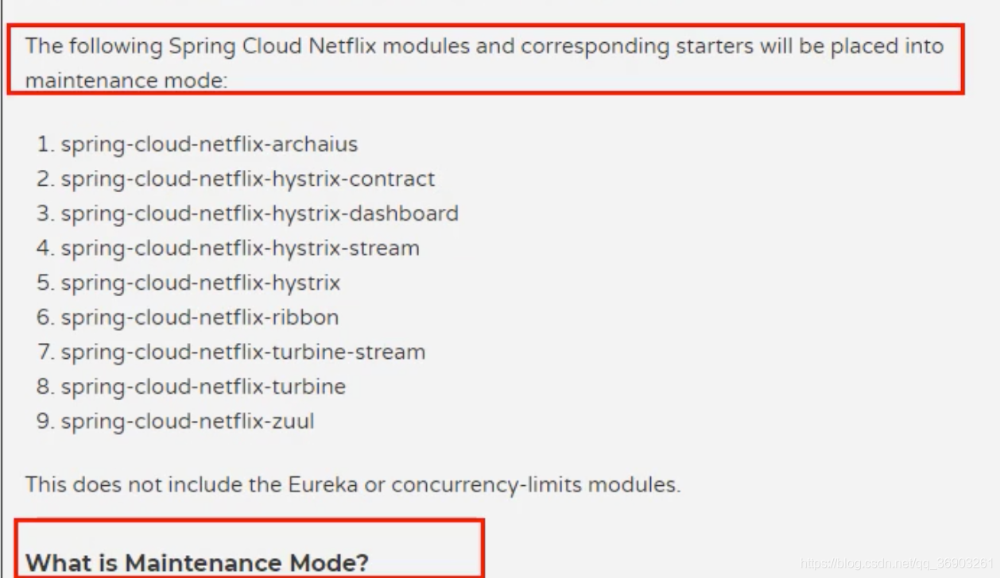


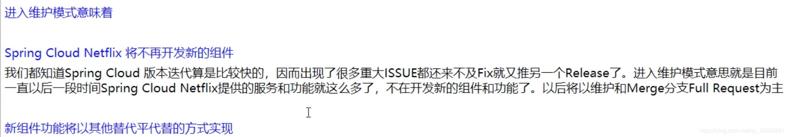
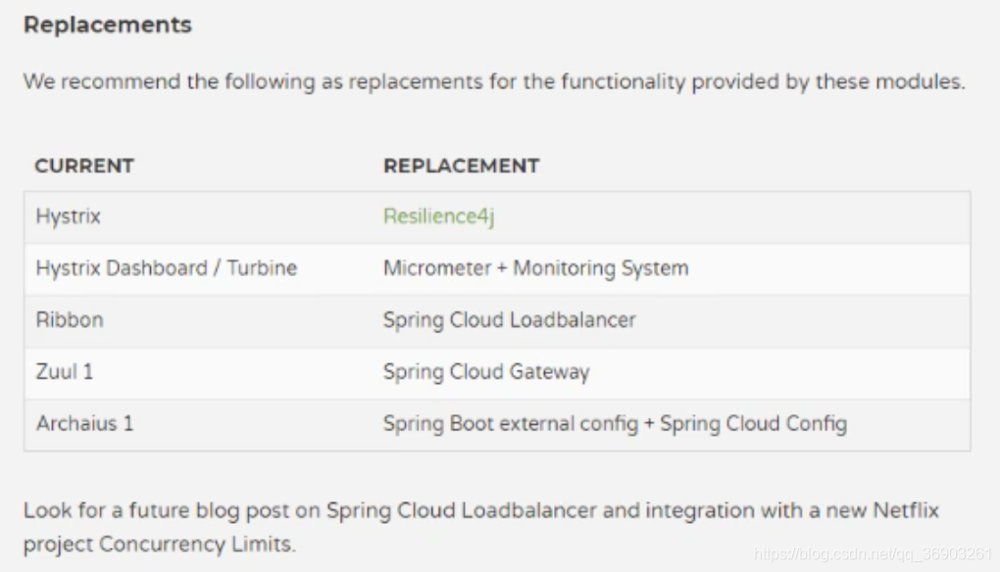
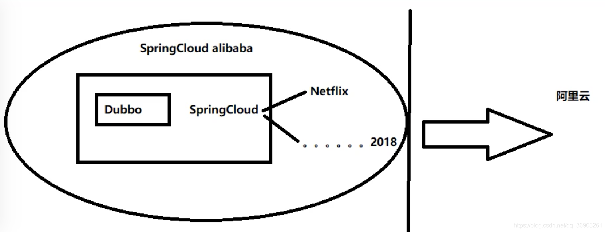

## 1.2 Spring Alibaba简介

Spring官网：https://spring.io/projects/spring-cloud-alibaba
GitHub：https://github.com/alibaba/spring-cloud-alibaba
GitHub中文文档：https://github.com/alibaba/spring-cloud-alibaba/blob/master/README-zh.md
Spring Cloud Alibaba参考文档：https://spring-cloud-alibaba-group.github.io/github-pages/greenwich/spring-cloud-alibaba.html
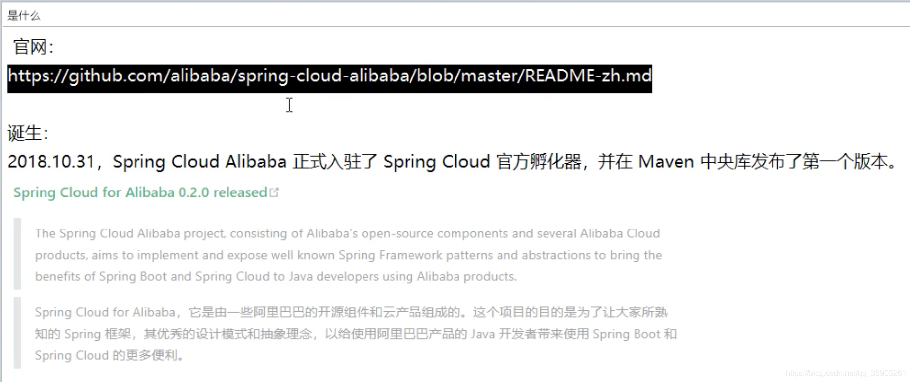
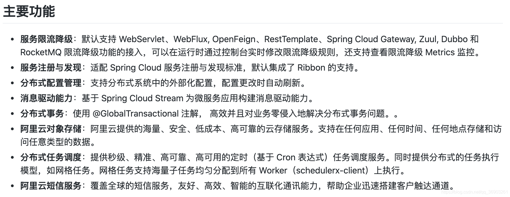
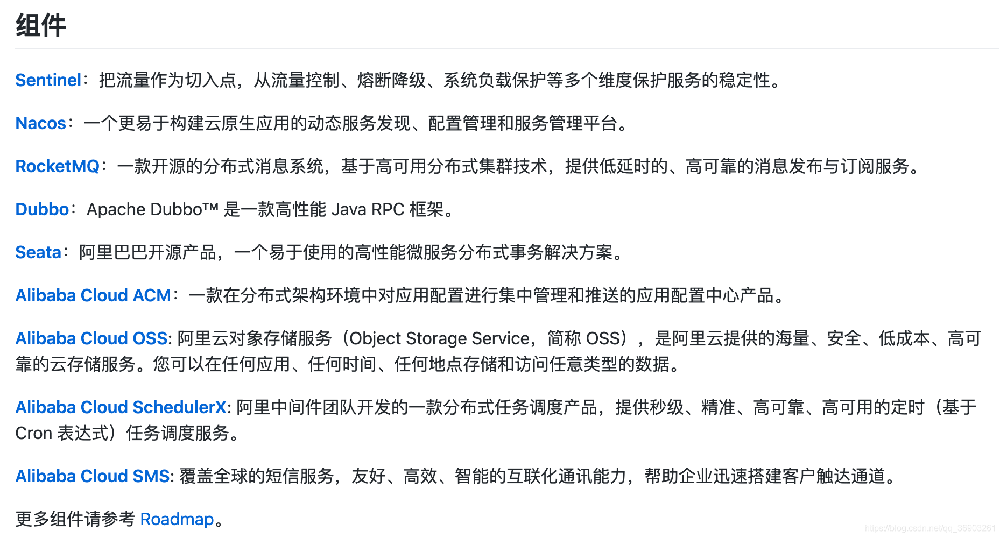
SpringCloud Alibaba的依赖：（已经在父工程的pom中引入了）

```xml
<dependencyManagement>
    <dependencies>
        <dependency>
            <groupId>com.alibaba.cloud</groupId>
            <artifactId>spring-cloud-alibaba-dependencies</artifactId>
            <version>2.2.0.RELEASE</version>
            <type>pom</type>
            <scope>import</scope>
        </dependency>
    </dependencies>
</dependencyManagement>
```

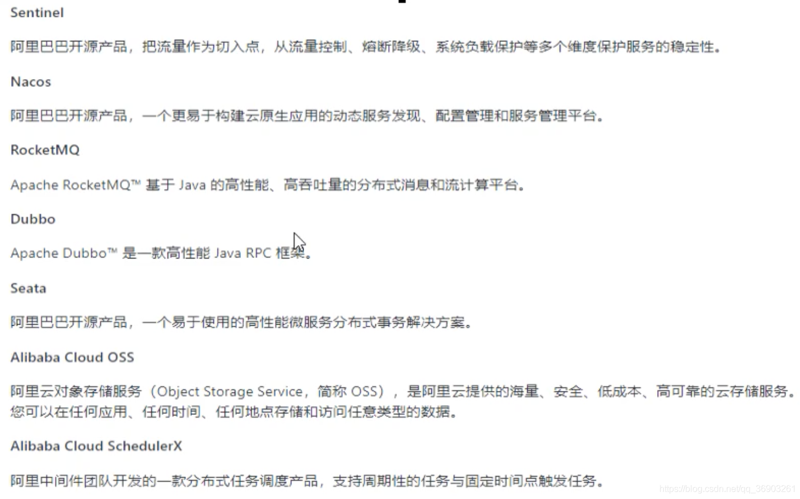

# 2 SpringCloud Alibaba Nacos服务注册和配置中心

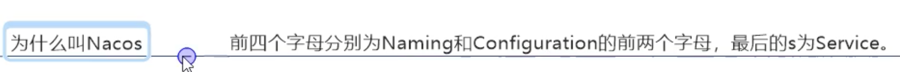


官网：[https://nacos.io/zh-cn/](https://nacos.io/zh-cn/)
GitHub：https://github.com/alibaba/Nacos
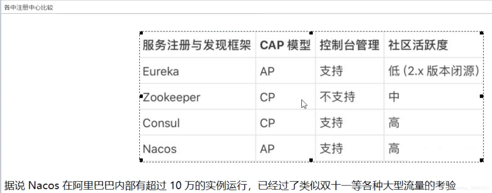
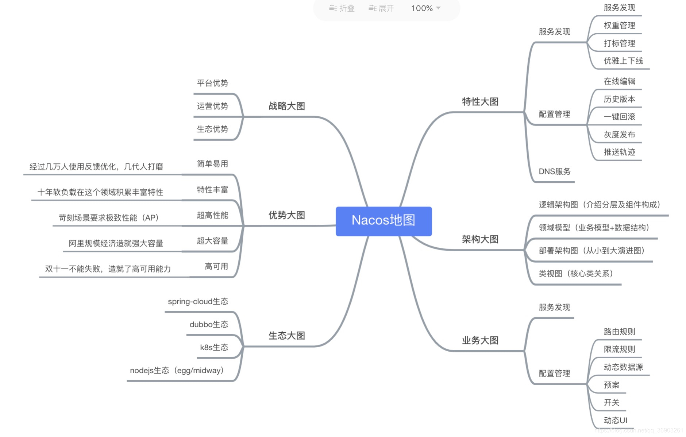
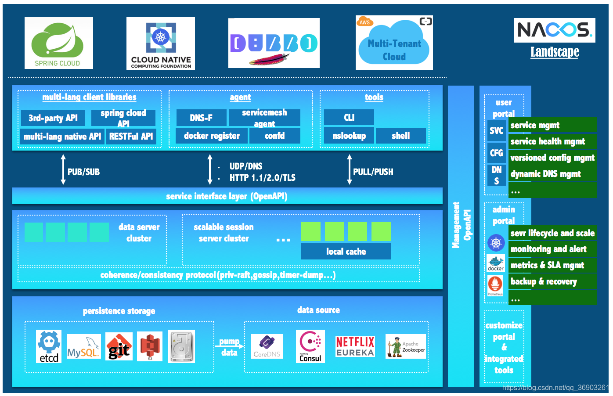

## 2.1 安装并运行nacos

在docker上安装nacos

拉取nacos镜像：

```shell
docker pull nacos/nacos-server
```

运行nacos：

```shell
docker run --env MODE=standalone --name nacos -d -p 8848:8848 nacos/nacos-server
```

在浏览器输入：`http://10.211.55.17:8848/nacos/`（10.211.55.17是我linux的IP地址）
账号和密码都是`nacos`。
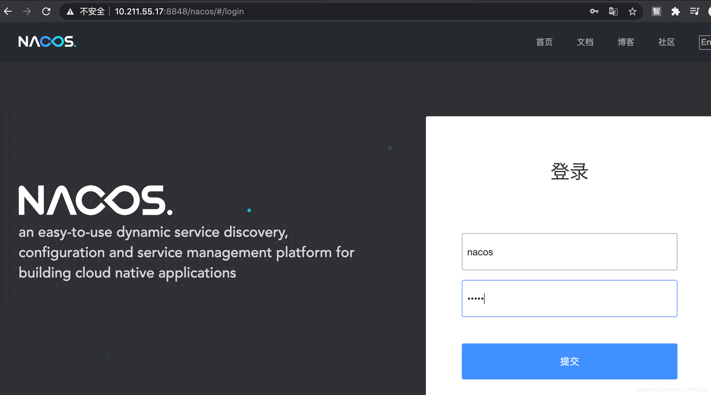
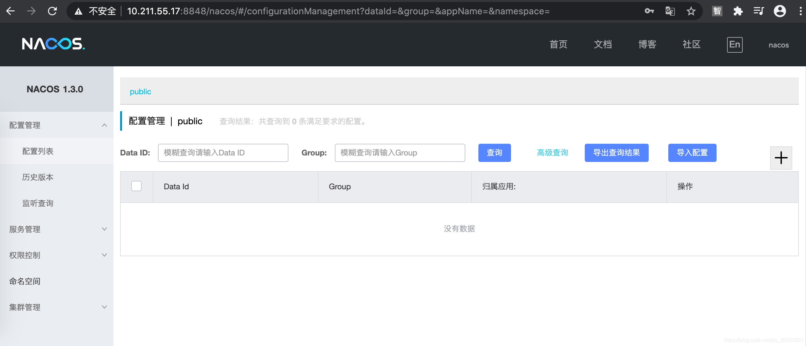

## 2.2 Nacos作为服务注册中心演示

官方文档：https://spring-cloud-alibaba-group.github.io/github-pages/greenwich/spring-cloud-alibaba.html

### 2.2.1 基于Nacos的服务提供者

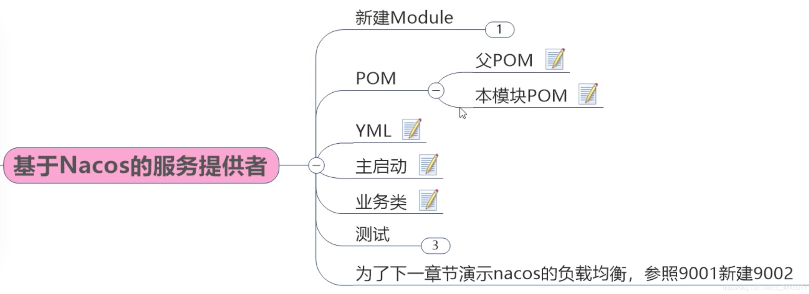

1. 新建模块cloudalibaba-provider-payment9001

2. pom

   ```xml
   <dependencies>
       <!--SpringCloud Alibaba nacos-->
       <dependency>
           <groupId>com.alibaba.cloud</groupId>
           <artifactId>spring-cloud-starter-alibaba-nacos-discovery</artifactId>
       </dependency>
   
       <dependency>
           <groupId>org.springframework.boot</groupId>
           <artifactId>spring-boot-starter-web</artifactId>
       </dependency>
   
       <dependency>
           <groupId>org.springframework.boot</groupId>
           <artifactId>spring-boot-starter-actuator</artifactId>
       </dependency>
   
       <dependency>
           <groupId>org.springframework.boot</groupId>
           <artifactId>spring-boot-devtools</artifactId>
           <scope>runtime</scope>
           <optional>true</optional>
       </dependency>
       <dependency>
           <groupId>org.projectlombok</groupId>
           <artifactId>lombok</artifactId>
           <optional>true</optional>
       </dependency>
       <dependency>
           <groupId>org.springframework.boot</groupId>
           <artifactId>spring-boot-starter-test</artifactId>
           <scope>test</scope>
       </dependency>
   </dependencies>
   12345678910111213141516171819202122232425262728293031323334
   ```

3. yml

   ```yml
   server:
     port: 9001
   
   
   spring:
     application:
       name: nacos-payment-provider
     cloud:
       nacos:
         discovery:
           server-addr: 10.211.55.17:8848  #配置的Nacos地址（本机的写localhost:8848，服务器的写IP地址）
   
   
   management:
     endpoints:
       web:
         exposure:
           include: '*'
   ```

4. 主启动类

   ```java
   @EnableDiscoveryClient
   @SpringBootApplication
   public class PaymentMain9001 {
   
       public static void main(String[] args) {
           SpringApplication.run(PaymentMain9001.class, args);
       }
   
   }
   ```

5. 新建controller.PaymentController

   ```java
   @RestController
   public class PaymentController {
   
       @Value("${server.port}")
       private String serverPort;
   
   
       @GetMapping("/payment/nacos/{id}")
       public String getPayment(@PathVariable("id") Integer id){
           return "nacos registry, serverPort: " + serverPort + "\t id: " + id;
       }
   
   }
   ```

6. 测试
   启动9001
   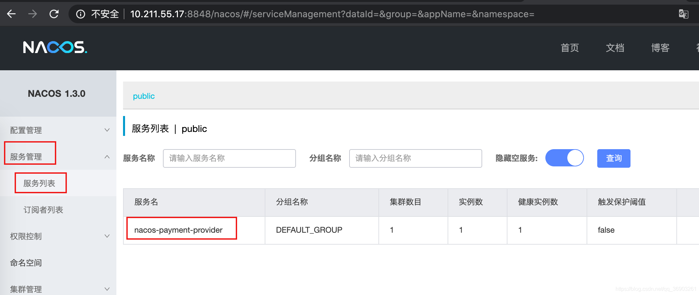

7. 参照9001新建9002，建立提供者集群。
   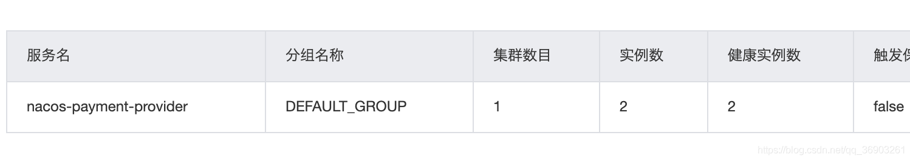

### 2.2.2 基于Nacos的服务消费者

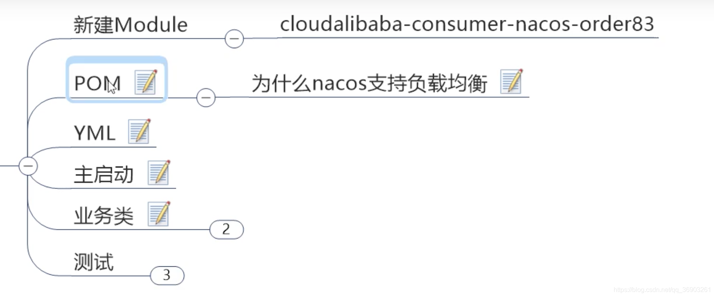

1. 新建模块cloudalibaba-consumer-nacos-order83

2. pom（nacos集成了ribbon，实现负载均衡）

   ```xml
   <dependencies>
       <!--SpringCloud Alibaba nacos-->
       <dependency>
           <groupId>com.alibaba.cloud</groupId>
           <artifactId>spring-cloud-starter-alibaba-nacos-discovery</artifactId>
       </dependency>
       <!-- 引用自己定义的api通用包，可以使用Payment支付Entity -->
       <dependency>
           <groupId>com.angenin.springcloud</groupId>
           <artifactId>cloud-api-commons</artifactId>
           <version>${project.version}</version>
       </dependency>
       <dependency>
           <groupId>org.springframework.boot</groupId>
           <artifactId>spring-boot-starter-web</artifactId>
       </dependency>
   
       <dependency>
           <groupId>org.springframework.boot</groupId>
           <artifactId>spring-boot-starter-actuator</artifactId>
       </dependency>
   
       <dependency>
           <groupId>org.springframework.boot</groupId>
           <artifactId>spring-boot-devtools</artifactId>
           <scope>runtime</scope>
           <optional>true</optional>
       </dependency>
       <dependency>
           <groupId>org.projectlombok</groupId>
           <artifactId>lombok</artifactId>
           <optional>true</optional>
       </dependency>
       <dependency>
           <groupId>org.springframework.boot</groupId>
           <artifactId>spring-boot-starter-test</artifactId>
           <scope>test</scope>
       </dependency>
   </dependencies>
   ```

3. yml

   ```yml
   server:
     port: 83
   
   
   spring:
     application:
       name: nacos-order-consumer
     cloud:
       nacos:
         discovery:
           server-addr: 10.211.55.17:8848  #配置的Nacos地址（本机的写localhost:8848，服务器的写IP地址）
   
   
   #消费者要访问的微服务名称（成功注册进nacos的服务提供者）
   service-url:
     nacos-user-service: http://nacos-payment-provider
   ```

4. 主启动类

   ```java
   @EnableDiscoveryClient
   @SpringBootApplication
   public class OrderNacosMain83 {
   
       public static void main(String[] args) {
           SpringApplication.run(OrderNacosMain83.class, args);
       }
   
   }
   ```

5. 新建config.ApplicationContextConfig

   ```java
   @Configuration
   public class ApplicationContextConfig {
   
       @Bean
       public RestTemplate getRestTemplate(){
           return new RestTemplate();
       }
   
   }
   ```

6. 新建controller.OrderNacosController

   ```java
   1
   ```

7. 测试
   启动9001，9002，83
   在浏览器输入：`http://localhost:83/consumer/payment/nacos/1`
   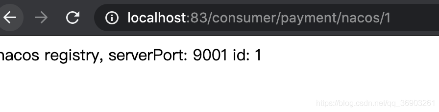
   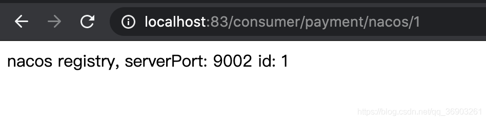

### 2.2.3 整合Feign

#### 在消费者83

1. 在pom中导入

   ```xml
   <!-- openfeign -->
   <dependency>
       <groupId>org.springframework.cloud</groupId>
       <artifactId>spring-cloud-starter-openfeign</artifactId>
   </dependency>
   ```

2. 在主启动类上加上`@EnableFeignClients`，激活feign。

3. 注释掉config配置类的`@Configuration`注解，不使用RestTemplate。

4. 新建service.PaymentFeignService接口

   ```java
   @Component
   @FeignClient(value = "nacos-payment-provider")
   public interface PaymentFeignService {
   
       @GetMapping("/payment/nacos/{id}")
       public String getPayment(@PathVariable("id") Integer id);
   
   }
   ```

5. 注释掉OrderNacosController中的restTemplate对象和paymentInfo方法。
   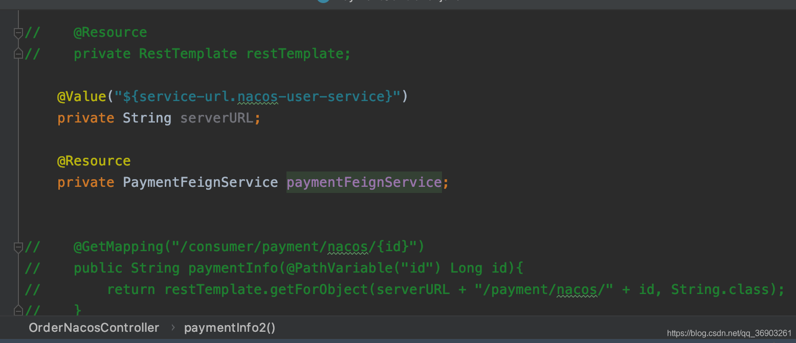

6. 在OrderNacosController中添加

   ```java
   @Resource
   private PaymentFeignService paymentFeignService;
   
       @GetMapping("/consumer/payment/feign/nacos/{id}")
       public String paymentInfo2(@PathVariable("id") Long id){
           return restTemplate.getForObject(serverURL + "/payment/feign/nacos/" + id, String.class);
       }
   1234567
   ```

7. 测试
   重启83。
   浏览器输入：`http://localhost:83/consumer/payment/feign/nacos/1`
   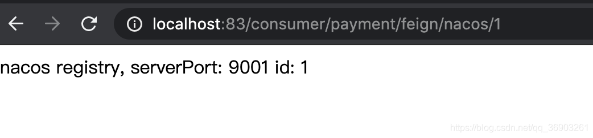
   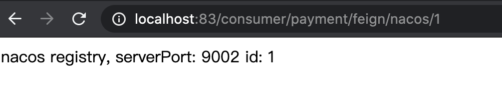

### 2.2.4 服务注册中心对比

#### Nacos全景图


#### Nacos和CAP

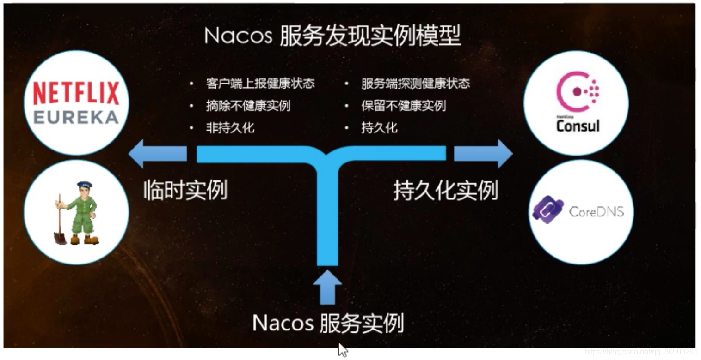
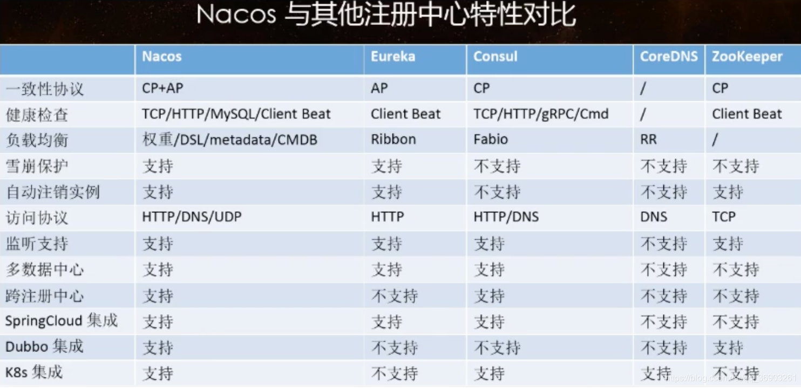

#### AP和CP的切换

A：可用性
C：一致性
P：分区容错性
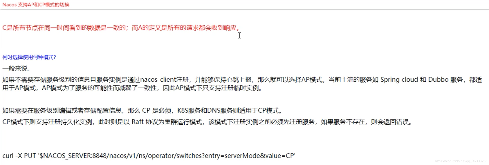
*Nacos默认AP。*

切换CP：


## 2.3 Nacos作为服务配置中心演示

### 2.3.1 Nacos作为配置中心——基础配置

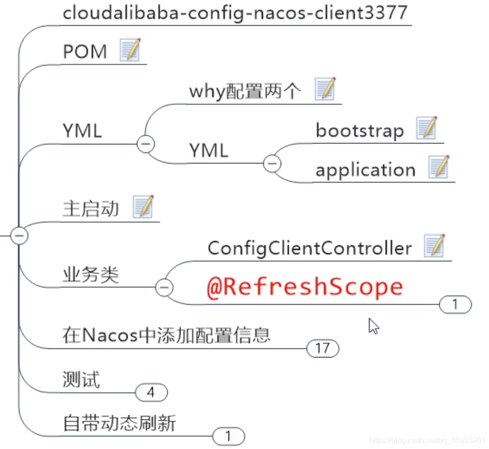

1. 新建模块cloudalibaba-config-nacos-client3377

2. pom

   ```xml
   <dependencies>
       <!-- nacos config-->
       <dependency>
           <groupId>com.alibaba.cloud</groupId>
           <artifactId>spring-cloud-starter-alibaba-nacos-config</artifactId>
       </dependency>
       <!-- openfeign -->
       <dependency>
           <groupId>org.springframework.cloud</groupId>
           <artifactId>spring-cloud-starter-openfeign</artifactId>
       </dependency>
       <!--SpringCloud Alibaba nacos-->
       <dependency>
           <groupId>com.alibaba.cloud</groupId>
           <artifactId>spring-cloud-starter-alibaba-nacos-discovery</artifactId>
       </dependency>
       <dependency>
           <groupId>org.springframework.boot</groupId>
           <artifactId>spring-boot-starter-web</artifactId>
       </dependency>
   
       <dependency>
           <groupId>org.springframework.boot</groupId>
           <artifactId>spring-boot-starter-actuator</artifactId>
       </dependency>
   
       <dependency>
           <groupId>org.springframework.boot</groupId>
           <artifactId>spring-boot-devtools</artifactId>
           <scope>runtime</scope>
           <optional>true</optional>
       </dependency>
       <dependency>
           <groupId>org.projectlombok</groupId>
           <artifactId>lombok</artifactId>
           <optional>true</optional>
       </dependency>
       <dependency>
           <groupId>org.springframework.boot</groupId>
           <artifactId>spring-boot-starter-test</artifactId>
           <scope>test</scope>
       </dependency>
   </dependencies>
   ```

3. xml
   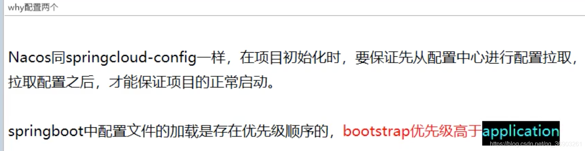
   bootstrap.yml：

   ```yml
   server:
     port: 3377
   
   spring:
     application:
       name: nacos-config-client
     cloud:
       nacos:
         discovery:
           server-addr: 10.211.55.17:8848 #Nacos服务注册中心地址（本机的写localhost）
         config:
           server-addr: 10.211.55.17:8848 #Nacos作为配置中心地址（本机的写localhost）
           file-extension: yml #指定yml格式配置
   12345678910111213
   ```

   application.yml

   ```yml
   spring:
     profiles:
       active: dev #表示开发环境
   123
   ```

4. 主启动类

   ```java
   @EnableDiscoveryClient
   @SpringBootApplication
   public class NacosConfigClientMain3377 {
   
       public static void main(String[] args) {
           SpringApplication.run(NacosConfigClientMain3377.class, args);
       }
   
   }
   ```

5. 新建controller.ConfigClientController

   ```java
   @RefreshScope   //支持Nacos的动态刷新功能
   @RestController
   public class ConfigClientController {
   
       @Value("${config.info}")
       private String configInfo;
   
   
       @GetMapping("/config/info")
       public String getConfigInfo(){
           return configInfo;
       }
   
   }
   ```

6. 在Nacos中添加配置信息
   
   https://nacos.io/zh-cn/docs/quick-start-spring-cloud.html
   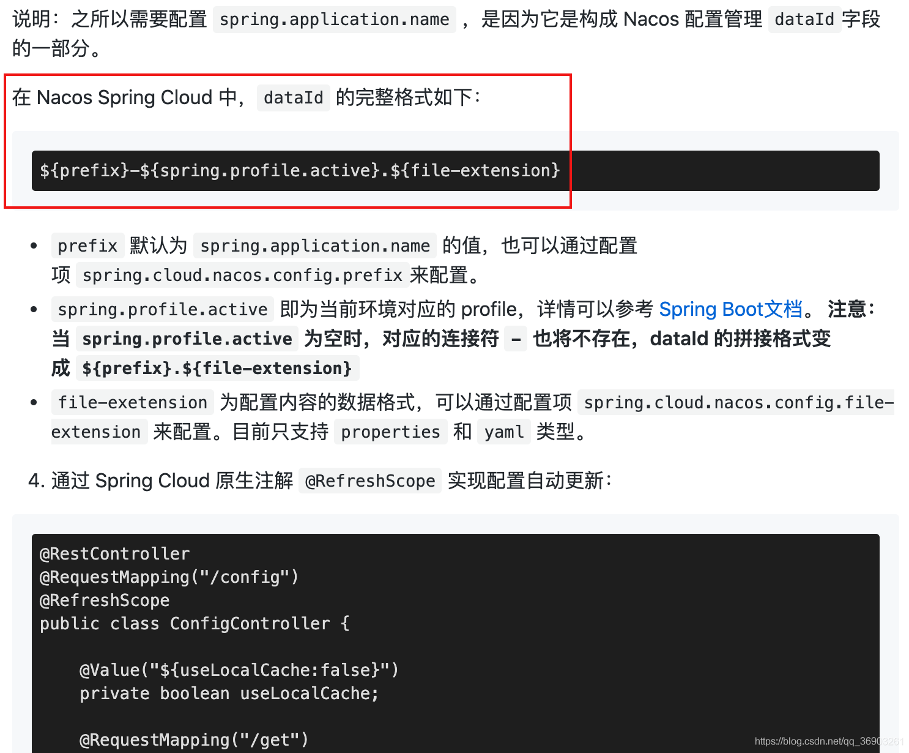
   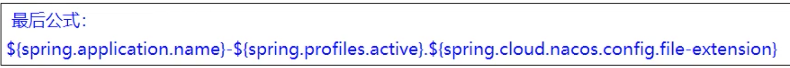

   ```yml
   #${prefix}-${spring.profile.active}.${file-extension}
   # ${spring.application.name}-${spring.profile.active}.${file-extension}
   # nacos-config-client-dev.yml
   ```

   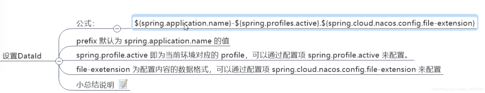
   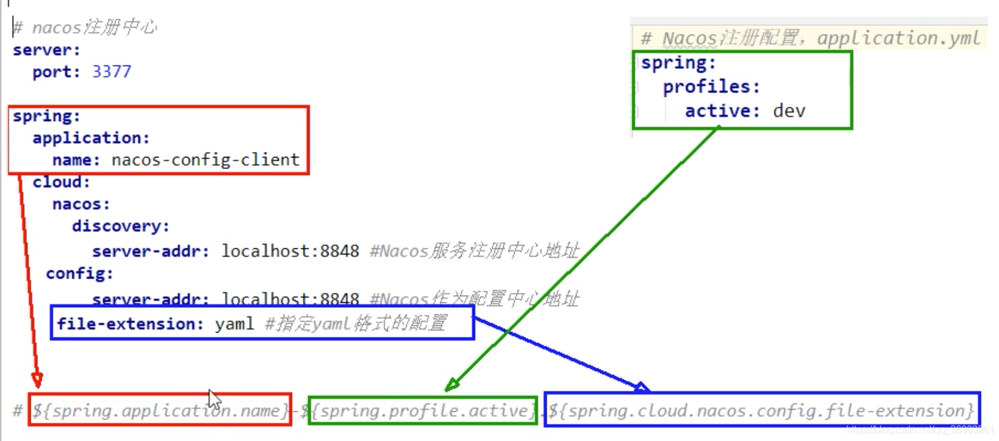
   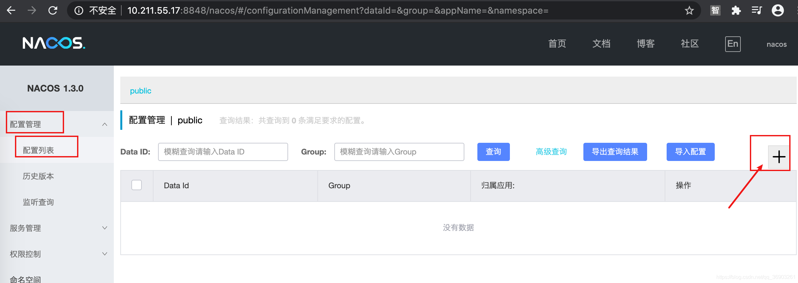
   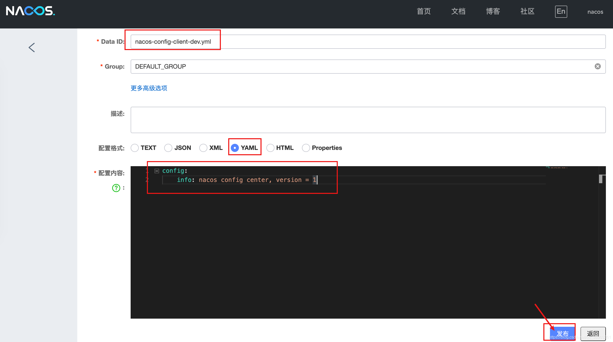
   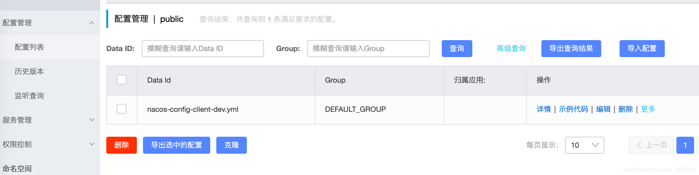

7. 测试
   启动3377
   浏览器输入：`http://localhost:3377/config/info`
   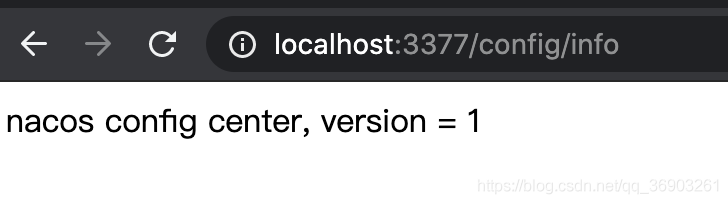

8. 在nacos后台修改yml文件的版本号
   刷新页面，动态刷新
   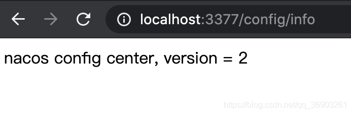

### 2.3.2 Nacos作为配置中心——分类配置

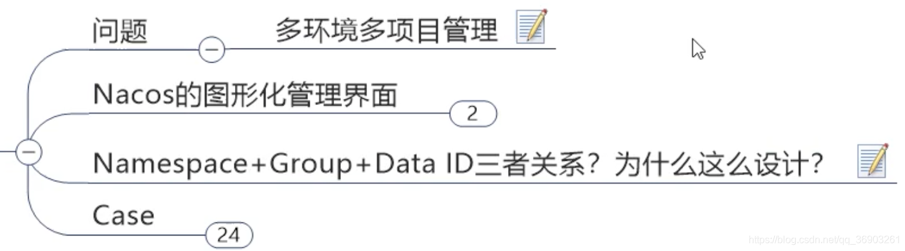
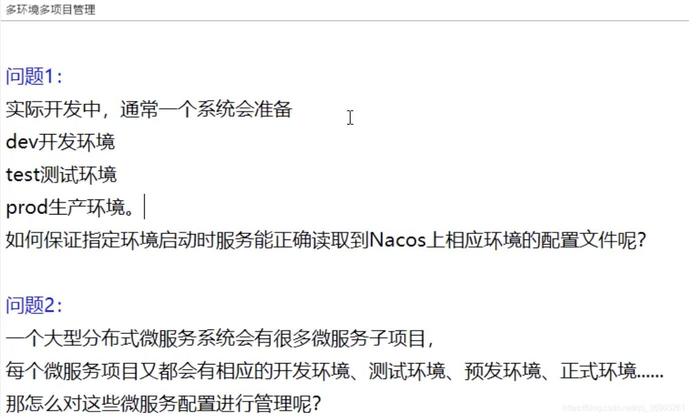
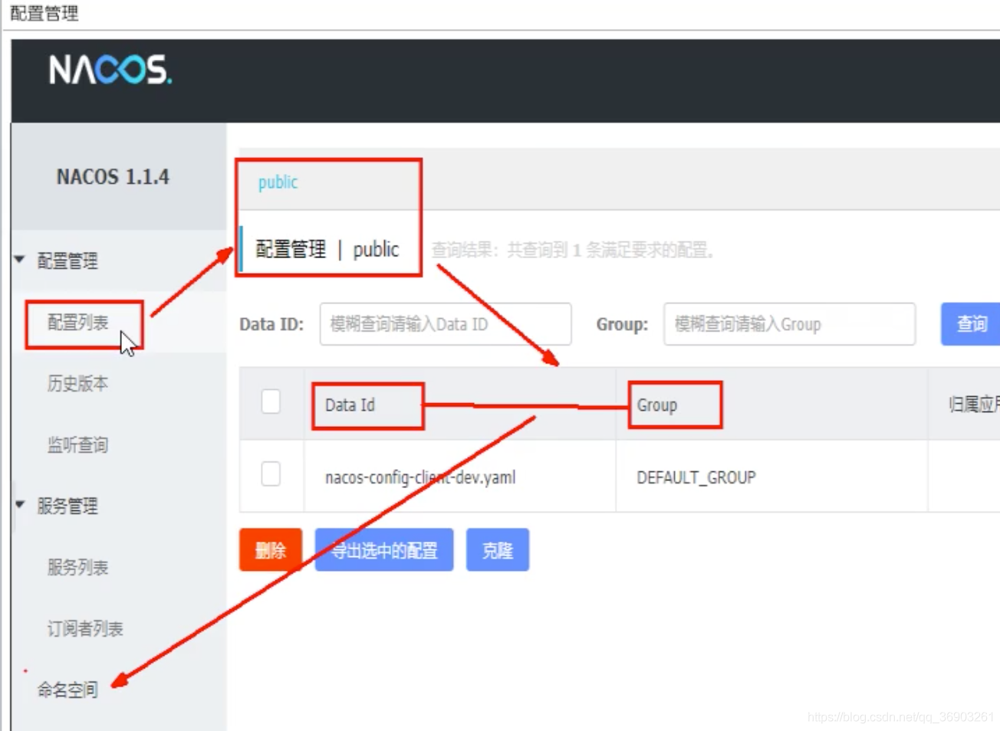
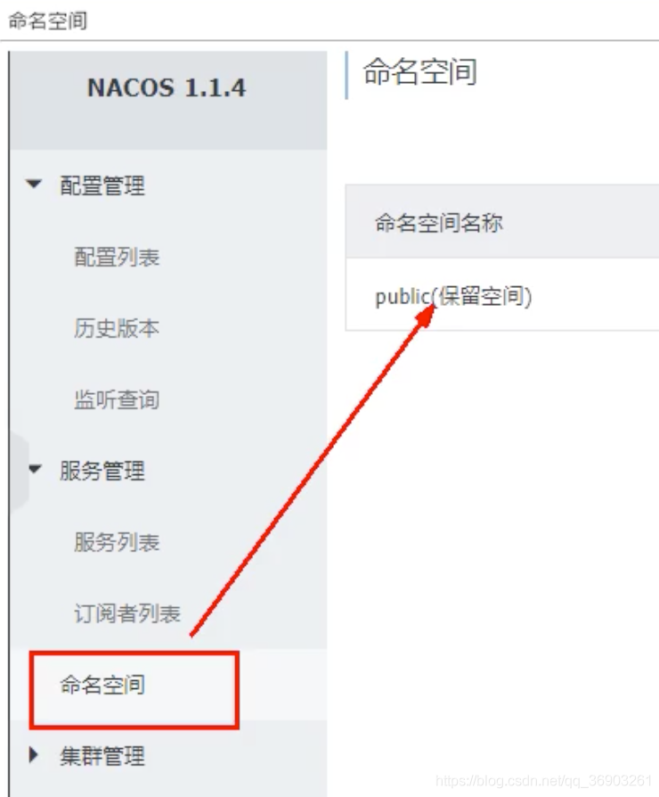

#### Namespace+Group+DataID三者的关系

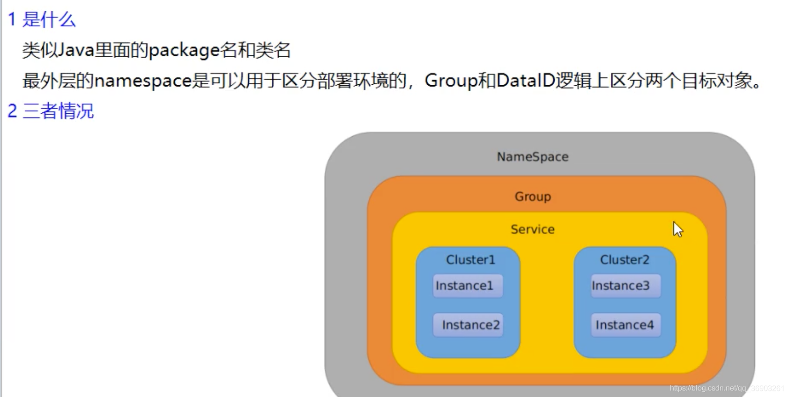

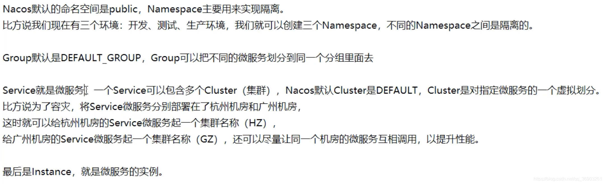

#### 三种方案加载配置

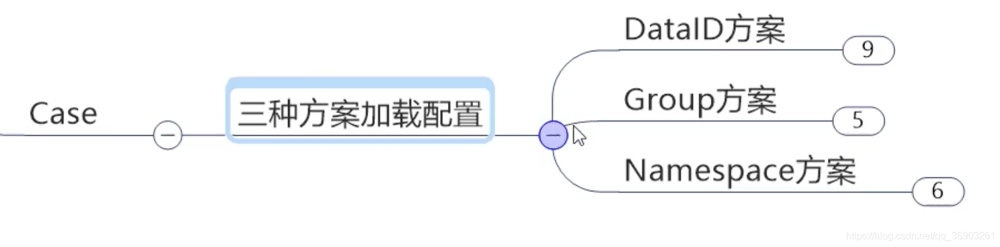

##### DataID方案

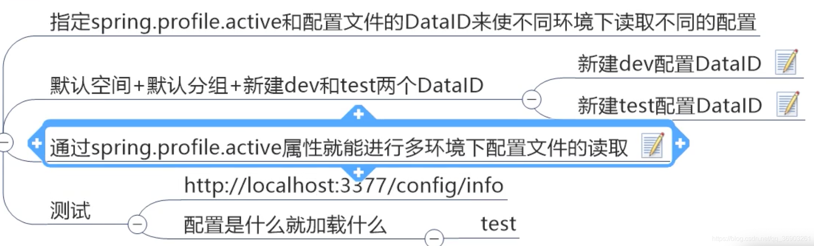

1. 新建DataId（test）
   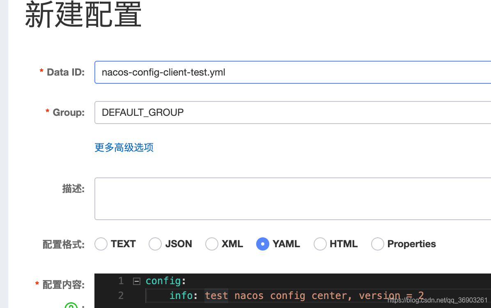

   ```yml
   config: 
       info: test nacos config center, version = 2
   12
   ```

   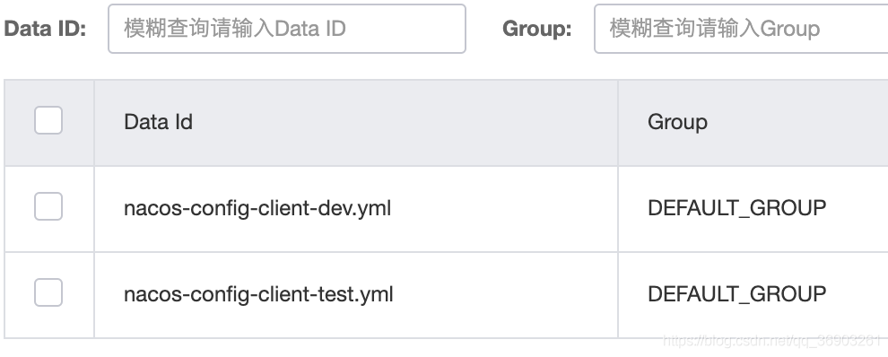

2. 修改3377的application.yml的active为`test`。

3. 启动3377。
   `http://localhost:3377/config/info`
   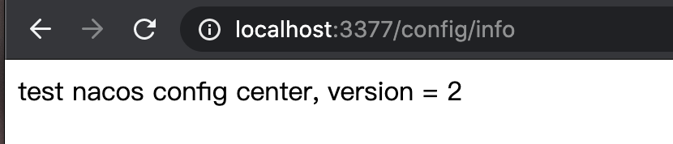

##### Group方案

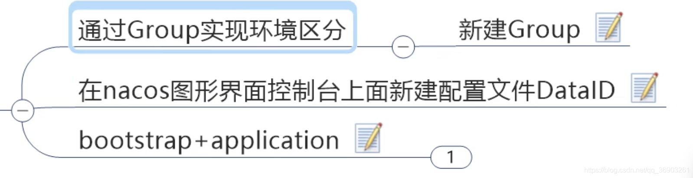
*Group默认DEFAULT_GROUP。*

1. 新建配置nacos-config-client-info.yml（DEV_GROUP）
   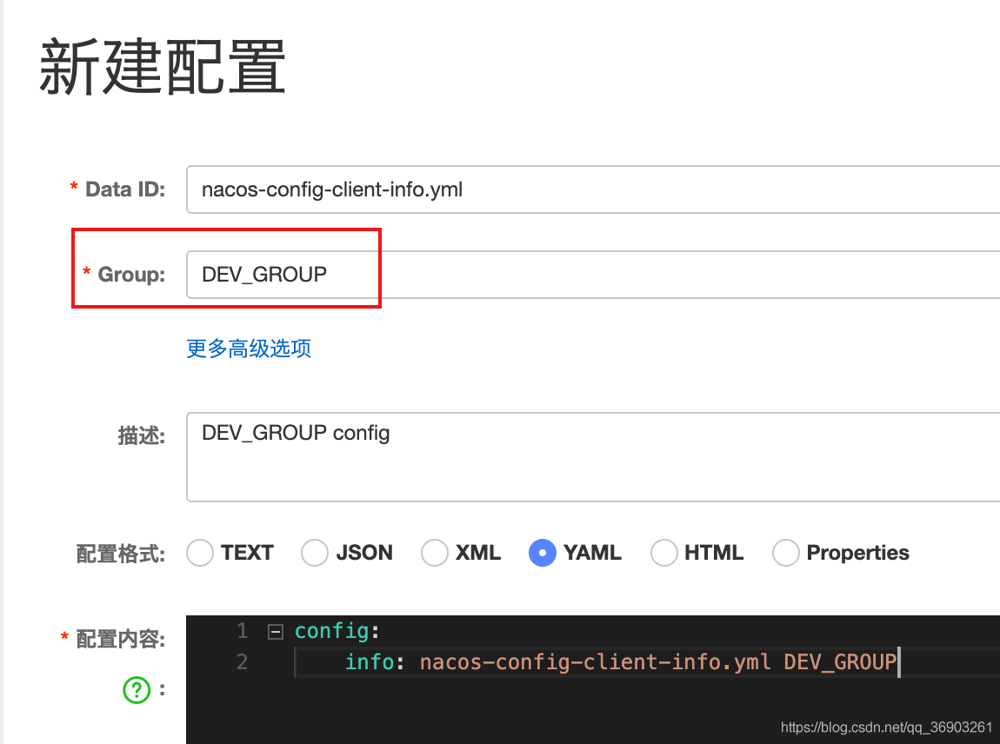

   ```yml
   config:
   	info: nacos-config-client-info.yml DEV_GROUP
   12
   ```

   新建配置时nacos-config-client-info.yml（TEST_GROUP）
   
   

2. bootstrap.yml的config下新增`group: TEST_GROUP`
   

3. 修改application.yml的active为`active: info`

4. 重启3377。
   `http://localhost:3377/config/info`
   

5. 修改bootstrap.yml的group为`DEV_GROUP`

6. 重启3377。
   

##### Namespace方案


*Namespace默认有一个public。（不可删除）*


1. 新建dev和test的Namespace
   
   
   
2. 给dev命名空间新增四个DataId，分三个Group。
   
   
3. 在bootstrap.yml的config里添加`namespace: xx`
   
4. 重启3377。
   `http://localhost:3377/config/info`
   

## 2.4 Nacos集群和持久化配置（重要）


https://nacos.io/zh-cn/docs/deployment.html

### 2.4.1 官网说明

官网说明：https://nacos.io/zh-cn/docs/cluster-mode-quick-start.html


### 2.4.2 Nacos持久化配置解释


nacos单机的持久化看这篇文章：[在Docker上用Nacos1.3容器连接MySQL5.6和8.0.18容器进入持久化的具体操作](https://blog.csdn.net/qq_36903261/article/details/106919191)
（步骤有点多，而且坑了我快一天的时间了，所以单独写在另一篇文章里，使用docker虽然启动时方便了，但是因为里面的配置已经被人改了，和官方文档不一样，想进行配置就变得不太方便。（个人吐槽））

### 2.4.3 Linux版Nacos+MySQL生产环境配置


#### 集群配置步骤

同样，因为是在docker上配置的，所以和阳哥的方式不一样，写在另一篇文章里了。
[在Docker上用3个Nacos1.3容器+一个MySQL5和8容器+一个Nginx容器进行集群的具体操作（Nacos集群版）](https://blog.csdn.net/qq_36903261/article/details/106932489)

阳哥的笔记还是会截的：


```shell
hostname -i
1
```


第4

这里和docker启动容器时的-p是类似的。


第5


##### 测试


修改9002的yml文件

```yml
#        server-addr: 10.211.55.17:8848  #配置的Nacos地址（本机的写localhost:8848，服务器的写IP地址）
		#改为下面这个，填自己linux的IP地址
        server-addr: 10.211.55.17:1111  #nginx的地址
123
```

启动9002

出现`java.net.SocketException: Connection reset`异常。

```
2020-06-24 20:13:04.549  INFO 47941 --- [  restartedMain] o.s.b.w.embedded.tomcat.TomcatWebServer  : Tomcat started on port(s): 9002 (http) with context path ''
2020-06-24 20:13:04.740 ERROR 47941 --- [  restartedMain] c.a.c.n.registry.NacosServiceRegistry    : nacos registry, nacos-payment-provider register failed...NacosRegistration{nacosDiscoveryProperties=NacosDiscoveryProperties{serverAddr='10.211.55.17:1111', endpoint='', namespace='', watchDelay=30000, logName='', service='nacos-payment-provider', weight=1.0, clusterName='DEFAULT', namingLoadCacheAtStart='false', metadata={preserved.register.source=SPRING_CLOUD}, registerEnabled=true, ip='192.168.0.109', networkInterface='', port=9002, secure=false, accessKey='', secretKey=''}},

java.lang.IllegalStateException: failed to req API:/nacos/v1/ns/instance after all servers([10.211.55.17:1111]) tried: failed to req API:10.211.55.17:1111/nacos/v1/ns/instance. code:500 msg: java.net.SocketException: Connection reset
	at com.alibaba.nacos.client.naming.net.NamingProxy.reqAPI(NamingProxy.java:464) ~[nacos-client-1.1.1.jar:na]
	at com.alibaba.nacos.client.naming.net.NamingProxy.reqAPI(NamingProxy.java:386) ~[nacos-client-1.1.1.jar:na]
	at com.alibaba.nacos.client.naming.net.NamingProxy.registerService(NamingProxy.java:188) ~[nacos-client-1.1.1.jar:na]
...
12345678
```

重新启动多次后出现`java.net.SocketTimeoutException: Read timed out`异常。

```
2020-06-24 20:32:01.365 ERROR 48776 --- [  restartedMain] c.a.c.n.registry.NacosServiceRegistry    : nacos registry, nacos-payment-provider register failed...NacosRegistration{nacosDiscoveryProperties=NacosDiscoveryProperties{serverAddr='10.211.55.17:1111', endpoint='', namespace='', watchDelay=30000, logName='', service='nacos-payment-provider', weight=1.0, clusterName='DEFAULT', namingLoadCacheAtStart='false', metadata={preserved.register.source=SPRING_CLOUD}, registerEnabled=true, ip='192.168.0.109', networkInterface='', port=9002, secure=false, accessKey='', secretKey=''}},

com.alibaba.nacos.api.exception.NacosException: failed to req API:/api//nacos/v1/ns/instance after all servers([10.211.55.17:1111]) tried: java.net.SocketTimeoutException: Read timed out
	at com.alibaba.nacos.client.naming.net.NamingProxy.reqAPI(NamingProxy.java:490) ~[nacos-client-1.2.0.jar:na]
	at com.alibaba.nacos.client.naming.net.NamingProxy.reqAPI(NamingProxy.java:395) ~[nacos-client-1.2.0.jar:na]
12345
```

在网上大部分问题都不一样，类似问题的解决办法尝试后还是解决不了，弄nacos真的把心态都搞崩了，希望也遇到这个问题并且已经解决了的兄弟，告知一下解决方法，谢谢。

##### 总结


# 3 Sentinel实现熔断与限流

## 3.1 简介


官网：https://github.com/alibaba/sentinel
中文版：[https://github.com/alibaba/Sentinel/wiki/%E4%BB%8B%E7%BB%8D](https://github.com/alibaba/Sentinel/wiki/介绍)


文档：https://spring-cloud-alibaba-group.github.io/github-pages/greenwich/spring-cloud-alibaba.html#_spring_cloud_alibaba_sentinel


### 下载

下载：https://github.com/alibaba/Sentinel/releases
*本来想着只有一个jar包，就不使用docker了，直接下载到本地运行，但是是真的下不动，点下载转了半天没反应，真的是服了。*

#### docker

```shell
#拉取sentinel镜像
docker pull bladex/sentinel-dashboard

#运行sentinel（docker里的sentinel是8858端口）
docker run --name sentinel -d -p 8858:8858 bladex/sentinel-dashboard

#把nacos和mysql也启动起来
1234567
```

在浏览器输入：`http://10.211.55.26:8858/#/login`（因为linux出了点问题，重装了，所以ip也变了）

账号和密码都是`sentinel`


控制台使用说明：[https://github.com/alibaba/Sentinel/wiki/%E6%8E%A7%E5%88%B6%E5%8F%B0](https://github.com/alibaba/Sentinel/wiki/控制台)

## 3.2 初始化演示工程


1. 新建模块cloudalibaba-sentinel-service8401

2. pom

   ```xml
   <dependencies>
       <!-- SpringCloud ailibaba nacos-->
       <dependency>
           <groupId>com.alibaba.cloud</groupId>
           <artifactId>spring-cloud-starter-alibaba-nacos-discovery</artifactId>
       </dependency>
       <!-- SpringCloud ailibaba sentinel-datasource-nacos 持久化需要用到-->
       <dependency>
           <groupId>com.alibaba.csp</groupId>
           <artifactId>sentinel-datasource-nacos</artifactId>
       </dependency>
       <!-- SpringCloud ailibaba sentinel-->
       <dependency>
           <groupId>com.alibaba.cloud</groupId>
           <artifactId>spring-cloud-starter-alibaba-sentinel</artifactId>
       </dependency>
       <dependency>
           <groupId>org.springframework.cloud</groupId>
           <artifactId>spring-cloud-starter-openfeign</artifactId>
       </dependency>
       <dependency>
           <groupId>org.springframework.boot</groupId>
           <artifactId>spring-boot-starter-web</artifactId>
       </dependency>
       <!--监控-->
       <dependency>
           <groupId>org.springframework.boot</groupId>
           <artifactId>spring-boot-starter-actuator</artifactId>
       </dependency>
       <!--热部署-->
       <dependency>
           <groupId>org.springframework.boot</groupId>
           <artifactId>spring-boot-devtools</artifactId>
           <scope>runtime</scope>
           <optional>true</optional>
       </dependency>
       <dependency>
           <groupId>org.projectlombok</groupId>
           <artifactId>lombok</artifactId>
           <optional>true</optional>
       </dependency>
       <dependency>
           <groupId>org.springframework.boot</groupId>
           <artifactId>spring-boot-starter-test</artifactId>
           <scope>test</scope>
       </dependency>
   </dependencies>
   1234567891011121314151617181920212223242526272829303132333435363738394041424344454647
   ```

3. yml

   ```yml
   server:
     port: 8401
   
   spring:
     application:
       name: cloudalibaba-sentinal-service
     cloud:
       nacos:
         discovery:
           #Nacos服务注册中心地址（改成自己的服务器ip地址，本地用localhost‍）
           server-addr: 10.211.55.26:8848
       sentinel:
         transport:
           #配置Sentin dashboard地址（改成自己的服务器ip地址，本地用localhost‍）
           dashboard: 10.211.55.26:8858
           # 默认8719端口，假如被占用了会自动从8719端口+1进行扫描，直到找到未被占用的 端口
           port: 8719
           
   
   management:
     endpoints:
       web:
         exposure:
           include: '*'
   ```

4. 主启动类

   ```java
   @EnableDiscoveryClient
   @SpringBootApplication
   public class MainApp8401 {
   
       public static void main(String[] args) {
           SpringApplication.run(MainApp8401.class, args);
       }
   }
   ```

5. controller

   ```java
   @RestController
   public class FlowLimitController {
   
       @GetMapping("/testA")
       public String testA() {
           return "----testA";
       }
   
       @GetMapping("/testB")
       public String testB() {
           return "----testB";
       }
   
   }
   ```

6. 测试，启动8401，然后刷新sentinel后台页面（因为sentinel采用懒加载策略，所以需要调用服务后才在后台显示）
   在浏览器分别输入，然后刷新sentinel后台页面：
   `http://localhost:8401/testA`
   `http://localhost:8401/testB`
   

## 3.3 流控规则


流量控制

可在流控规则处新建：

也可簇点链路处指定添加：


每秒请求数超过1个就会限流。


#### 阈值类型

##### QPS与线程数的区别


QPS是直接挡在外面，而线程数是有多少个线程在处理，放进来后，有线程是空闲状态就对请求进行处理，都没空闲，就限流（关门打狗）。

#### 流控模式


##### 直接


##### 关联


A去调用B，B如果资源不足了，就限流A。


此时不管调用多少次A都不会限流，而此时超过1秒调用1次B，则会限流A。

使用Postman进行多次访问。


##### 链路

在网上搜关于链路的是用下面这个例子，然而显示不了限流的效果。

新建一个TestService

```java
@Service
public class TestService {

    @SentinelResource("getTest")
    public void getTest(){
    System.out.println("getTest...");
    }

}
123456789
```

然后在FlowLimitController添加修改：

```java
    @Resource
    TestService testService;
    
    @GetMapping("/testA")
    public String testA() {
        testService.getTest();
        return "----testA";
    }

    @GetMapping("/testB")
    public String testB() {
        testService.getTest();
        return "----testB";
    }
1234567891011121314
```

然后重新启动8401，输入`http://localhost:8401/testA`和`http://localhost:8401/testB`

给getTest添加流控链路规则。


#### 流控效果

流控效果只有QPS有，线程数没有。


##### 快速失败


##### 预热（Warm Up）


对testA新增流控规则

然后输入`http://localhost:8401/testA`，不停刷新，前5秒会限流，5秒后只要每秒不超过10个请求，就不会限流。

##### 排队等待


在testB方法中添加

```java
        log.info(Thread.currentThread().getName() + "\t ...testB");
1
```

然后重启8401


postman发起的每秒10个请求进行排队，testB每秒处理一个请求。


## 3.4 降级规则


### 降级策略实战


#### RT


在FlowLimitController中添加

```java
    @GetMapping("/testD")
    public String testD() {
        try {
            TimeUnit.SECONDS.sleep(1);
        } catch (InterruptedException e) {
            e.printStackTrace();
        }
        log.info("testD 测试RT");
        return "----testD";
    }
12345678910
```

启动8401，在浏览器输入`http://localhost:8401/testD`，然后在sentinel设置testD降级规则。

*请求处理完成的时间为200毫秒（阈值），超过这个时间熔断降级进入时间窗口期不处理请求，1秒后退出时间窗口期，继续处理请求。（前提是一秒请求数超过5个，如果请求数没超过5个，就算请求处理的时间超过阈值也不会熔断降级）*

然后用Jmeter进行压力测试。


#### 异常比例


修改testD

```java
    @GetMapping("/testD")
    public String testD() {
        log.info("testD 异常比例");
        int age = 10 / 0;   //百分百出错

        return "----testD";
    }
1234567
```

启动8401，浏览器输入`http://localhost:8401/testD`，然后在后台设置testD的降级规则。

*处理请求出错超过0.2（20%，阈值），熔断降级，进入时间窗口期不处理请求，3秒后退出时间窗口期继续处理请求。（前提也是每秒请求数超过5个，防止不会熔断降级）*

用Jmeter进行测试


#### 异常数


因为是按照一分钟内的异常数对阈值进行比较，如果时间窗口小于60秒，可能会再次进入熔断状态。所以时间窗口一定要大于等于60秒。


在FlowLimitController里添加：

```java
    @GetMapping("/testE")
    public String testE() {
        log.info("testE 测试异常数");
        int age = 10 / 0;
        return "----testE 测试异常数";
    }
123456
```


启动8401，浏览器输入`http://localhost:8401/testE`，然后在后台设置testE的降级规则。

一分钟内，如果访问处理出现异常的次数超过5次，熔断降级，进入时间窗口期不处理请求，61秒后退出时间窗口期继续处理请求。（时间窗口必须大于等于60秒，防止再次熔断降级）

刷新6次，`http://localhost:8401/testE`


## 3.5 热点key限流


在FlowLimitController中添加：

```java
    @GetMapping("/testHotKey")
    @SentinelResource(value = "testHotKey", blockHandler = "deal_testHotKey")
    public String testHotKey(@RequestParam(value = "p1", required = false)String p1,
                             @RequestParam(value = "p2", required = false)String p2) {
        return "----testHotKey";
    }
    
    //兜底方法
    public String deal_testHotKey(String p1, String p2, BlockException exception) {
        // sentinel的默认提示都是： Blocked by Sentinel (flow limiting)
        return "----deal_testHotKey, o(╥﹏╥)o";
    }
123456789101112
```

重启8401，浏览器输入`http://localhost:8401/testHotKey`，然后在后台对testHotKey进行热点规则配置。

*如果每秒的访问请求带有索引为0的参数的数量超过1，进入统计窗口期，然后调用兜底方法，1秒后退出统计窗口期，继续处理请求。*

`http://localhost:8401/testHotKey?p1=1`
`http://localhost:8401/testHotKey?p1=1&p2=2`


如果设置热点规则，而@SentinelResource注解里没有指明blockHandler兜底方法，就会把直接把错误页面信息打印到前台。


#### 参数例外项


高级选项只有在热点规则里有，簇点链路无法配置高级选项。

`http://localhost:8401/testHotKey?p1=1`

`http://localhost:8401/testHotKey?p1=vip`


给testHotKey方法添加`int i = 1 / 0;`异常。
然后重新测试，发现兜底方法不适用于异常，有异常会直接打印到页面。


## 3.6 系统规则

Sentinel 系统自适应限流从整体维度对应用入口流量进行控制，结合应用的 Load、CPU 使用率、总体平均 RT、入口 QPS 和并发线程数等几个维度的监控指标，通过自适应的流控策略，让系统的入口流量和系统的负载达到一个平衡，让系统尽可能跑在最大吞吐量的同时保证系统整体的稳定性。


*针对整个系统的，每秒访问量超过1（阈值），限流。*

`http://localhost:8401/testA`

`http://localhost:8401/testB`


## 3.7 @SentinelResource


### 按资源名称限流+后续处理

资源名称


在pom添加

```xml
 <!--换成你们直接的包名-->
 <!-- 引用自己定义的api通用包，可以使用Payment支付Entity -->
 <dependency>
     <groupId>com.angenin.springcloud</groupId>
     <artifactId>cloud-api-commons</artifactId>
     <version>${project.version}</version>
 </dependency>
```

新建RateLimitController：

```java
@RestController
public class RateLimitController {

    @GetMapping("/byResource")
    @SentinelResource(value = "byResource",blockHandler = "handleException")
    public CommonResult byResource() {
        return  new CommonResult(200,"按照资源名称限流测试",new Payment(2020L,"serial001"));
    }

	//兜底方法
    public CommonResult handleException(BlockException exception) {
        return  new CommonResult(444,exception.getClass().getCanonicalName() + "\t 服务不可用");
    }
}
```

启动8401
`http://localhost:8401/byResource`


*用资源名称进行配置兜底方法才生效。*

多次刷新页面


### 按照URL地址限流+后续处理

URL地址：


在RateLimitController中添加：

```java
    @GetMapping("/rateLimit/byUrl")
    @SentinelResource(value = "byUrl")	//没有兜底方法，系统就用默认的
    public CommonResult byUrl() {
        return  new CommonResult(200,"按照byUrl限流测试",new Payment(2020L,"serial002"));
    }
```

启动8401
`http://localhost:8401/rateLimit/byUrl`


多次刷新：


### 上面兜底方案面临的问题


### 客户自定义限流处理逻辑


新建myhandler.CustomerBlockHandler自定义限流处理类：

```java
public class CustomerBlockHandler {

    public static CommonResult handlerException(BlockException exception) {
        return  new CommonResult(444,"按照客户自定义限流测试，Glogal handlerException ---- 1");
    }

    public static CommonResult handlerException2(BlockException exception) {
        return  new CommonResult(444,"按照客户自定义限流测试，Glogal handlerException ---- 2");
    }
}
12345678910
```

在RateLimitController中添加：

```java
    //CustomerBlockHandler
    @GetMapping("/rateLimit/customerBlockHandler")
    @SentinelResource(value = "customerBlockHandler",
            blockHandlerClass = CustomerBlockHandler.class, blockHandler = "handlerException2")
    public CommonResult customerBlockHandler() {
        return  new CommonResult(200,"按照客户自定义限流测试",new Payment(2020L,"serial003"));
    }
```

启动8401
`http://localhost:8401/rateLimit/customerBlockHandler`

*用资源名称进行配置兜底方法才生效。*

多次刷新：


### 更多注解属性说明


## 3.8 服务熔断功能


### Ribbon系列


#### 新建提供者


1. 新建模块cloudalibaba-provider-payment9003

2. pom

   ```xml
   <dependencies>
       <!-- SpringCloud ailibaba nacos-->
       <dependency>
           <groupId>com.alibaba.cloud</groupId>
           <artifactId>spring-cloud-starter-alibaba-nacos-discovery</artifactId>
       </dependency>
       <!-- SpringCloud ailibaba sentinel-->
       <dependency>
           <groupId>com.alibaba.cloud</groupId>
           <artifactId>spring-cloud-starter-alibaba-sentinel</artifactId>
       </dependency>
       <!-- 引用自己定义的api通用包，可以使用Payment支付Entity -->
       <dependency>
           <groupId>com.angenin.springcloud</groupId>
           <artifactId>cloud-api-commons</artifactId>
           <version>${project.version}</version>
       </dependency>
       <dependency>
           <groupId>org.springframework.cloud</groupId>
           <artifactId>spring-cloud-starter-openfeign</artifactId>
       </dependency>
       <dependency>
           <groupId>org.springframework.boot</groupId>
           <artifactId>spring-boot-starter-web</artifactId>
       </dependency>
       <!--监控-->
       <dependency>
           <groupId>org.springframework.boot</groupId>
           <artifactId>spring-boot-starter-actuator</artifactId>
       </dependency>
       <!--热部署-->
       <dependency>
           <groupId>org.springframework.boot</groupId>
           <artifactId>spring-boot-devtools</artifactId>
           <scope>runtime</scope>
           <optional>true</optional>
       </dependency>
       <dependency>
           <groupId>org.projectlombok</groupId>
           <artifactId>lombok</artifactId>
           <optional>true</optional>
       </dependency>
       <dependency>
           <groupId>org.springframework.boot</groupId>
           <artifactId>spring-boot-starter-test</artifactId>
           <scope>test</scope>
       </dependency>
   </dependencies>
   123456789101112131415161718192021222324252627282930313233343536373839404142434445464748
   ```

3. yml

   ```yml
   server:
     port: 9003
   
   spring:
     application:
       name: nacos-payment-provider
     cloud:
       nacos:
         discovery:
           server-addr: 10.211.55.26:8848  #nacos
   
   management:
     endpoints:
       web:
         exposure:
           include: '*'
   12345678910111213141516
   ```

4. 主启动类

   ```java
   @SpringBootApplication
   @EnableDiscoveryClient
   public class PaymentMain9003 {
   
       public static void main(String[] args) {
           SpringApplication.run(PaymentMain9003.class,args);
       }
   }
   12345678
   ```

5. controller

   ```java
   @RestController
   public class PaymentController {
   
       @Value("${server.port}")    //spring的注解
       private  String serverPort;
   
       public static HashMap<Long, Payment> map = new HashMap<>();
       static {
           map.put(1L,new Payment(1L,"1111"));
           map.put(2L,new Payment(2L,"2222"));
           map.put(3L,new Payment(3L,"3333"));
       }
   
   
       @GetMapping(value = "/paymentSQL/{id}")
       public CommonResult<Payment> paymentSQL(@PathVariable("id") Long id) {
           Payment payment = map.get(id);
           CommonResult<Payment> result = new CommonResult<>(200,"from mysql,serverPort: " + serverPort,payment);
           return result;
       }
   }
   123456789101112131415161718192021
   ```

6. 按照9003新建9004

#### 新建消费者


1. 新建模块cloudalibaba-consumer-nacos-order84

2. pom

   ```xml
   <dependencies>
       <!-- SpringCloud ailibaba nacos-->
       <dependency>
           <groupId>com.alibaba.cloud</groupId>
           <artifactId>spring-cloud-starter-alibaba-nacos-discovery</artifactId>
       </dependency>
       <!-- SpringCloud ailibaba sentinel-->
       <dependency>
           <groupId>com.alibaba.cloud</groupId>
           <artifactId>spring-cloud-starter-alibaba-sentinel</artifactId>
       </dependency>
       <!-- 引用自己定义的api通用包，可以使用Payment支付Entity -->
       <dependency>
           <groupId>com.angenin.springcloud</groupId>
           <artifactId>cloud-api-commons</artifactId>
           <version>${project.version}</version>
       </dependency>
       <dependency>
           <groupId>org.springframework.cloud</groupId>
           <artifactId>spring-cloud-starter-openfeign</artifactId>
       </dependency>
       <dependency>
           <groupId>org.springframework.boot</groupId>
           <artifactId>spring-boot-starter-web</artifactId>
       </dependency>
       <!--监控-->
       <dependency>
           <groupId>org.springframework.boot</groupId>
           <artifactId>spring-boot-starter-actuator</artifactId>
       </dependency>
       <!--热部署-->
       <dependency>
           <groupId>org.springframework.boot</groupId>
           <artifactId>spring-boot-devtools</artifactId>
           <scope>runtime</scope>
           <optional>true</optional>
       </dependency>
       <dependency>
           <groupId>org.projectlombok</groupId>
           <artifactId>lombok</artifactId>
           <optional>true</optional>
       </dependency>
       <dependency>
           <groupId>org.springframework.boot</groupId>
           <artifactId>spring-boot-starter-test</artifactId>
           <scope>test</scope>
       </dependency>
   </dependencies>
   123456789101112131415161718192021222324252627282930313233343536373839404142434445464748
   ```

3. yml

   ```yml
   server:
     port: 84
   
   spring:
     application:
       name: nacos-order-consumer
     cloud:
       nacos:
         discovery:
           server-addr: 10.211.55.26:8848  #nacos
       sentinel:
         transport:
           dashboard: 10.211.55.26:8858    #sentinel
           port: 8719
   
   #消费者将去访问的微服务名称
   server-url:
     nacos-user-service: http://nacos-payment-provider
   
   #激活Sentinel对Feign的支持
   feign:
     sentinel:
       enabled: true
   ```

4. 主启动类

   ```java
   @EnableDiscoveryClient
   @SpringBootApplication
   @EnableFeignClients
   public class OrderMain84 {
   
       public static void main(String[] args) {
           SpringApplication.run(OrderMain84.class,args);
       }
   }
   ```

5. config

   ```java
   @Configuration
   public class ApplicationContextConfig {
   
       @Bean
       @LoadBalanced
       public RestTemplate getRestTemplate() {
           return new RestTemplate();
       }
   }
   ```

6. controller

   ```java
   @RestController
   @Slf4j
   public class CircleBreakerController {
   
       public static  final  String SERVICE_URL = "http://nacos-payment-provider";
   
       @Resource
       private RestTemplate restTemplate;
   
       @RequestMapping("/consumer/fallback/{id}")
       @SentinelResource(value = "fallback")   //没有配置
       public CommonResult<Payment> fallback(@PathVariable Long id) {
           CommonResult<Payment> result = restTemplate.getForObject(
                   SERVICE_URL + "/paymentSQL/" + id,CommonResult.class,id);
   
           if(id == 4){
               throw new IllegalArgumentException("IllegalArgument,非法参数异常...");
           }else if(result.getData() == null) {
               throw new NullPointerException("NullPointerException,该ID没有对应记录，空指针异常");
           }
   
           return  result;
       }
       
   }
   ```


启动9003，9004，84
`http://localhost:84/consumer/fallback/1`


`http://localhost:84/consumer/fallback/4`

`http://localhost:84/consumer/fallback/5`


#### 只配置fallback

修改84的CircleBreakerController类的fallback方法中的@SentinelResource注解，并在类中添加

```java
    @SentinelResource(value = "fallback",fallback ="handlerFallback")   //只配置fallback（只负责业务异常）


    //fallback兜底
    public CommonResult handlerFallback(@PathVariable Long id,Throwable e) {
        Payment payment = new Payment(id,"null");
        return new CommonResult(444,"异常handlerFallback，exception内容： " + e.getMessage(), payment);
    }
12345678
```

重新运行
`http://localhost:84/consumer/fallback/4`

`http://localhost:84/consumer/fallback/5`


#### 只配置blockHandler

修改@SentinelResource注解，并在类中添加

```java
    @SentinelResource(value = "fallback", blockHandler = "blockHandler")	//只配置blockHandler（只负责sentinel控制台配置违规）


    //blockHandler兜底
    public CommonResult blockHandler(@PathVariable Long id,BlockException e) {
        Payment payment = new Payment(id,"null");
        return new CommonResult(444,"blockHandler-sentinel 限流，BlockException： " + e.getMessage(), payment);
    }
12345678
```

重启项目
访问`http://localhost:84/consumer/fallback/1`，然后在sentinel后台进行配置。

`http://localhost:84/consumer/fallback/5`

因为没配置指定fallback兜底方法，所以会直接显示错误页面，配置了blockHandler兜底方法，所以当sentinel配置违规会执行blockHandler兜底方法。


#### 配置fallback和blockHandler

修改@SentinelResource注解

```java
    @SentinelResource(value = "fallback", fallback ="handlerFallback", blockHandler = "blockHandler")
1
```

重启项目，输入`http://localhost:84/consumer/fallback/1`，然后到后台配置。

`http://localhost:84/consumer/fallback/1`多次刷新执行blockHandler兜底方法。

`http://localhost:84/consumer/fallback/5`执行fallback兜底方法。

`http://localhost:84/consumer/fallback/5`多次刷新执行blockHandler兜底方法。

当@SentinelResource注解fallback和blockHandler都指定后，然后同时符合，优先执行blockHandler兜底方法。

#### 忽略属性


修改@SentinelResource注解：

```java
    @SentinelResource(value = "fallback", 
            fallback ="handlerFallback", 
            blockHandler = "blockHandler", 
            exceptionsToIgnore = {IllegalArgumentException.class})
    //如果出现exceptionsToIgnore中的异常，不运行fallback兜底方法。
12345
```

`http://localhost:84/consumer/fallback/4`

`http://localhost:84/consumer/fallback/5`


### Feign系列


修改84

1. pom

   ```xml
   <!--前面已添加了-->
   <dependency>
       <groupId>org.springframework.cloud</groupId>
       <artifactId>spring-cloud-starter-openfeign</artifactId>
   </dependency>
   12345
   ```

2. yml

   ```yml
   #前面也已经添加了
   #激活Sentinel对Feign的支持
   feign:
     sentinel:
       enabled: true
   ```

3. 主启动类上添加`@EnableFeignClients`（也已经添加了）

4. service
   PaymentService接口

   ```java
   @FeignClient(value = "nacos-payment-provider",fallback = PaymentFallbackService.class)
   public interface PaymentService {
   
       @GetMapping(value = "/paymentSQL/{id}")
       public CommonResult<Payment> paymentSQL(@PathVariable("id") Long id);
   
   }
   ```

   PaymentFallbackService实现类

   ```java
   @Component
   public class PaymentFallbackService implements PaymentService{
       
       @Override
       public CommonResult<Payment> paymentSQL(Long id) {
           return new CommonResult<>(444,"服务降级返回，---PaymentFallbackService",new Payment(id,"ErrorSerial"));
       }
   }
   ```

5. controller
   CircleBreakerController中添加：

   ```java
       //======= OpenFeign
       @Resource
       private PaymentService paymentService;
   
       @GetMapping(value = "/consumer/paymentSQL/{id}")
       public CommonResult< Payment > paymentSQL(@PathVariable("id") Long id){
           return paymentService.paymentSQL(id);
       }
   ```

启动项目，`http://localhost:84/consumer/paymentSQL/1`

关闭9003和9004，执行@FeignClient的fallback兜底方法PaymentFallbackService。


## 3.9 熔断限流框架对比


## 3.10 规则持久化


修改8401

1. pom

   ```xml
   	<!--之前添加了-->
       <!-- SpringCloud ailibaba sentinel-datasource-nacos 持久化需要用到-->
       <dependency>
           <groupId>com.alibaba.csp</groupId>
           <artifactId>sentinel-datasource-nacos</artifactId>
       </dependency>
   123456
   ```

2. yml

   ```yml
   	      datasource:
   	        ds1:
   	          nacos:
   	            server-addr: 10.211.55.26:8848  #nacos
           		dataId: ${spring.application.name}
   	            groupId: DEFAULT_GROUP
   	            data-type: json
   	            rule-type: flow
   
   feign:
     sentinel:
       enabled: true #激活Sentinel 对Feign的支持
   123456789101112
   ```

   

3. 在nacos后台添加配置：
   

   ```json
   [
       {
           "resource": "/rateLimit/byUrl",
           "limitApp": "default",
           "grade": 1,
           "count": 1,
           "strategy": 0,
           "controlBehavior": 0,
           "clusterMode": false
       }
   ]	
   1234567891011
   ```

   
   
   启动8401
   `http://localhost:8401/rateLimit/byUrl`多次刷新
   
   
   停止8401
   
   再次启动8401，因为sentinel是懒加载模式，所以需要先访问`http://localhost:8401/rateLimit/byUrl`，然后查看sentinel后台。
   
   多次刷新`http://localhost:8401/rateLimit/byUrl`
   
   实现sentinel配置的持久化。

# 4 Seata处理分布式事务


## [分布式事务](https://so.csdn.net/so/search?q=分布式事务&spm=1001.2101.3001.7020)问题


## Seata简介


官网：http://seata.io/zh-cn/


## Seata-Server安装


下载：https://github.com/seata/seata/releases


数据库建库建表
*mysql8的同学需要修改file.conf的驱动配置store.db.driver-class-name；并lib目录下删除mysql5驱动，添加mysql8驱动。*

启动[nacos](https://so.csdn.net/so/search?q=nacos&spm=1001.2101.3001.7020)

启动seata

#### docker下载安装

mysql5.6：

```shell
#启动数据库容器（注意，我这里数据库暴露的是3305端口）
docker start 数据库容器ID
#docker run -p 3305:3306 --name mysql5.6 -e MYSQL_ROOT_PASSWORD=123456 -d mysql:5.6

#进入mysql5.6容器
docker exec -it 容器ID /bin/bash

#进入mysql
mysql -uroot -p123456  --default-character-set=utf8

#创建seata数据库
create database seata character set utf8;
use seata;

#创建seata数据库需要的表（三张表）
CREATE TABLE IF NOT EXISTS `global_table`
(
    `xid`                       VARCHAR(128) NOT NULL,
    `transaction_id`            BIGINT,
    `status`                    TINYINT      NOT NULL,
    `application_id`            VARCHAR(32),
    `transaction_service_group` VARCHAR(32),
    `transaction_name`          VARCHAR(128),
    `timeout`                   INT,
    `begin_time`                BIGINT,
    `application_data`          VARCHAR(2000),
    `gmt_create`                DATETIME,
    `gmt_modified`              DATETIME,
    PRIMARY KEY (`xid`),
    KEY `idx_gmt_modified_status` (`gmt_modified`, `status`),
    KEY `idx_transaction_id` (`transaction_id`)
) ENGINE = InnoDB
  DEFAULT CHARSET = utf8;

CREATE TABLE IF NOT EXISTS `branch_table`
(
    `branch_id`         BIGINT       NOT NULL,
    `xid`               VARCHAR(128) NOT NULL,
    `transaction_id`    BIGINT,
    `resource_group_id` VARCHAR(32),
    `resource_id`       VARCHAR(256),
    `branch_type`       VARCHAR(8),
    `status`            TINYINT,
    `client_id`         VARCHAR(64),
    `application_data`  VARCHAR(2000),
    `gmt_create`        DATETIME(6),
    `gmt_modified`      DATETIME(6),
    PRIMARY KEY (`branch_id`),
    KEY `idx_xid` (`xid`)
) ENGINE = InnoDB
  DEFAULT CHARSET = utf8;

CREATE TABLE IF NOT EXISTS `lock_table`
(
    `row_key`        VARCHAR(128) NOT NULL,
    `xid`            VARCHAR(96),
    `transaction_id` BIGINT,
    `branch_id`      BIGINT       NOT NULL,
    `resource_id`    VARCHAR(256),
    `table_name`     VARCHAR(32),
    `pk`             VARCHAR(36),
    `gmt_create`     DATETIME,
    `gmt_modified`   DATETIME,
    PRIMARY KEY (`row_key`),
    KEY `idx_branch_id` (`branch_id`)
) ENGINE = InnoDB
  DEFAULT CHARSET = utf8;

#因为之前已经弄过了nacos的持久化，已建了nacos_config数据库了，所以这里就不再赘述。

#退出数据库
exit

#退出容器
exit
123456789101112131415161718192021222324252627282930313233343536373839404142434445464748495051525354555657585960616263646566676869707172737475
```

nacos1.3：

```shell
#启动nacos
docker start nacos容器ID
#docker run --env MODE=standalone --name mynacos -d -p 8848:8848 -e MYSQL_SERVICE_HOST=10.211.55.26  -e MYSQL_SERVICE_PORT=3305  -e MYSQL_SERVICE_DB_NAME=nacos_config  -e MYSQL_SERVICE_USER=root  -e MYSQL_SERVICE_PASSWORD=123456  -e SPRING_DATASOURCE_PLATFORM=mysql  -e MYSQL_DATABASE_NUM=1 nacos/nacos-server
123
```

seata：

```shell
#拉取seata镜像（此时最新版为1.2）
docker pull seataio/seata-server

#运行seata
docker run --name myseata -d -h 10.211.55.26 -p 8091:8091 seataio/seata-server

#进入seata容器
docker exec -it 容器ID /bin/bash
cd resources
#因为容器没有装vim，所以我们要先安装vim
apt-get update
apt-get install vim
#备份文件
cp file.conf file.conf.bk
cp registry.conf registry.conf.bk

#修改file.conf文件（看下图）
vim file.conf
#seata1.2的file.conf里没有service模块，store的mode支持了redis
#mysql8的同学需要修改file.conf的驱动配置store.db.driver-class-name；并lib目录下删除mysql5驱动，添加mysql8驱动。
#按esc键然后:wq!退出

#修改文件（看下图）
vim registry.conf
#按esc键然后:wq!退出

#退出容器
exit

#重启容器
docker restart seata容器ID
12345678910111213141516171819202122232425262728293031
```

file.conf

```shell
#service {
#  vgroupMapping.my_test_tx_group = "fsp_tx_group"
#  default.grouplist = "10.211.55.26:8091"
#  enableDegrade = false
#  disableGlobalTransaction = false
#}
123456
```


```shell
jdbc:mysql://10.211.55.26:3305/seata_order?useUnicode=true&characterEncoding=UTF-8&useSSL=false&serverTimezone=GMT%2B8
1
```

registry.conf

`http://10.211.55.26:8848/nacos`，到nacos后台看seata是否成功注册进nacos。

查看注册进nacos的seata信息是否正确。


## 订单/库存/账户业务数据库准备


```shell
#进入mysql5.6容器
docker exec -it 容器ID /bin/bash

#进入mysql
mysql -uroot -p123456  --default-character-set=utf8

#创建业务数据库和对应的业务表

#order
create database seata_order;

use seata_order;

CREATE TABLE t_order(
`id` BIGINT(11) NOT NULL AUTO_INCREMENT PRIMARY KEY,
`user_id` BIGINT(11) DEFAULT NULL COMMENT '用户id',
`product_id` BIGINT(11)DEFAULT NULL COMMENT '产品id',
`count` INT(11) DEFAULT NULL COMMENT '数量',
`money` DECIMAL(11,0) DEFAULT NULL COMMENT '金额',
`status` INT(1) DEFAULT NULL COMMENT '订单状态: 0:创建中; 1:已完结'
)ENGINE=INNODB AUTO_INCREMENT=7 DEFAULT CHARSET=utf8;

select * from t_order;

CREATE TABLE IF NOT EXISTS `undo_log`
(
    `branch_id`     BIGINT(20)   NOT NULL COMMENT 'branch transaction id',
    `xid`           VARCHAR(100) NOT NULL COMMENT 'global transaction id',
    `context`       VARCHAR(128) NOT NULL COMMENT 'undo_log context,such as serialization',
    `rollback_info` LONGBLOB     NOT NULL COMMENT 'rollback info',
    `log_status`    INT(11)      NOT NULL COMMENT '0:normal status,1:defense status',
    `log_created`   DATETIME(6)  NOT NULL COMMENT 'create datetime',
    `log_modified`  DATETIME(6)  NOT NULL COMMENT 'modify datetime',
    UNIQUE KEY `ux_undo_log` (`xid`, `branch_id`)
) ENGINE = InnoDB
  AUTO_INCREMENT = 1
  DEFAULT CHARSET = utf8 COMMENT ='AT transaction mode undo table';


#storage
create database seata_storage;

use seata_storage;

CREATE TABLE t_storage(
`id` BIGINT(11) NOT NULL AUTO_INCREMENT PRIMARY KEY,
`product_id` BIGINT(11) DEFAULT NULL COMMENT '产品id',
`total` INT(11) DEFAULT NULL COMMENT '总库存',
`used` INT(11) DEFAULT NULL COMMENT '已用库存',
`residue` INT(11) DEFAULT NULL COMMENT '剩余库存'
)ENGINE=INNODB AUTO_INCREMENT=2 DEFAULT CHARSET=utf8;

INSERT INTO t_storage(`id`,`product_id`,`total`,`used`,`residue`)VALUES('1','1','100','0','100');

SELECT * FROM t_storage;

CREATE TABLE IF NOT EXISTS `undo_log`
(
    `branch_id`     BIGINT(20)   NOT NULL COMMENT 'branch transaction id',
    `xid`           VARCHAR(100) NOT NULL COMMENT 'global transaction id',
    `context`       VARCHAR(128) NOT NULL COMMENT 'undo_log context,such as serialization',
    `rollback_info` LONGBLOB     NOT NULL COMMENT 'rollback info',
    `log_status`    INT(11)      NOT NULL COMMENT '0:normal status,1:defense status',
    `log_created`   DATETIME(6)  NOT NULL COMMENT 'create datetime',
    `log_modified`  DATETIME(6)  NOT NULL COMMENT 'modify datetime',
    UNIQUE KEY `ux_undo_log` (`xid`, `branch_id`)
) ENGINE = InnoDB
  AUTO_INCREMENT = 1
  DEFAULT CHARSET = utf8 COMMENT ='AT transaction mode undo table';


#account
create database seata_account;

use seata_account;

CREATE TABLE t_account(
`id` BIGINT(11) NOT NULL AUTO_INCREMENT PRIMARY KEY COMMENT 'id',
`user_id` BIGINT(11) DEFAULT NULL COMMENT '用户id',
`total` DECIMAL(10,0) DEFAULT NULL COMMENT '总额度',
`used` DECIMAL(10,0) DEFAULT NULL COMMENT '已用余额',
`residue` DECIMAL(10,0) DEFAULT '0' COMMENT '剩余可用额度'
)ENGINE=INNODB AUTO_INCREMENT=2 DEFAULT CHARSET=utf8;

INSERT INTO t_account(`id`,`user_id`,`total`,`used`,`residue`)VALUES('1','1','1000','0','1000');

SELECT * FROM t_account;

CREATE TABLE IF NOT EXISTS `undo_log`
(
    `branch_id`     BIGINT(20)   NOT NULL COMMENT 'branch transaction id',
    `xid`           VARCHAR(100) NOT NULL COMMENT 'global transaction id',
    `context`       VARCHAR(128) NOT NULL COMMENT 'undo_log context,such as serialization',
    `rollback_info` LONGBLOB     NOT NULL COMMENT 'rollback info',
    `log_status`    INT(11)      NOT NULL COMMENT '0:normal status,1:defense status',
    `log_created`   DATETIME(6)  NOT NULL COMMENT 'create datetime',
    `log_modified`  DATETIME(6)  NOT NULL COMMENT 'modify datetime',
    UNIQUE KEY `ux_undo_log` (`xid`, `branch_id`)
) ENGINE = InnoDB
  AUTO_INCREMENT = 1
  DEFAULT CHARSET = utf8 COMMENT ='AT transaction mode undo table';


#退出mysql
exit

#退出容器
exit
123456789101112131415161718192021222324252627282930313233343536373839404142434445464748495051525354555657585960616263646566676869707172737475767778798081828384858687888990919293949596979899100101102103104105106107108
```

## 订单/库存/账户业务微服务准备


### 订单模块


1. 新建模块seata-order-service2001

2. pom

   ```xml
   <dependencies>
       <!-- nacos -->
       <dependency>
           <groupId>com.alibaba.cloud</groupId>
           <artifactId>spring-cloud-starter-alibaba-nacos-discovery</artifactId>
       </dependency>
       <!-- seata-->
       <dependency>
           <groupId>com.alibaba.cloud</groupId>
           <artifactId>spring-cloud-starter-alibaba-seata</artifactId>
           <exclusions>
               <exclusion>
                   <groupId>io.seata</groupId>
                   <artifactId>seata-all</artifactId>
               </exclusion>
           </exclusions>
       </dependency>
       <dependency>
           <groupId>io.seata</groupId>
           <artifactId>seata-all</artifactId>
           <version>1.2.0</version>
       </dependency>
       <dependency>
           <groupId>org.springframework.cloud</groupId>
           <artifactId>spring-cloud-starter-openfeign</artifactId>
       </dependency>
               <dependency>
           <groupId>org.mybatis.spring.boot</groupId>
           <artifactId>mybatis-spring-boot-starter</artifactId>
       </dependency>
       <dependency>
           <groupId>com.alibaba</groupId>
           <artifactId>druid-spring-boot-starter</artifactId>
       </dependency>
       <dependency>
           <groupId>mysql</groupId>
           <artifactId>mysql-connector-java</artifactId>
       </dependency>
       <!--jdbc-->
       <dependency>
           <groupId>org.springframework.boot</groupId>
           <artifactId>spring-boot-starter-jdbc</artifactId>
       </dependency>
       <dependency>
           <groupId>org.springframework.boot</groupId>
           <artifactId>spring-boot-starter-web</artifactId>
       </dependency>
       <dependency>
           <groupId>org.springframework.boot</groupId>
           <artifactId>spring-boot-starter-actuator</artifactId>
       </dependency>
       <dependency>
           <groupId>org.projectlombok</groupId>
           <artifactId>lombok</artifactId>
           <optional>true</optional>
       </dependency>
       <dependency>
           <groupId>org.springframework.boot</groupId>
           <artifactId>spring-boot-starter-test</artifactId>
           <scope>test</scope>
       </dependency>
   </dependencies>
   1234567891011121314151617181920212223242526272829303132333435363738394041424344454647484950515253545556575859606162
   ```

3. yml

   ```yml
   server:
     port: 2001
   
   spring:
     application:
       name: seata-order-service
     cloud:
       alibaba:
         seata:
           # 自定义事务组名称需要与seata-server中的对应
           tx-service-group: my_test_tx_group #因为seata的file.conf文件中没有service模块，事务组名默认为my_test_tx_group
           #service要与tx-service-group对齐，vgroupMapping和grouplist在service的下一级，my_test_tx_group在再下一级
           service:
             vgroupMapping:
               #要和tx-service-group的值一致
               my_test_tx_group: default
             grouplist:
               # seata seaver的 地址配置，此处可以集群配置是个数组
               default: 10.211.55.26:8091
       nacos:
         discovery:
           server-addr: 10.211.55.26:8848  #nacos
     datasource:
       # 当前数据源操作类型
       type: com.alibaba.druid.pool.DruidDataSource
       # mysql驱动类
       driver-class-name: com.mysql.cj.jdbc.Driver
       url: jdbc:mysql://10.211.55.26:3305/seata_storage?useUnicode=true&characterEncoding=UTF-8&useSSL=false&serverTimezone=GMT%2B8
       username: root
       password: 123456
   feign:
     hystrix:
       enabled: false
   logging:
     level:
       io:
         seata: info
   
   mybatis:
     mapperLocations: classpath*:mapper/*.xml
   12345678910111213141516171819202122232425262728293031323334353637383940
   ```

4. file.conf

   ```shell
   transport {
     # tcp udt unix-domain-socket
     type = "TCP"
     #NIO NATIVE
     server = "NIO"
     #enable heartbeat
     heartbeat = true
     # the client batch send request enable
     enableClientBatchSendRequest = true
     #thread factory for netty
     threadFactory {
       bossThreadPrefix = "NettyBoss"
       workerThreadPrefix = "NettyServerNIOWorker"
       serverExecutorThread-prefix = "NettyServerBizHandler"
       shareBossWorker = false
       clientSelectorThreadPrefix = "NettyClientSelector"
       clientSelectorThreadSize = 1
       clientWorkerThreadPrefix = "NettyClientWorkerThread"
       # netty boss thread size,will not be used for UDT
       bossThreadSize = 1
       #auto default pin or 8
       workerThreadSize = "default"
     }
     shutdown {
       # when destroy server, wait seconds
       wait = 3
     }
     serialization = "seata"
     compressor = "none"
   }
   service {
     vgroupMapping.my_test_tx_group = "default"
     default.grouplist = "10.211.55.26:8091"
     enableDegrade = false
     disableGlobalTransaction = false
   }
   
   client {
     rm {
       asyncCommitBufferLimit = 10000
       lock {
         retryInterval = 10
         retryTimes = 30
         retryPolicyBranchRollbackOnConflict = true
       }
       reportRetryCount = 5
       tableMetaCheckEnable = false
       reportSuccessEnable = false
       sagaBranchRegisterEnable = false
     }
     tm {
       commitRetryCount = 5
       rollbackRetryCount = 5
       degradeCheck = false
       degradeCheckPeriod = 2000
       degradeCheckAllowTimes = 10
     }
     undo {
       dataValidation = true
       onlyCareUpdateColumns = true
       logSerialization = "jackson"
       logTable = "undo_log"
     }
     log {
       exceptionRate = 100
     }
   }
   12345678910111213141516171819202122232425262728293031323334353637383940414243444546474849505152535455565758596061626364656667
   ```

5. registry.conf

   ```shell
   registry {
     # file 、nacos 、eureka、redis、zk、consul、etcd3、sofa
     type = "nacos"
   
     nacos {
       application = "seata-server"
       serverAddr = "10.211.55.26:8848"    #nacos
       namespace = ""
       username = ""
       password = ""
     }
     eureka {
       serviceUrl = "http://localhost:8761/eureka"
       weight = "1"
     }
     redis {
       serverAddr = "localhost:6379"
       db = "0"
       password = ""
       timeout = "0"
     }
     zk {
       serverAddr = "127.0.0.1:2181"
       sessionTimeout = 6000
       connectTimeout = 2000
       username = ""
       password = ""
     }
     consul {
       serverAddr = "127.0.0.1:8500"
     }
     etcd3 {
       serverAddr = "http://localhost:2379"
     }
     sofa {
       serverAddr = "127.0.0.1:9603"
       region = "DEFAULT_ZONE"
       datacenter = "DefaultDataCenter"
       group = "SEATA_GROUP"
       addressWaitTime = "3000"
     }
     file {
       name = "file.conf"
     }
   }
   
   config {
     # file、nacos 、apollo、zk、consul、etcd3、springCloudConfig
     type = "file"
   
     nacos {
       serverAddr = "127.0.0.1:8848"
       namespace = ""
       group = "SEATA_GROUP"
       username = ""
       password = ""
     }
     consul {
       serverAddr = "127.0.0.1:8500"
     }
     apollo {
       appId = "seata-server"
       apolloMeta = "http://192.168.1.204:8801"
       namespace = "application"
     }
     zk {
       serverAddr = "127.0.0.1:2181"
       sessionTimeout = 6000
       connectTimeout = 2000
       username = ""
       password = ""
     }
     etcd3 {
       serverAddr = "http://localhost:2379"
     }
     file {
       name = "file.conf"
     }
   }
   12345678910111213141516171819202122232425262728293031323334353637383940414243444546474849505152535455565758596061626364656667686970717273747576777879
   ```

6. domain
   CommonResult

   ```java
   @Data
   @AllArgsConstructor
   @NoArgsConstructor
   public class CommonResult<T> {
       private Integer code;
       private String message;
       private T data;
   
       public CommonResult(Integer code, String message) {
           this(code, message, null);
       }
   }
   123456789101112
   ```

   Order

   ```java
   @Data
   @AllArgsConstructor
   @NoArgsConstructor
   public class Order {
   
       private Long id;
   
       private Long userId;
   
       private Long productId;
   
       private Integer count;
   
       private BigDecimal money;
   
       private Integer status; // 订单状态 0：创建中 1：已完结
   }
   1234567891011121314151617
   ```

7. Dao

   ```java
   @Mapper
   public interface OrderDao {
   
       //1 新建订单
       int create(Order order);
   
       //2 修改订单状态,从0改为1
       int update(@Param("userId") Long userId, @Param("status") Integer status);
   
   }
   12345678910
   ```

8. mapper
   OrderMapper.xml

   ```xml
   <?xml version="1.0" encoding="UTF-8" ?>
   <!DOCTYPE mapper PUBLIC "-//mybatis.org//DTD Mapper 3.0//EN"
           "http://mybatis.org/dtd/mybatis-3-mapper.dtd">
   <mapper namespace="com.angenin.springcloud.dao.OrderDao">
       
       <resultMap id="BaseResultMap" type="com.angenin.springcloud.domain.Order">
           <id column="id" property="id" jdbcType="BIGINT" />
           <result column="user_id" property="userId" jdbcType="BIGINT" />
           <result column="product_id" property="productId" jdbcType="BIGINT" />
           <result column="count" property="count" jdbcType="INTEGER" />
           <result column="money" property="money" jdbcType="DECIMAL" />
           <result column="status" property="status" jdbcType="INTEGER" />
       </resultMap>
       
       <insert id="create" parameterType="com.angenin.springcloud.domain.Order"
               useGeneratedKeys="true" keyProperty="id">
           insert into t_order(`user_id`, `product_id`, `count`, `money`, `status`)
               values(#{userId}, #{productId}, #{count}, #{money}, 0);
       </insert>
       <update id="update" parameterType="com.angenin.springcloud.domain.Order">
           update t_order set `status` = 1 
               where `user_id` = #{userId} and `status` = #{status};
       </update>
   </mapper>
   123456789101112131415161718192021222324
   ```

9. service
   StorageService

   ```java
   @FeignClient(value = "seata-storage-service")
   public interface StorageService {
   
       //减库存
       @PostMapping(value = "/storage/decrease")
       CommonResult decrease(@RequestParam("productId") Long productId, @RequestParam("count") Integer count);
   }
   1234567
   ```

   AccountService

   ```java
   @FeignClient(value = "seata-account-service")
   public interface AccountService {
   
       @PostMapping(value = "/account/decrease")
       CommonResult decrease(@RequestParam("userId") Long userId, @RequestParam("money") BigDecimal money);
   }
   123456
   ```

   OrderService

   ```java
   public interface OrderService {
   
       void create(Order order);
   
   }
   12345
   ```

10. impl
    OderServiceImpl

    ```java
    @Slf4j
    @Service
    public class OderServiceImpl implements OrderService {
    
        @Resource
        private OrderDao orderDao;
        @Resource
        private StorageService storageService;
        @Resource
        private AccountService accountService;
    
        @Override
        public void create(Order order) {
            //1. 新建订单
            log.info("-------> 开始新建订单");
            orderDao.create(order);
    
            //2. 扣减库存
            log.info("-------> 订单微服务开始调用库存，做扣减count");
            storageService.decrease(order.getProductId(), order.getCount());
            log.info("-------> 订单微服务开始调用库存，做扣减完成");
    
            //3. 扣减账号余额
            log.info("-------> 订单微服务开始调用账号，做扣减money");
            accountService.decrease(order.getUserId(), order.getMoney());
            log.info("-------> 订单微服务开始调用账号，做扣减完成");
    
            //4. 修改订单状态，1代表已完成
            log.info("-------> 修改订单状态");
            orderDao.update(order.getUserId(), 0);
            log.info("-------> 修改订单状态完成");
    
            log.info("-------> 新建订单完成");
        }
    }
    1234567891011121314151617181920212223242526272829303132333435
    ```

11. controller
    OrderController

    ```java
    @RestController
    public class OrderController {
    
        @Resource
        private OrderService orderService;
    
        @GetMapping("/order/create")
        public CommonResult create(Order order){
            orderService.create(order);
            return new CommonResult(200, "订单创建成功!");
        }
    }
    123456789101112
    ```

12. config
    MybatisConfig

    ```java
    @MapperScan("com.angenin.springcloud.dao")
    @Configuration
    public class MybatisConfig {
    }
    1234
    ```

    DataSourceProxyConfig

    ```java
    //使用Seata对数据源进行代理
    @Configuration
    public class DataSourceProxyConfig {
    
        @Value("${mybatis.mapperLocations}")
        private String mapperLocations;
    
        @Bean
        @ConfigurationProperties(prefix = "spring.datasource")
        public DataSource druidDataSource() {
            return new DruidDataSource();
        }
    
        @Bean
        public DataSourceProxy dataSourceProxy(DataSource druidDataSource) {
            return new DataSourceProxy(druidDataSource);
        }
    
        @Bean
        public SqlSessionFactory sqlSessionFactoryBean(DataSourceProxy dataSourceProxy) throws Exception {
            SqlSessionFactoryBean bean = new SqlSessionFactoryBean();
            bean.setDataSource(dataSourceProxy);
            ResourcePatternResolver resolver = new PathMatchingResourcePatternResolver();
            bean.setMapperLocations(resolver.getResources(mapperLocations));
            return bean.getObject();
        }
    }
    123456789101112131415161718192021222324252627
    ```

13. 主启动类

    ```java
    @SpringBootApplication(exclude = DataSourceAutoConfiguration.class) //取消数据源的自动创建
    @EnableDiscoveryClient
    @EnableFeignClients
    public class SeataOrderMain2001 {
    
        public static void main(String[] args) {
            SpringApplication.run(SeataOrderMain2001.class,args);
        }
    }
    123456789
    ```

14. 启动2001
    
    
    官方列举的常见问题：https://seata.io/zh-cn/docs/overview/faq.html

### 库存模块


1. 新建模块seata-storage-service2002

2. pom

   ```xml
   <dependencies>
       <!-- nacos -->
       <dependency>
           <groupId>com.alibaba.cloud</groupId>
           <artifactId>spring-cloud-starter-alibaba-nacos-discovery</artifactId>
       </dependency>
       <!-- seata-->
       <dependency>
           <groupId>com.alibaba.cloud</groupId>
           <artifactId>spring-cloud-starter-alibaba-seata</artifactId>
           <exclusions>
               <exclusion>
                   <groupId>io.seata</groupId>
                   <artifactId>seata-all</artifactId>
               </exclusion>
           </exclusions>
       </dependency>
       <dependency>
           <groupId>io.seata</groupId>
           <artifactId>seata-all</artifactId>
           <version>1.2.0</version>
       </dependency>
       <dependency>
           <groupId>org.springframework.cloud</groupId>
           <artifactId>spring-cloud-starter-openfeign</artifactId>
       </dependency>
               <dependency>
           <groupId>org.mybatis.spring.boot</groupId>
           <artifactId>mybatis-spring-boot-starter</artifactId>
       </dependency>
       <dependency>
           <groupId>com.alibaba</groupId>
           <artifactId>druid-spring-boot-starter</artifactId>
       </dependency>
       <dependency>
           <groupId>mysql</groupId>
           <artifactId>mysql-connector-java</artifactId>
       </dependency>
       <!--jdbc-->
       <dependency>
           <groupId>org.springframework.boot</groupId>
           <artifactId>spring-boot-starter-jdbc</artifactId>
       </dependency>
       <dependency>
           <groupId>org.springframework.boot</groupId>
           <artifactId>spring-boot-starter-web</artifactId>
       </dependency>
       <dependency>
           <groupId>org.springframework.boot</groupId>
           <artifactId>spring-boot-starter-actuator</artifactId>
       </dependency>
       <dependency>
           <groupId>org.projectlombok</groupId>
           <artifactId>lombok</artifactId>
           <optional>true</optional>
       </dependency>
       <dependency>
           <groupId>org.springframework.boot</groupId>
           <artifactId>spring-boot-starter-test</artifactId>
           <scope>test</scope>
       </dependency>
   </dependencies>
   1234567891011121314151617181920212223242526272829303132333435363738394041424344454647484950515253545556575859606162
   ```

3. yml

   ```yml
   server:
     port: 2002
   
   spring:
     application:
       name: seata-storage-service
     cloud:
       alibaba:
         seata:
           # 自定义事务组名称需要与seata-server中的对应
           tx-service-group: my_test_tx_group #因为seata的file.conf文件中没有service模块，事务组名默认为my_test_tx_group
   	    #service要与tx-service-group对齐，vgroupMapping和grouplist在service的下一级，my_test_tx_group在再下一级
           service:
             vgroupMapping:
               #要和tx-service-group的值一致
               my_test_tx_group: default
             grouplist:
               # seata seaver的 地址配置，此处可以集群配置是个数组
               default: 10.211.55.26:8091
       nacos:
         discovery:
           server-addr: 10.211.55.26:8848  #nacos
     datasource:
       # 当前数据源操作类型
       type: com.alibaba.druid.pool.DruidDataSource
       # mysql驱动类
       driver-class-name: com.mysql.cj.jdbc.Driver
       url: jdbc:mysql://10.211.55.26:3305/seata_account?useUnicode=true&characterEncoding=UTF-8&useSSL=false&serverTimezone=GMT%2B8
       username: root
       password: 123456
   feign:
     hystrix:
       enabled: false
   logging:
     level:
       io:
         seata: info
   
   mybatis:
     mapperLocations: classpath*:mapper/*.xml
   12345678910111213141516171819202122232425262728293031323334353637383940
   ```

4. file.conf

   ```shell
   transport {
     # tcp udt unix-domain-socket
     type = "TCP"
     #NIO NATIVE
     server = "NIO"
     #enable heartbeat
     heartbeat = true
     # the client batch send request enable
     enableClientBatchSendRequest = true
     #thread factory for netty
     threadFactory {
       bossThreadPrefix = "NettyBoss"
       workerThreadPrefix = "NettyServerNIOWorker"
       serverExecutorThread-prefix = "NettyServerBizHandler"
       shareBossWorker = false
       clientSelectorThreadPrefix = "NettyClientSelector"
       clientSelectorThreadSize = 1
       clientWorkerThreadPrefix = "NettyClientWorkerThread"
       # netty boss thread size,will not be used for UDT
       bossThreadSize = 1
       #auto default pin or 8
       workerThreadSize = "default"
     }
     shutdown {
       # when destroy server, wait seconds
       wait = 3
     }
     serialization = "seata"
     compressor = "none"
   }
   service {
     vgroupMapping.my_test_tx_group = "default"
     default.grouplist = "10.211.55.26:8091"
     enableDegrade = false
     disableGlobalTransaction = false
   }
   
   client {
     rm {
       asyncCommitBufferLimit = 10000
       lock {
         retryInterval = 10
         retryTimes = 30
         retryPolicyBranchRollbackOnConflict = true
       }
       reportRetryCount = 5
       tableMetaCheckEnable = false
       reportSuccessEnable = false
       sagaBranchRegisterEnable = false
     }
     tm {
       commitRetryCount = 5
       rollbackRetryCount = 5
       degradeCheck = false
       degradeCheckPeriod = 2000
       degradeCheckAllowTimes = 10
     }
     undo {
       dataValidation = true
       onlyCareUpdateColumns = true
       logSerialization = "jackson"
       logTable = "undo_log"
     }
     log {
       exceptionRate = 100
     }
   }
   12345678910111213141516171819202122232425262728293031323334353637383940414243444546474849505152535455565758596061626364656667
   ```

5. registry.conf

   ```shell
   registry {
     # file 、nacos 、eureka、redis、zk、consul、etcd3、sofa
     type = "nacos"
   
     nacos {
       application = "seata-server"
       serverAddr = "10.211.55.26:8848"    #nacos
       namespace = ""
       username = ""
       password = ""
     }
     eureka {
       serviceUrl = "http://localhost:8761/eureka"
       weight = "1"
     }
     redis {
       serverAddr = "localhost:6379"
       db = "0"
       password = ""
       timeout = "0"
     }
     zk {
       serverAddr = "127.0.0.1:2181"
       sessionTimeout = 6000
       connectTimeout = 2000
       username = ""
       password = ""
     }
     consul {
       serverAddr = "127.0.0.1:8500"
     }
     etcd3 {
       serverAddr = "http://localhost:2379"
     }
     sofa {
       serverAddr = "127.0.0.1:9603"
       region = "DEFAULT_ZONE"
       datacenter = "DefaultDataCenter"
       group = "SEATA_GROUP"
       addressWaitTime = "3000"
     }
     file {
       name = "file.conf"
     }
   }
   
   config {
     # file、nacos 、apollo、zk、consul、etcd3、springCloudConfig
     type = "file"
   
     nacos {
       serverAddr = "127.0.0.1:8848"
       namespace = ""
       group = "SEATA_GROUP"
       username = ""
       password = ""
     }
     consul {
       serverAddr = "127.0.0.1:8500"
     }
     apollo {
       appId = "seata-server"
       apolloMeta = "http://192.168.1.204:8801"
       namespace = "application"
     }
     zk {
       serverAddr = "127.0.0.1:2181"
       sessionTimeout = 6000
       connectTimeout = 2000
       username = ""
       password = ""
     }
     etcd3 {
       serverAddr = "http://localhost:2379"
     }
     file {
       name = "file.conf"
     }
   }
   12345678910111213141516171819202122232425262728293031323334353637383940414243444546474849505152535455565758596061626364656667686970717273747576777879
   ```

6. domain
   CommonResult

   ```java
   @Data
   @AllArgsConstructor
   @NoArgsConstructor
   public class CommonResult<T> {
       private Integer code;
       private String message;
       private T data;
   
       public CommonResult(Integer code, String message) {
           this(code, message, null);
       }
   }
   123456789101112
   ```

   Storage

   ```java
   @Data
   @AllArgsConstructor
   @NoArgsConstructor
   public class Storage {
   
       private Long id;
   
       private Long productId;
   
       private Integer total;
   
       private Integer used;
   
       private Integer residue;
   }
   123456789101112131415
   ```

7. dao

   ```java
   @Mapper
   public interface StorageDao {
   
       void decrease(@Param("productId") Long productId, @Param("count") Integer count);
   
   }
   123456
   ```

8. mapper
   StorageMapper.xml

   ```xml
   <?xml version="1.0" encoding="UTF-8" ?>
   <!DOCTYPE mapper PUBLIC "-//mybatis.org//DTD Mapper 3.0//EN"
           "http://mybatis.org/dtd/mybatis-3-mapper.dtd">
   <mapper namespace="com.angenin.springcloud.dao.StorageDao">
   
       <resultMap id="BaseResultMap" type="com.angenin.springcloud.domain.Storage">
           <id column="id" property="id" jdbcType="BIGINT"/>
           <result column="product_id" property="productId" jdbcType="BIGINT"/>
           <result column="total" property="total" jdbcType="INTEGER"/>
           <result column="used" property="used" jdbcType="INTEGER"/>
           <result column="residue" property="residue" jdbcType="INTEGER"/>
       </resultMap>
       
       <update id="decrease">
           update t_storage
           set used = used + #{count}, residue = residue - #{count}
           where product_id= #{productId};
       </update>
   </mapper>
   12345678910111213141516171819
   ```

9. service
   StorageService

   ```java
   public interface StorageService {
   
       void decrease(Long productId, Integer count);
   
   }
   12345
   ```

10. impl
    StorageServiceImpl

    ```java
    @Service
    public class StorageServiceImpl implements StorageService {
    
        private static final Logger LOGGER = LoggerFactory.getLogger(StorageServiceImpl.class);
    
        @Resource
        private StorageDao storageDao;
    
        @Override
        public void decrease(Long productId, Integer count) {
            LOGGER.info("----> StorageService中扣减库存");
            storageDao.decrease(productId, count);
            LOGGER.info("----> StorageService中扣减库存完成");
        }
    }
    123456789101112131415
    ```

11. controller
    StorageController

    ```java
    @RestController
    public class StorageController {
    
        @Resource
        private StorageService storageService;
    
    	@RequestMapping("/storage/decrease")
    	public CommonResult decrease(@RequestParam("productId") Long productId, @RequestParam("count") Integer count){
            storageService.decrease(productId, count);
            return new CommonResult(200, "扣减库存成功!");
        }
    
    }
    12345678910111213
    ```

12. config
    MyBatisConfig

    ```java
    @Configuration
    @MapperScan({"com.angenin.springcloud.dao"})
    public class MyBatisConfig {
    }
    1234
    ```

    DataSourceProxyConfig

    ```java
    @Configuration
    public class DataSourceProxyConfig {
    
        @Value("${mybatis.mapperLocations}")
        private String mapperLocations;
    
        @Bean
        @ConfigurationProperties(prefix = "spring.datasource")
        public DataSource druidDataSource() {
            return new DruidDataSource();
        }
    
        @Bean
        public DataSourceProxy dataSourceProxy(DataSource druidDataSource) {
            return new DataSourceProxy(druidDataSource);
        }
    
        @Bean
        public SqlSessionFactory sqlSessionFactoryBean(DataSourceProxy dataSourceProxy) throws Exception {
            SqlSessionFactoryBean bean = new SqlSessionFactoryBean();
            bean.setDataSource(dataSourceProxy);
            ResourcePatternResolver resolver = new PathMatchingResourcePatternResolver();
            bean.setMapperLocations(resolver.getResources(mapperLocations));
            return bean.getObject();
        }
    }
    1234567891011121314151617181920212223242526
    ```

13. 主启动类

    ```java
    @SpringBootApplication(exclude = DataSourceAutoConfiguration.class)
    @EnableFeignClients
    @EnableDiscoveryClient
    public class SeataStorageMain2002 {
    
        public static void main(String[] args) {
            SpringApplication.run(SeataStorageMain2002.class,args);
        }
    }
    123456789
    ```

14. 启动2002
    
    

### 账户模块


1. 新建模块seata-account-service2003

2. pom

   ```xml
   <dependencies>
       <!-- nacos -->
       <dependency>
           <groupId>com.alibaba.cloud</groupId>
           <artifactId>spring-cloud-starter-alibaba-nacos-discovery</artifactId>
       </dependency>
       <!-- seata-->
       <dependency>
           <groupId>com.alibaba.cloud</groupId>
           <artifactId>spring-cloud-starter-alibaba-seata</artifactId>
           <exclusions>
               <exclusion>
                   <groupId>io.seata</groupId>
                   <artifactId>seata-all</artifactId>
               </exclusion>
           </exclusions>
       </dependency>
       <dependency>
           <groupId>io.seata</groupId>
           <artifactId>seata-all</artifactId>
           <version>1.2.0</version>
       </dependency>
       <dependency>
           <groupId>org.springframework.cloud</groupId>
           <artifactId>spring-cloud-starter-openfeign</artifactId>
       </dependency>
               <dependency>
           <groupId>org.mybatis.spring.boot</groupId>
           <artifactId>mybatis-spring-boot-starter</artifactId>
       </dependency>
       <dependency>
           <groupId>com.alibaba</groupId>
           <artifactId>druid-spring-boot-starter</artifactId>
       </dependency>
       <dependency>
           <groupId>mysql</groupId>
           <artifactId>mysql-connector-java</artifactId>
       </dependency>
       <!--jdbc-->
       <dependency>
           <groupId>org.springframework.boot</groupId>
           <artifactId>spring-boot-starter-jdbc</artifactId>
       </dependency>
       <dependency>
           <groupId>org.springframework.boot</groupId>
           <artifactId>spring-boot-starter-web</artifactId>
       </dependency>
       <dependency>
           <groupId>org.springframework.boot</groupId>
           <artifactId>spring-boot-starter-actuator</artifactId>
       </dependency>
       <dependency>
           <groupId>org.projectlombok</groupId>
           <artifactId>lombok</artifactId>
           <optional>true</optional>
       </dependency>
       <dependency>
           <groupId>org.springframework.boot</groupId>
           <artifactId>spring-boot-starter-test</artifactId>
           <scope>test</scope>
       </dependency>
   </dependencies>
   1234567891011121314151617181920212223242526272829303132333435363738394041424344454647484950515253545556575859606162
   ```

3. yml

   ```yml
   server:
     port: 2003
   
   spring:
     application:
       name: seata-account-service
     cloud:
       alibaba:
         seata:
           # 自定义事务组名称需要与seata-server中的对应
           tx-service-group: my_test_tx_group #因为seata的file.conf文件中没有service模块，事务组名默认为my_test_tx_group
           #service要与tx-service-group对齐，vgroupMapping和grouplist在service的下一级，my_test_tx_group在再下一级
           service:	
             vgroupMapping:
               #要和tx-service-group的值一致
               my_test_tx_group: default
             grouplist:
               # seata seaver的 地址配置，此处可以集群配置是个数组
               default: 10.211.55.26:8091
       nacos:
         discovery:
           server-addr: 10.211.55.26:8848  #nacos
     datasource:
       # 当前数据源操作类型
       type: com.alibaba.druid.pool.DruidDataSource
       # mysql驱动类
       driver-class-name: com.mysql.cj.jdbc.Driver
       url: jdbc:mysql://10.211.55.26:3305/seata_order?useUnicode=true&characterEncoding=UTF-8&useSSL=false&serverTimezone=GMT%2B8
       username: root
       password: 123456
   feign:
     hystrix:
       enabled: false
   logging:
     level:
       io:
         seata: info
   
   mybatis:
     mapperLocations: classpath*:mapper/*.xml
   12345678910111213141516171819202122232425262728293031323334353637383940
   ```

4. file.conf

   ```shell
   transport {
     # tcp udt unix-domain-socket
     type = "TCP"
     #NIO NATIVE
     server = "NIO"
     #enable heartbeat
     heartbeat = true
     # the client batch send request enable
     enableClientBatchSendRequest = true
     #thread factory for netty
     threadFactory {
       bossThreadPrefix = "NettyBoss"
       workerThreadPrefix = "NettyServerNIOWorker"
       serverExecutorThread-prefix = "NettyServerBizHandler"
       shareBossWorker = false
       clientSelectorThreadPrefix = "NettyClientSelector"
       clientSelectorThreadSize = 1
       clientWorkerThreadPrefix = "NettyClientWorkerThread"
       # netty boss thread size,will not be used for UDT
       bossThreadSize = 1
       #auto default pin or 8
       workerThreadSize = "default"
     }
     shutdown {
       # when destroy server, wait seconds
       wait = 3
     }
     serialization = "seata"
     compressor = "none"
   }
   service {
     vgroupMapping.my_test_tx_group = "default"
     default.grouplist = "10.211.55.26:8091"
     enableDegrade = false
     disableGlobalTransaction = false
   }
   
   client {
     rm {
       asyncCommitBufferLimit = 10000
       lock {
         retryInterval = 10
         retryTimes = 30
         retryPolicyBranchRollbackOnConflict = true
       }
       reportRetryCount = 5
       tableMetaCheckEnable = false
       reportSuccessEnable = false
       sagaBranchRegisterEnable = false
     }
     tm {
       commitRetryCount = 5
       rollbackRetryCount = 5
       degradeCheck = false
       degradeCheckPeriod = 2000
       degradeCheckAllowTimes = 10
     }
     undo {
       dataValidation = true
       onlyCareUpdateColumns = true
       logSerialization = "jackson"
       logTable = "undo_log"
     }
     log {
       exceptionRate = 100
     }
   }
   12345678910111213141516171819202122232425262728293031323334353637383940414243444546474849505152535455565758596061626364656667
   ```

5. registry.conf

   ```shell
   registry {
     # file 、nacos 、eureka、redis、zk、consul、etcd3、sofa
     type = "nacos"
   
     nacos {
       application = "seata-server"
       serverAddr = "10.211.55.26:8848"    #nacos
       namespace = ""
       username = ""
       password = ""
     }
     eureka {
       serviceUrl = "http://localhost:8761/eureka"
       weight = "1"
     }
     redis {
       serverAddr = "localhost:6379"
       db = "0"
       password = ""
       timeout = "0"
     }
     zk {
       serverAddr = "127.0.0.1:2181"
       sessionTimeout = 6000
       connectTimeout = 2000
       username = ""
       password = ""
     }
     consul {
       serverAddr = "127.0.0.1:8500"
     }
     etcd3 {
       serverAddr = "http://localhost:2379"
     }
     sofa {
       serverAddr = "127.0.0.1:9603"
       region = "DEFAULT_ZONE"
       datacenter = "DefaultDataCenter"
       group = "SEATA_GROUP"
       addressWaitTime = "3000"
     }
     file {
       name = "file.conf"
     }
   }
   
   config {
     # file、nacos 、apollo、zk、consul、etcd3、springCloudConfig
     type = "file"
   
     nacos {
       serverAddr = "127.0.0.1:8848"
       namespace = ""
       group = "SEATA_GROUP"
       username = ""
       password = ""
     }
     consul {
       serverAddr = "127.0.0.1:8500"
     }
     apollo {
       appId = "seata-server"
       apolloMeta = "http://192.168.1.204:8801"
       namespace = "application"
     }
     zk {
       serverAddr = "127.0.0.1:2181"
       sessionTimeout = 6000
       connectTimeout = 2000
       username = ""
       password = ""
     }
     etcd3 {
       serverAddr = "http://localhost:2379"
     }
     file {
       name = "file.conf"
     }
   }
   12345678910111213141516171819202122232425262728293031323334353637383940414243444546474849505152535455565758596061626364656667686970717273747576777879
   ```

6. domain
   CommonResult

   ```java
   @Data
   @AllArgsConstructor
   @NoArgsConstructor
   public class CommonResult<T> {
       private Integer code;
       private String message;
       private T data;
   
       public CommonResult(Integer code, String message) {
           this(code, message, null);
       }
   }
   123456789101112
   ```

   Account

   ```java
   @Data
   @AllArgsConstructor
   @NoArgsConstructor
   public class Account {
   
       private Long id;
   
       private Long userId;
   
       private BigDecimal total;
   
       private BigDecimal used;
   
       private BigDecimal  residue;
   }
   123456789101112131415
   ```

7. dao
   AccountDao

   ```java
   @Mapper
   public interface AccountDao {
   
       void decrease(@Param("userId") Long userId, @Param("money") BigDecimal money);
   
   }
   123456
   ```

8. mapper
   AccountMapper.xml

   ```xml
   <?xml version="1.0" encoding="UTF-8" ?>
   <!DOCTYPE mapper PUBLIC "-//mybatis.org//DTD Mapper 3.0//EN"
           "http://mybatis.org/dtd/mybatis-3-mapper.dtd">
   <mapper namespace="com.angenin.springcloud.dao.AccountDao">
   
       <resultMap id="BaseResultMap" type="com.angenin.springcloud.domain.Account">
           <id column="id" property="id" jdbcType="BIGINT"/>
           <result column="user_id" property="userId" jdbcType="BIGINT"/>
           <result column="total" property="total" jdbcType="DECIMAL"/>
           <result column="used" property="used" jdbcType="DECIMAL"/>
           <result column="residue" property="residue" jdbcType="DECIMAL"/>
       </resultMap>
   
       <update id="decrease">
           update t_account
           set used = used + #{money}, residue = residue - #{money}
           where user_id = #{userId};
       </update>
   </mapper>
   12345678910111213141516171819
   ```

9. service
   AccountService

   ```java
   public interface AccountService {
   
       void decrease(Long userId, BigDecimal money);
   
   }
   12345
   ```

10. impl
    AccountServiceImpl

    ```java
    @Service
    public class AccountServiceImpl implements AccountService {
    
        private static final Logger LOGGER = LoggerFactory.getLogger(AccountServiceImpl.class);
    
        @Resource
        private AccountDao accountDao;
    
        @Override
        public void decrease(Long userId, BigDecimal money) {
            LOGGER.info("---> AccountService中扣减账户余额");
            accountDao.decrease(userId, money);
            LOGGER.info("---> AccountService中扣减账户余额完成");
        }
    }
    123456789101112131415
    ```

11. controller
    AccountController

    ```java
    @RestController
    public class AccountController {
    
        @Resource
        private AccountService accountService;
    
        @RequestMapping("/account/decrease")
        public CommonResult decrease(@RequestParam("userId") Long userId, @RequestParam("money") BigDecimal money){
            accountService.decrease(userId, money);
            return new CommonResult(200, "扣减库存成功!");
        }
    
    }
    12345678910111213
    ```

12. config
    MyBatisConfig

    ```java
    @Configuration
    @MapperScan({"com.angenin.springcloud.dao"})
    public class MyBatisConfig {
    }
    1234
    ```

    DataSourceProxyConfig

    ```java
    @Configuration
    public class DataSourceProxyConfig {
    
        @Value("${mybatis.mapperLocations}")
        private String mapperLocations;
    
        @Bean
        @ConfigurationProperties(prefix = "spring.datasource")
        public DataSource druidDataSource() {
            return new DruidDataSource();
        }
    
        @Bean
        public DataSourceProxy dataSourceProxy(DataSource druidDataSource) {
            return new DataSourceProxy(druidDataSource);
        }
    
        @Bean
        public SqlSessionFactory sqlSessionFactoryBean(DataSourceProxy dataSourceProxy) throws Exception {
            SqlSessionFactoryBean bean = new SqlSessionFactoryBean();
            bean.setDataSource(dataSourceProxy);
            ResourcePatternResolver resolver = new PathMatchingResourcePatternResolver();
            bean.setMapperLocations(resolver.getResources(mapperLocations));
            return bean.getObject();
        }
    }
    1234567891011121314151617181920212223242526
    ```

13. 主启动类
    SeataAccountMain2003

    ```java
    @SpringBootApplication(exclude = DataSourceAutoConfiguration.class)
    @EnableFeignClients
    @EnableDiscoveryClient
    public class SeataAccountMain2003 {
    
        public static void main(String[] args) {
            SpringApplication.run(SeataAccountMain2003.class,args);
        }
    }
    123456789
    ```

14. 启动2003
    
    

## Test


### 正常下单

启动2001，2002，2003

在浏览器输入：`http://localhost:2001/order/create?userId=1&productId=1&count=10&money=10`


### 超时异常

1. 停止2003。

2. 在2003的AccountServiceImpl里的decrease中添加

   ```java
           //模拟超时异常，暂停20秒
           try {
               TimeUnit.SECONDS.sleep(20);
           } catch (InterruptedException e) {
               e.printStackTrace();
           }
   123456
   ```

   

3. 重新启动2003。

4. 刷新页面`http://localhost:2001/order/create?userId=1&productId=1&count=10&money=10`
   
   
   
   
   超时异常后，order添加了订单，而且storage的库存和account的余额都发生了变化。
   因为feign调用时间默认是1秒，超过1秒就不等待，直接返回超时异常，但是account在20秒后还是会去扣余额，而且没有回滚，所以order添加了订单，storage的库存也发生了变化。
   而且feign有超时重试机制，所以可能会多次扣款。

### 

1. 停止2001。

2. 在2001的OderServiceImpl里的create方法上加上：

   ```java
       //name随便命名，只要不重复即可
    	//rollbackFor = Exception.class表示出现所有异常都回滚
       //rollbackFor表示哪些需要回滚
       //noRollbackFor表示哪些不需要回滚
       @GlobalTransactional(name = "fsp-create-order", rollbackFor = Exception.class)
   12345
   ```

3. 重启2001。

4. 刷新页面`http://localhost:2001/order/create?userId=1&productId=1&count=10&money=10`
   
   
   
   

订单没有添加，storage和account也没变化，回滚成功。

## 补充


#### Seata


#### TC/TM/RM三组件


#### 分布式事务的执行流程


seata文档：http://seata.io/zh-cn/docs/overview/what-is-seata.html


